# Technical Specifications

## 1. INTRODUCTION

### 1.1 EXECUTIVE SUMMARY

Thinkcaring app is a HIPAA compliant and HCBS Revenue Management System that is a comprehensive web application designed to transform financial operations for Home and Community-Based Services (HCBS) providers. This system addresses critical challenges in revenue cycle management by streamlining billing processes, enhancing financial visibility, and ensuring compliance with Medicaid and other payer requirements.

Use the flow: ## Authentication Flow

1\. \*\*Login Page\*\*

1\. Username/password login form

2\. Forgot password link

3\. Remember me option

4\. Multi-factor authentication (if enabled)

2\. \*\*Forgot Password Page\*\*

1\. Email input for password reset

2\. Email verification

3\. \*\*Password Reset Page\*\*

1\. New password creation

2\. Password confirmation

4\. \*\*Multi-Factor Authentication Page\*\*

1\. Code entry form

2\. Resend code option

3\. Remember device option

\## 2. Dashboard Flow

1\. \*\*Main Dashboard\*\*

1\. Revenue metrics overview

2\. Alert notifications

3\. Quick action buttons

4\. Navigation to all main sections

5\. Filtering options (date range, program, payer)

2\. \*\*Revenue Metrics Detail Page\*\*

1\. Expanded view of revenue metrics

2\. Tabbed interface (current period, YTD, projected)

3\. Drill-down capabilities

4\. Export options

3\. \*\*Alerts Detail Page\*\*

1\. List of all system alerts

2\. Filtering and sorting options

3\. Action buttons for each alert

4\. Mark as resolved functionality

\## 3. Client Management Flow

1\. \*\*Clients List Page\*\*

1\. Searchable, sortable client directory

2\. Quick filters (active/inactive, program type)

3\. Quick actions (view details, add service)

4\. Add new client button

2\. \*\*Client Detail Page\*\*

1\. Client demographic information

2\. Program enrollments

3\. Service authorizations

4\. Billing information

5\. Tabs for services, claims, and payments

3\. \*\*Add/Edit Client Page\*\*

1\. Client information form

2\. Program enrollment section

3\. Insurance information section

4\. Contact information section

4\. \*\*Client Service Authorization Page\*\*

1\. List of current authorizations

2\. Authorization details (service type, units, date range)

3\. Add/edit authorization functionality

4\. Authorization utilization tracking

\## 4. Service Tracking Flow

1\. \*\*Services Dashboard\*\*

1\. Service delivery metrics

2\. Unbilled services alert

3\. Services by program chart

4\. Quick action buttons

2\. \*\*Services List Page\*\*

1\. Searchable, filterable service list

2\. Grouping options (by client, date, program)

3\. Billing status indicators

4\. Batch actions (select for billing)

3\. \*\*Service Detail Page\*\*

1\. Service information

2\. Documentation status

3\. Billing status

4\. Claim information (if billed)

5\. Edit and delete options

4\. \*\*Add/Edit Service Page\*\*

1\. Service information form

2\. Client selection

3\. Service code selection

4\. Units and rate fields

5\. Documentation upload

5\. \*\*Service Validation Page\*\*

1\. Validation results for selected services

2\. Error and warning messages

3\. Fix options for issues

4\. Proceed to billing option

\## 5. Claims Management Flow

1\. \*\*Claims Dashboard\*\*

1\. Claims status overview

2\. Claim aging chart

3\. Denial rate metrics

4\. Quick action buttons

2\. \*\*Claims List Page\*\*

1\. Searchable, filterable claims list

2\. Status indicators (submitted, paid, denied)

3\. Aging indicators

4\. Batch actions

3\. \*\*Claim Detail Page\*\*

1\. Claim header information

2\. Services included in claim

3\. Submission history

4\. Payment information

5\. Action buttons (resubmit, void, adjust)

4\. \*\*Create Claim Page\*\*

1\. Payer selection

2\. Service selection

3\. Claim validation results

4\. Submission options

5\. \*\*Claim Batch Page\*\*

1\. Batch creation interface

2\. Service grouping options

3\. Validation results

4\. Submission controls

6\. \*\*Claim Status Tracking Page\*\*

1\. Status timeline for selected claims

2\. Filtering options

3\. Batch status update functionality

4\. Export options

\## 6. Billing Workflow

1\. \*\*Billing Dashboard\*\*

1\. Unbilled services metrics

2\. Upcoming billing deadlines

3\. Recent billing activity

4\. Quick action buttons

2\. \*\*Billing Queue Page\*\*

1\. Services ready for billing

2\. Grouping options (by payer, program, client)

3\. Batch selection tools

4\. Proceed to validation button

3\. \*\*Billing Validation Page\*\*

1\. Validation results for selected services

2\. Error and warning messages

3\. Fix options for issues

4\. Proceed to claim creation

4\. \*\*Claim Creation Page\*\*

1\. Claim form with service details

2\. Payer-specific fields

3\. Validation checks

4\. Submit or save as draft options

5\. \*\*Submission Confirmation Page\*\*

1\. Submission results

2\. Confirmation numbers

3\. Error messages (if any)

4\. Next steps guidance

\## 7. Payment and Reconciliation Flow

1\. \*\*Payments Dashboard\*\*

1\. Recent payments overview

2\. Unreconciled payments alert

3\. Expected payments timeline

4\. Quick action buttons

2\. \*\*Payments List Page\*\*

1\. Searchable, filterable payments list

2\. Reconciliation status indicators

3\. Payment source and method filters

4\. Batch reconciliation option

3\. \*\*Payment Detail Page\*\*

1\. Payment header information

2\. Claims associated with payment

3\. Adjustment codes

4\. Reconciliation status

5\. Action buttons

4\. \*\*Add Payment Page\*\*

1\. Payment information form

2\. Payer selection

3\. Payment allocation to claims

4\. Adjustment code entry

5\. \*\*Reconciliation Page\*\*

1\. Payment matching interface

2\. Claim selection tools

3\. Adjustment entry

4\. Balance calculation

5\. Complete reconciliation button

6\. \*\*Accounts Receivable Page\*\*

1\. AR aging report

2\. Filtering options

3\. Collection action tools

4\. Export functionality

\## 8. Reporting Flow

1\. \*\*Reports Dashboard\*\*

1\. Report categories

2\. Recently run reports

3\. Scheduled reports

4\. Quick action buttons

2\. \*\*Report Selection Page\*\*

1\. Report category selection

2\. Report template list

3\. Report description

4\. Parameter configuration

3\. \*\*Revenue Reports Page\*\*

1\. Revenue report templates

2\. Parameter selection

3\. Preview option

4\. Generate and export buttons

4\. \*\*Claims Reports Page\*\*

1\. Claims report templates

2\. Parameter selection

3\. Preview option

4\. Generate and export buttons

5\. \*\*Financial Reports Page\*\*

1\. Financial report templates

2\. Parameter selection

3\. Preview option

4\. Generate and export buttons

6\. \*\*Custom Report Builder Page\*\*

1\. Data source selection

2\. Field selection

3\. Filtering options

4\. Grouping and sorting options

5\. Visualization selection

7\. \*\*Report Viewer Page\*\*

1\. Report display

2\. Interactive elements

3\. Export options

4\. Schedule option

8\. \*\*Report Scheduler Page\*\*

1\. Schedule configuration

2\. Recipient selection

3\. Format selection

4\. Recurrence settings

\## 9. Settings and Administration Flow

1\. \*\*Settings Dashboard\*\*

1\. Settings categories

2\. Quick links to common settings

3\. System status information

2\. \*\*User Management Page\*\*

1\. User list

2\. Role assignments

3\. Add/edit/deactivate users

4\. Permission management

3\. \*\*Organization Settings Page\*\*

1\. Organization information

2\. Branding settings

3\. Contact information

4\. License information

4\. \*\*Program Configuration Page\*\*

1\. Program list

2\. Add/edit programs

3\. Service code configuration

4\. Rate schedule management

5\. \*\*Payer Configuration Page\*\*

1\. Payer list

2\. Add/edit payers

3\. Billing requirements

4\. Submission method configuration

6\. \*\*Service Code Management Page\*\*

1\. Service code list

2\. Add/edit service codes

3\. Rate association

4\. Documentation requirements

7\. \*\*Integration Settings Page\*\*

1\. Integration list

2\. Configuration settings

3\. Connection testing

4\. Credentials management

8\. \*\*Notification Settings Page\*\*

1\. Alert configuration

2\. Email notification settings

3\. In-app notification settings

4\. Scheduled notification management

9\. \*\*Audit Log Page\*\*

1\. System activity log

2\. Filtering options

3\. Export functionality

4\. Retention settings

\## 10. Supplementary Flows

1\. \*\*Help and Support Flow\*\*

1\. Help Center Page

2\. Knowledge Base

3\. Tutorial Videos

4\. Support Ticket Creation

5\. Live Chat Support

2\. \*\*Onboarding Flow\*\*

1\. Welcome Page

2\. Setup Wizard

3\. Configuration Checklist

4\. Data Import Tools

5\. Training Resources

3\. \*\*Profile Management Flow\*\*

1\. User Profile Page

2\. Password Change

3\. Notification Preferences

4\. Theme Settings

5\. API Key Management

\## 11. Mobile-Specific Flows

1\. \*\*Mobile Dashboard\*\*

1\. Simplified metrics view

2\. Critical alerts

3\. Quick actions optimized for mobile

2\. \*\*Mobile Service Entry\*\*

1\. Simplified service entry form

2\. Quick client selection

3\. Service template selection

4\. Documentation upload

3\. \*\*Mobile Claim Tracking\*\*

1\. Simplified claim status view

2\. Push notification settings

3\. Quick action buttons

| Business Problem | Solution Approach | Expected Impact |
| --- | --- | --- |
| High billing error rates and claim rejections | Automated validation and claim scrubbing | 30% reduction in claim rejections |
| Time-intensive revenue management processes | Streamlined workflows and automation | 40% decrease in time spent on revenue tasks |
| Limited financial visibility across programs | Comprehensive dashboards and reporting | Improved strategic decision-making |
| Complex compliance requirements | Built-in compliance checks and validations | Reduced audit risk and compliance costs |

**Key Stakeholders:** Financial Managers, Billing Specialists, Executive Directors, Program Managers, and Administrative Staff within HCBS provider organizations.

**Value Proposition:** The system will significantly improve cash flow predictability, reduce administrative burden, maximize reimbursement rates, and provide actionable financial insights that support strategic growth.

### 1.2 SYSTEM OVERVIEW

#### 1.2.1 Project Context

The HCBS Revenue Management System positions itself as a specialized financial management solution for the underserved HCBS market segment. Unlike general healthcare billing systems, this solution addresses the unique requirements of community-based care providers.

| Current Limitations | System Advantages |
| --- | --- |
| Manual reconciliation processes | Automated payment matching and reconciliation |
| Siloed program financial data | Integrated cross-program financial visibility |
| Limited claim tracking capabilities | End-to-end claim lifecycle management |
| Generic financial reporting | HCBS-specific financial analytics |

The system will integrate with existing Electronic Health Records (EHR), accounting systems, clearinghouses, and state Medicaid portals to create a cohesive financial management ecosystem.

#### 1.2.2 High-Level Description

The HCBS Revenue Management System is a modern web application built on the Next.js framework with React components for the frontend and RESTful APIs for backend services. The system employs server-side rendering for optimal performance and responsive design for cross-device compatibility.

**Primary System Capabilities:**

- Comprehensive financial dashboard with real-time metrics
- End-to-end claims management and tracking
- Automated billing workflow with validation
- Payment reconciliation and accounts receivable management
- Program-specific financial reporting and analysis

**Major System Components:**

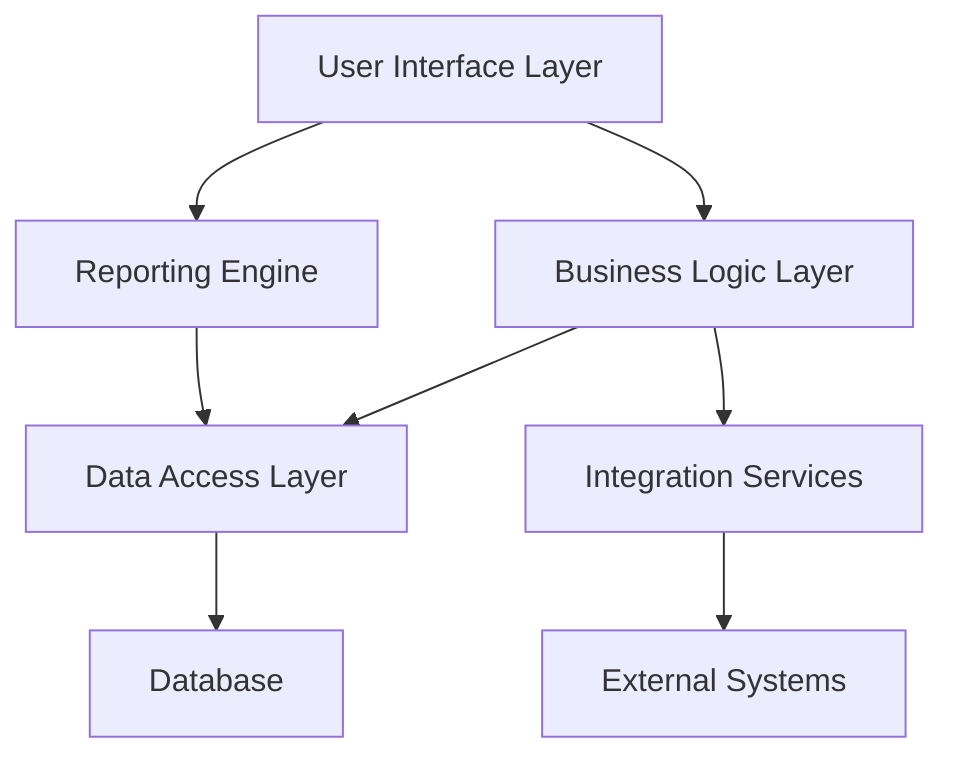
```mermaid
graph TD
    A[User Interface Layer] --> B[Business Logic Layer]
    B --> C[Data Access Layer]
    C --> D[Database]
    B --> E[Integration Services]
    E --> F[External Systems]
    A --> G[Reporting Engine]
    G --> C
```

The architecture employs a modular approach with clear separation of concerns, allowing for scalability and future enhancements.

#### 1.2.3 Success Criteria

| Success Category | Measurable Objectives | KPIs |
| --- | --- | --- |
| Financial Impact | Reduce claim denials by 30% | Denial rate, Clean claim rate |
| Operational Efficiency | Decrease billing cycle time by 40% | Time to submit claims, DSO |
| User Adoption | Achieve 90% user satisfaction | User satisfaction scores, Feature utilization |
| Technical Performance | Maintain 99.5% system uptime | System availability, Response times |

Critical success factors include seamless integration with existing systems, intuitive user experience, accurate financial calculations, and robust security measures.

### 1.3 SCOPE

#### 1.3.1 In-Scope

**Core Features and Functionalities:**

- Financial dashboard with key metrics and alerts
- Revenue tracking by program, payer, and facility
- Claims management throughout the lifecycle
- Streamlined billing workflow with validation
- Payment reconciliation and accounts receivable
- Financial reporting and analysis
- User authentication and role-based access

**Implementation Boundaries:**

| Boundary Type | Coverage |
| --- | --- |
| User Groups | Financial staff, billing specialists, executives, program managers |
| Data Domains | Client information, services, claims, payments, programs, facilities |
| Integrations | EHR/EMR systems, clearinghouses, accounting systems, Medicaid portals |
| Technical Scope | Web application with responsive design for desktop and mobile access |

#### 1.3.2 Out-of-Scope

The following items are explicitly excluded from the MVP implementation:

- Direct service documentation and time tracking
- Staff scheduling and workforce management
- Payroll processing and human resources functions
- Clinical documentation and treatment planning
- Advanced analytics and machine learning capabilities
- Native mobile applications (mobile-responsive web only)
- Direct integration with all state Medicaid portals (limited to key states)
- Custom report builder with drag-and-drop interface (planned for future release)

These capabilities may be considered for future phases based on user feedback and business priorities.

## 2. PRODUCT REQUIREMENTS

### 2.1 FEATURE CATALOG

#### 2.1.1 Dashboard Features

| Feature ID | Feature Name | Category | Priority | Status |
| --- | --- | --- | --- | --- |
| F-101 | Financial Overview Dashboard | Dashboard | Critical | Approved |
| F-102 | Revenue Metrics Visualization | Dashboard | High | Approved |
| F-103 | Claims Status Tracking | Dashboard | High | Approved |
| F-104 | Alert Notification System | Dashboard | Medium | Approved |

**F-101: Financial Overview Dashboard**

- **Description**: Comprehensive dashboard providing real-time financial metrics and KPIs for HCBS providers.
- **Business Value**: Enables quick assessment of financial health and identifies areas requiring attention.
- **User Benefits**: Reduces time spent gathering financial data and provides actionable insights.
- **Technical Context**: Requires integration with multiple data sources and real-time calculation capabilities.
- **Dependencies**:
  * Prerequisite Features: Authentication system (F-401)
  * System Dependencies: Data aggregation services
  * External Dependencies: None
  * Integration Requirements: EHR/EMR systems, accounting systems

**F-102: Revenue Metrics Visualization**

- **Description**: Interactive charts and graphs displaying revenue breakdowns by program, payer, and facility.
- **Business Value**: Provides visual representation of revenue streams for better financial analysis.
- **User Benefits**: Simplifies complex financial data and enables trend identification.
- **Technical Context**: Requires data visualization components and filtering capabilities.
- **Dependencies**:
  * Prerequisite Features: Financial Overview Dashboard (F-101)
  * System Dependencies: Reporting engine
  * External Dependencies: None
  * Integration Requirements: None

**F-103: Claims Status Tracking**

- **Description**: Visual representation of claims by status (draft, submitted, pending, paid, denied).
- **Business Value**: Provides immediate visibility into claims pipeline and potential revenue.
- **User Benefits**: Enables proactive management of claims issues.
- **Technical Context**: Requires real-time data from claims management system.
- **Dependencies**:
  * Prerequisite Features: Claims Management System (F-301)
  * System Dependencies: Claims database
  * External Dependencies: None
  * Integration Requirements: Clearinghouse systems

**F-104: Alert Notification System**

- **Description**: System-generated alerts for critical financial events and issues.
- **Business Value**: Ensures timely response to financial issues that could impact cash flow.
- **User Benefits**: Reduces risk of missed deadlines or unaddressed claim issues.
- **Technical Context**: Requires rules engine for alert generation and notification system.
- **Dependencies**:
  * Prerequisite Features: Financial Overview Dashboard (F-101)
  * System Dependencies: Notification service
  * External Dependencies: None
  * Integration Requirements: Email/SMS gateways

#### 2.1.2 Revenue Tracking Features

| Feature ID | Feature Name | Category | Priority | Status |
| --- | --- | --- | --- | --- |
| F-201 | Program Revenue Tracking | Revenue | Critical | Approved |
| F-202 | Payer Source Analysis | Revenue | High | Approved |
| F-203 | Facility Revenue Management | Revenue | Medium | Approved |
| F-204 | Revenue Trend Analysis | Revenue | High | Approved |

**F-201: Program Revenue Tracking**

- **Description**: Detailed tracking of revenue by program type (Personal Care, Residential, Day Services, etc.).
- **Business Value**: Enables program-specific financial analysis and decision-making.
- **User Benefits**: Provides clear visibility into program performance and profitability.
- **Technical Context**: Requires program-specific data categorization and reporting.
- **Dependencies**:
  * Prerequisite Features: Financial Overview Dashboard (F-101)
  * System Dependencies: Program database
  * External Dependencies: None
  * Integration Requirements: Accounting systems

**F-202: Payer Source Analysis**

- **Description**: Tracking and analysis of revenue by payer source (Medicaid, Medicare, Private Pay, etc.).
- **Business Value**: Identifies payer-specific trends and issues affecting revenue.
- **User Benefits**: Enables strategic decisions about payer mix and contract negotiations.
- **Technical Context**: Requires payer-specific data categorization and analysis.
- **Dependencies**:
  * Prerequisite Features: Financial Overview Dashboard (F-101)
  * System Dependencies: Payer database
  * External Dependencies: None
  * Integration Requirements: None

**F-203: Facility Revenue Management**

- **Description**: Tracking and management of revenue by facility/location.
- **Business Value**: Enables location-specific financial analysis and resource allocation.
- **User Benefits**: Provides insights into facility performance and profitability.
- **Technical Context**: Requires facility-specific data categorization and reporting.
- **Dependencies**:
  * Prerequisite Features: Financial Overview Dashboard (F-101)
  * System Dependencies: Facility database
  * External Dependencies: None
  * Integration Requirements: None

**F-204: Revenue Trend Analysis**

- **Description**: Interactive tools for analyzing revenue trends across time periods.
- **Business Value**: Enables identification of patterns and forecasting of future revenue.
- **User Benefits**: Supports strategic planning and financial decision-making.
- **Technical Context**: Requires historical data analysis and visualization capabilities.
- **Dependencies**:
  * Prerequisite Features: Program Revenue Tracking (F-201), Payer Source Analysis (F-202)
  * System Dependencies: Reporting engine
  * External Dependencies: None
  * Integration Requirements: None

#### 2.1.3 Claims Management Features

| Feature ID | Feature Name | Category | Priority | Status |
| --- | --- | --- | --- | --- |
| F-301 | Claims Lifecycle Management | Claims | Critical | Approved |
| F-302 | Claim Validation System | Claims | Critical | Approved |
| F-303 | Batch Claims Processing | Claims | High | Approved |
| F-304 | Claims Aging Reports | Claims | High | Approved |

**F-301: Claims Lifecycle Management**

- **Description**: End-to-end tracking of claims from creation through adjudication.
- **Business Value**: Provides complete visibility into claims process and identifies bottlenecks.
- **User Benefits**: Reduces lost claims and improves follow-up on pending claims.
- **Technical Context**: Requires workflow engine and status tracking system.
- **Dependencies**:
  * Prerequisite Features: None
  * System Dependencies: Claims database
  * External Dependencies: Clearinghouse systems
  * Integration Requirements: Payer systems

**F-302: Claim Validation System**

- **Description**: Automated validation of claims against payer requirements before submission.
- **Business Value**: Reduces claim rejections and improves clean claim rate.
- **User Benefits**: Saves time by identifying issues before submission.
- **Technical Context**: Requires rules engine and payer-specific validation logic.
- **Dependencies**:
  * Prerequisite Features: Claims Lifecycle Management (F-301)
  * System Dependencies: Validation rules database
  * External Dependencies: None
  * Integration Requirements: None

**F-303: Batch Claims Processing**

- **Description**: Tools for creating, validating, and submitting multiple claims simultaneously.
- **Business Value**: Improves efficiency of claims submission process.
- **User Benefits**: Reduces time spent on claim submission tasks.
- **Technical Context**: Requires batch processing capabilities and error handling.
- **Dependencies**:
  * Prerequisite Features: Claims Lifecycle Management (F-301), Claim Validation System (F-302)
  * System Dependencies: Claims database
  * External Dependencies: Clearinghouse systems
  * Integration Requirements: None

**F-304: Claims Aging Reports**

- **Description**: Reports showing aging of claims by status, payer, and time period.
- **Business Value**: Identifies delayed payments and potential cash flow issues.
- **User Benefits**: Enables prioritization of follow-up activities.
- **Technical Context**: Requires reporting engine and aging calculation logic.
- **Dependencies**:
  * Prerequisite Features: Claims Lifecycle Management (F-301)
  * System Dependencies: Reporting engine
  * External Dependencies: None
  * Integration Requirements: None

#### 2.1.4 Billing Workflow Features

| Feature ID | Feature Name | Category | Priority | Status |
| --- | --- | --- | --- | --- |
| F-401 | Service-to-Claim Conversion | Billing | Critical | Approved |
| F-402 | Documentation Validation | Billing | Critical | Approved |
| F-403 | Authorization Tracking | Billing | High | Approved |
| F-404 | Electronic Submission | Billing | Critical | Approved |

**F-401: Service-to-Claim Conversion**

- **Description**: Automated conversion of service data to billable claims.
- **Business Value**: Streamlines billing process and reduces manual data entry.
- **User Benefits**: Saves time and reduces billing errors.
- **Technical Context**: Requires mapping logic between service and billing codes.
- **Dependencies**:
  * Prerequisite Features: None
  * System Dependencies: Service database
  * External Dependencies: None
  * Integration Requirements: EHR/EMR systems

**F-402: Documentation Validation**

- **Description**: Validation of service documentation against billing requirements.
- **Business Value**: Ensures compliance with documentation requirements for billing.
- **User Benefits**: Reduces claim denials due to documentation issues.
- **Technical Context**: Requires rules engine for documentation validation.
- **Dependencies**:
  * Prerequisite Features: Service-to-Claim Conversion (F-401)
  * System Dependencies: Documentation database
  * External Dependencies: None
  * Integration Requirements: EHR/EMR systems

**F-403: Authorization Tracking**

- **Description**: Tracking of service authorizations and limits for billing purposes.
- **Business Value**: Prevents billing for unauthorized services.
- **User Benefits**: Reduces claim denials due to authorization issues.
- **Technical Context**: Requires authorization database and validation logic.
- **Dependencies**:
  * Prerequisite Features: Service-to-Claim Conversion (F-401)
  * System Dependencies: Authorization database
  * External Dependencies: None
  * Integration Requirements: EHR/EMR systems

**F-404: Electronic Submission**

- **Description**: Electronic submission of claims to multiple payers.
- **Business Value**: Accelerates claim submission process and improves tracking.
- **User Benefits**: Reduces manual submission work and improves submission accuracy.
- **Technical Context**: Requires integration with clearinghouses and direct payer connections.
- **Dependencies**:
  * Prerequisite Features: Service-to-Claim Conversion (F-401), Claim Validation System (F-302)
  * System Dependencies: Claims database
  * External Dependencies: Clearinghouse systems, Payer systems
  * Integration Requirements: EDI systems

#### 2.1.5 Payment Reconciliation Features

| Feature ID | Feature Name | Category | Priority | Status |
| --- | --- | --- | --- | --- |
| F-501 | Remittance Processing | Payments | Critical | Approved |
| F-502 | Payment Matching | Payments | Critical | Approved |
| F-503 | Adjustment Tracking | Payments | High | Approved |
| F-504 | Accounts Receivable Management | Payments | High | Approved |

**F-501: Remittance Processing**

- **Description**: Import and processing of 835 remittance advice files.
- **Business Value**: Automates payment posting and reconciliation process.
- **User Benefits**: Reduces manual data entry and improves accuracy.
- **Technical Context**: Requires 835 file parsing and processing capabilities.
- **Dependencies**:
  * Prerequisite Features: Claims Lifecycle Management (F-301)
  * System Dependencies: Payment database
  * External Dependencies: None
  * Integration Requirements: Accounting systems

**F-502: Payment Matching**

- **Description**: Automated matching of payments received with claims submitted.
- **Business Value**: Streamlines reconciliation process and identifies discrepancies.
- **User Benefits**: Reduces time spent on manual reconciliation.
- **Technical Context**: Requires matching algorithms and exception handling.
- **Dependencies**:
  * Prerequisite Features: Remittance Processing (F-501)
  * System Dependencies: Claims database, Payment database
  * External Dependencies: None
  * Integration Requirements: None

**F-503: Adjustment Tracking**

- **Description**: Tracking of payment adjustments, denials, and reasons.
- **Business Value**: Provides visibility into payment issues and trends.
- **User Benefits**: Enables targeted improvements to reduce future adjustments.
- **Technical Context**: Requires adjustment code mapping and categorization.
- **Dependencies**:
  * Prerequisite Features: Payment Matching (F-502)
  * System Dependencies: Adjustment code database
  * External Dependencies: None
  * Integration Requirements: None

**F-504: Accounts Receivable Management**

- **Description**: Tracking and management of accounts receivable aging.
- **Business Value**: Improves cash flow management and collection efforts.
- **User Benefits**: Provides clear visibility into outstanding receivables.
- **Technical Context**: Requires aging calculation and reporting capabilities.
- **Dependencies**:
  * Prerequisite Features: Payment Matching (F-502)
  * System Dependencies: Reporting engine
  * External Dependencies: None
  * Integration Requirements: Accounting systems

#### 2.1.6 Financial Reporting Features

| Feature ID | Feature Name | Category | Priority | Status |
| --- | --- | --- | --- | --- |
| F-601 | Standard Financial Reports | Reporting | High | Approved |
| F-602 | Custom Report Generation | Reporting | Medium | Approved |
| F-603 | Scheduled Reporting | Reporting | Low | Approved |
| F-604 | Financial Metrics Tracking | Reporting | High | Approved |

**F-601: Standard Financial Reports**

- **Description**: Pre-defined reports for common financial analysis needs.
- **Business Value**: Provides consistent financial reporting across the organization.
- **User Benefits**: Saves time in report creation and ensures standardized metrics.
- **Technical Context**: Requires reporting engine and pre-defined report templates.
- **Dependencies**:
  * Prerequisite Features: Program Revenue Tracking (F-201), Claims Aging Reports (F-304)
  * System Dependencies: Reporting engine
  * External Dependencies: None
  * Integration Requirements: None

**F-602: Custom Report Generation**

- **Description**: Tools for creating custom financial reports.
- **Business Value**: Enables tailored analysis for specific business needs.
- **User Benefits**: Provides flexibility in financial analysis.
- **Technical Context**: Requires report builder interface and query capabilities.
- **Dependencies**:
  * Prerequisite Features: Standard Financial Reports (F-601)
  * System Dependencies: Reporting engine
  * External Dependencies: None
  * Integration Requirements: None

**F-603: Scheduled Reporting**

- **Description**: Automated generation and distribution of reports on schedule.
- **Business Value**: Ensures timely delivery of financial information.
- **User Benefits**: Reduces manual report generation and distribution tasks.
- **Technical Context**: Requires scheduling system and distribution capabilities.
- **Dependencies**:
  * Prerequisite Features: Standard Financial Reports (F-601)
  * System Dependencies: Scheduling service
  * External Dependencies: None
  * Integration Requirements: Email system

**F-604: Financial Metrics Tracking**

- **Description**: Tracking of key financial metrics (DSO, collection rate, denial rate).
- **Business Value**: Provides objective measures of financial performance.
- **User Benefits**: Enables data-driven financial management.
- **Technical Context**: Requires metric calculation logic and historical tracking.
- **Dependencies**:
  * Prerequisite Features: Standard Financial Reports (F-601)
  * System Dependencies: Metrics database
  * External Dependencies: None
  * Integration Requirements: None

### 2.2 FUNCTIONAL REQUIREMENTS TABLE

#### 2.2.1 Dashboard Requirements

**F-101: Financial Overview Dashboard**

| Requirement ID | Description | Acceptance Criteria | Priority |
| --- | --- | --- | --- |
| F-101-RQ-001 | Display current period, YTD, and projected revenue metrics | Dashboard shows all three time periods with accurate calculations | Must-Have |
| F-101-RQ-002 | Present revenue breakdown by program, payer, and facility | Revenue breakdowns are displayed with correct totals and percentages | Must-Have |
| F-101-RQ-003 | Allow filtering by date range, program, and payer | Filters function correctly and update all dashboard components | Should-Have |
| F-101-RQ-004 | Refresh dashboard data at least every 15 minutes | Dashboard data is updated automatically within specified timeframe | Must-Have |

**Technical Specifications:**

- Input Parameters: User selections for filters, time periods
- Output/Response: Visual dashboard with metrics, charts, and tables
- Performance Criteria: Dashboard load time \< 3 seconds, filter response \< 1 second
- Data Requirements: Revenue data, claims data, program data, payer data

**Validation Rules:**

- Business Rules: Revenue calculations must match accounting system totals
- Data Validation: All metrics must be validated against source data
- Security Requirements: Access restricted to authorized financial staff
- Compliance Requirements: Financial calculations must comply with accounting standards

**F-102: Revenue Metrics Visualization**

| Requirement ID | Description | Acceptance Criteria | Priority |
| --- | --- | --- | --- |
| F-102-RQ-001 | Provide trend analysis with interactive charts | Charts respond to user interaction and show correct trend data | Must-Have |
| F-102-RQ-002 | Allow comparison across time periods | Time period comparison shows accurate differential values | Should-Have |
| F-102-RQ-003 | Support drill-down from summary to detailed data | Drill-down functionality works and displays correct detailed data | Should-Have |
| F-102-RQ-004 | Enable export of visualizations in multiple formats | Export functions work for all supported formats (PNG, PDF) | Could-Have |

**Technical Specifications:**

- Input Parameters: Selected metrics, time periods, grouping options
- Output/Response: Interactive charts and graphs with drill-down capability
- Performance Criteria: Chart rendering \< 2 seconds, interaction response \< 500ms
- Data Requirements: Historical revenue data, categorized by relevant dimensions

**Validation Rules:**

- Business Rules: Chart totals must match database totals
- Data Validation: Chart data points must be validated against source data
- Security Requirements: Access restricted to authorized financial staff
- Compliance Requirements: None specific

#### 2.2.2 Claims Management Requirements

**F-301: Claims Lifecycle Management**

| Requirement ID | Description | Acceptance Criteria | Priority |
| --- | --- | --- | --- |
| F-301-RQ-001 | Track claim status (draft, submitted, pending, paid, denied) | System accurately displays current status for all claims | Must-Have |
| F-301-RQ-002 | Alert on denied or delayed claims | Alerts are generated within 1 hour of status change | Must-Have |
| F-301-RQ-003 | Support claim resubmission workflows | Resubmission process maintains claim history and creates proper tracking | Must-Have |
| F-301-RQ-004 | Track claim processing times by payer | System calculates and displays accurate processing times | Should-Have |

**Technical Specifications:**

- Input Parameters: Claim data, status updates, payer responses
- Output/Response: Updated claim status, alerts, processing metrics
- Performance Criteria: Status updates processed within 5 minutes of receipt
- Data Requirements: Claim data, status history, payer response data

**Validation Rules:**

- Business Rules: Status transitions must follow valid workflow paths
- Data Validation: Status updates must be validated against payer responses
- Security Requirements: Access restricted to billing staff and managers
- Compliance Requirements: Maintain audit trail of all status changes

**F-302: Claim Validation System**

| Requirement ID | Description | Acceptance Criteria | Priority |
| --- | --- | --- | --- |
| F-302-RQ-001 | Validate service documentation before billing | System identifies missing or incomplete documentation | Must-Have |
| F-302-RQ-002 | Check for service authorization limits | System alerts when services exceed authorization limits | Must-Have |
| F-302-RQ-003 | Validate claim format for payer requirements | System validates claim format against payer-specific requirements | Must-Have |
| F-302-RQ-004 | Provide detailed error messages for failed validations | Error messages clearly identify issues and suggest corrections | Should-Have |

**Technical Specifications:**

- Input Parameters: Claim data, service data, authorization data
- Output/Response: Validation results, error messages, warnings
- Performance Criteria: Validation completed within 3 seconds per claim
- Data Requirements: Validation rules, payer requirements, authorization data

**Validation Rules:**

- Business Rules: Validation must check all payer-specific requirements
- Data Validation: All required fields must be present and properly formatted
- Security Requirements: Access restricted to billing staff
- Compliance Requirements: Validation rules must be updated when payer requirements change

#### 2.2.3 Billing Workflow Requirements

**F-401: Service-to-Claim Conversion**

| Requirement ID | Description | Acceptance Criteria | Priority |
| --- | --- | --- | --- |
| F-401-RQ-001 | Convert service data to billable claims | Conversion creates accurate claims with correct codes and amounts | Must-Have |
| F-401-RQ-002 | Support multiple billing formats (837P, CMS-1500) | System generates claims in all required formats | Must-Have |
| F-401-RQ-003 | Group services appropriately for efficient billing | Services are grouped according to payer requirements | Should-Have |
| F-401-RQ-004 | Maintain traceability between services and claims | System maintains links between services and resulting claims | Must-Have |

**Technical Specifications:**

- Input Parameters: Service data, billing rules, payer requirements
- Output/Response: Formatted claims ready for submission
- Performance Criteria: Conversion completed within 5 seconds for standard batch
- Data Requirements: Service data, billing codes, rate information

**Validation Rules:**

- Business Rules: Conversion must follow payer-specific billing rules
- Data Validation: All required claim fields must be populated correctly
- Security Requirements: Access restricted to billing staff
- Compliance Requirements: Claim format must comply with HIPAA standards

**F-404: Electronic Submission**

| Requirement ID | Description | Acceptance Criteria | Priority |
| --- | --- | --- | --- |
| F-404-RQ-001 | Support electronic submission to multiple payers | System successfully submits claims to all supported payers | Must-Have |
| F-404-RQ-002 | Track submission status and confirmation | System records submission timestamps and confirmation numbers | Must-Have |
| F-404-RQ-003 | Handle submission errors with retry capability | System identifies submission errors and supports resubmission | Must-Have |
| F-404-RQ-004 | Track billing deadlines and timely filing limits | System alerts on approaching deadlines | Should-Have |

**Technical Specifications:**

- Input Parameters: Validated claims, submission credentials, payer endpoints
- Output/Response: Submission confirmation, error messages
- Performance Criteria: Submission completed within 30 seconds per batch
- Data Requirements: Claim data, payer connection information

**Validation Rules:**

- Business Rules: Submissions must comply with payer-specific requirements
- Data Validation: Claims must pass final validation before submission
- Security Requirements: Secure transmission using encryption
- Compliance Requirements: Submission process must comply with HIPAA standards

#### 2.2.4 Payment Reconciliation Requirements

**F-501: Remittance Processing**

| Requirement ID | Description | Acceptance Criteria | Priority |
| --- | --- | --- | --- |
| F-501-RQ-001 | Import 835 remittance advice files | System successfully imports and processes 835 files | Must-Have |
| F-501-RQ-002 | Extract payment and adjustment information | System correctly extracts all payment details and adjustment codes | Must-Have |
| F-501-RQ-003 | Validate remittance data against expected payments | System identifies discrepancies between expected and actual payments | Should-Have |
| F-501-RQ-004 | Support manual remittance entry for non-electronic payments | System allows manual entry with same validation as electronic | Should-Have |

**Technical Specifications:**

- Input Parameters: 835 files, manual payment data
- Output/Response: Processed payment records, validation results
- Performance Criteria: Import and processing completed within 2 minutes per file
- Data Requirements: 835 file structure, payment codes, adjustment codes

**Validation Rules:**

- Business Rules: Payment totals must balance within remittance
- Data Validation: All required payment fields must be present
- Security Requirements: Access restricted to finance staff
- Compliance Requirements: Processing must comply with HIPAA standards

**F-502: Payment Matching**

| Requirement ID | Description | Acceptance Criteria | Priority |
| --- | --- | --- | --- |
| F-502-RQ-001 | Match payments to submitted claims | System correctly matches payments to corresponding claims | Must-Have |
| F-502-RQ-002 | Identify underpayments and overpayments | System flags payments that don't match expected amounts | Must-Have |
| F-502-RQ-003 | Support partial payments and multiple payments per claim | System correctly handles complex payment scenarios | Must-Have |
| F-502-RQ-004 | Generate reconciliation exceptions for manual review | System identifies payments that cannot be automatically matched | Should-Have |

**Technical Specifications:**

- Input Parameters: Payment data, claim data, matching rules
- Output/Response: Matched payments, exception reports
- Performance Criteria: Matching completed within 5 minutes for standard batch
- Data Requirements: Payment data, claim data, expected payment amounts

**Validation Rules:**

- Business Rules: Matching must follow accounting reconciliation rules
- Data Validation: Payment amounts must be validated against claim amounts
- Security Requirements: Access restricted to finance staff
- Compliance Requirements: Reconciliation must comply with accounting standards

### 2.3 FEATURE RELATIONSHIPS

#### 2.3.1 Feature Dependencies Map

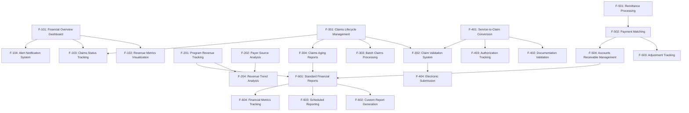
```mermaid
graph TD
    F101[F-101: Financial Overview Dashboard] --> F102[F-102: Revenue Metrics Visualization]
    F101 --> F103[F-103: Claims Status Tracking]
    F101 --> F104[F-104: Alert Notification System]
    F201[F-201: Program Revenue Tracking] --> F204[F-204: Revenue Trend Analysis]
    F202[F-202: Payer Source Analysis] --> F204
    F301[F-301: Claims Lifecycle Management] --> F302[F-302: Claim Validation System]
    F301 --> F303[F-303: Batch Claims Processing]
    F301 --> F304[F-304: Claims Aging Reports]
    F301 --> F103
    F401[F-401: Service-to-Claim Conversion] --> F402[F-402: Documentation Validation]
    F401 --> F403[F-403: Authorization Tracking]
    F401 --> F302
    F302 --> F404[F-404: Electronic Submission]
    F501[F-501: Remittance Processing] --> F502[F-502: Payment Matching]
    F502 --> F503[F-503: Adjustment Tracking]
    F502 --> F504[F-504: Accounts Receivable Management]
    F601[F-601: Standard Financial Reports] --> F602[F-602: Custom Report Generation]
    F601 --> F603[F-603: Scheduled Reporting]
    F601 --> F604[F-604: Financial Metrics Tracking]
    F201 --> F601
    F304 --> F601
    F504 --> F601
```

#### 2.3.2 Integration Points

| Feature ID | Integration Point | Description | Integration Type |
| --- | --- | --- | --- |
| F-101 | EHR/EMR Systems | Retrieves service data for financial calculations | API/Data Import |
| F-101 | Accounting Systems | Validates financial data against accounting records | API/Data Import |
| F-301 | Clearinghouse Systems | Sends claims and receives status updates | API/EDI |
| F-401 | EHR/EMR Systems | Retrieves service documentation for billing | API/Data Import |
| F-404 | Payer Systems | Submits claims directly to payers | API/EDI |
| F-501 | Accounting Systems | Posts payment information to accounting system | API/Data Export |

#### 2.3.3 Shared Components

| Component | Related Features | Description |
| --- | --- | --- |
| Claims Database | F-301, F-302, F-303, F-304, F-502 | Central repository for all claim data |
| Reporting Engine | F-102, F-204, F-304, F-504, F-601, F-602 | Generates reports and visualizations |
| Validation Rules Engine | F-302, F-402, F-403 | Validates data against business rules |
| Notification Service | F-104, F-301, F-403 | Generates and delivers alerts and notifications |

#### 2.3.4 Common Services

| Service | Related Features | Description |
| --- | --- | --- |
| Authentication Service | All Features | Manages user authentication and session management |
| Authorization Service | All Features | Controls access to features based on user roles |
| Data Export Service | F-102, F-304, F-504, F-601 | Handles export of data in various formats |
| Integration Service | F-101, F-301, F-401, F-404, F-501 | Manages external system integrations |

### 2.4 IMPLEMENTATION CONSIDERATIONS

#### 2.4.1 Technical Constraints

| Feature ID | Constraint | Impact | Mitigation |
| --- | --- | --- | --- |
| F-301 | Varied payer response formats | Increases complexity of status tracking | Implement payer-specific adapters |
| F-404 | Limited direct payer connections | May require clearinghouse for some payers | Prioritize direct connections for major payers |
| F-501 | Non-standard remittance formats | Complicates automated processing | Support manual entry for non-standard formats |
| F-602 | Complex query requirements | May impact performance | Implement query optimization and caching |

#### 2.4.2 Performance Requirements

| Feature ID | Requirement | Metric | Target |
| --- | --- | --- | --- |
| F-101 | Dashboard load time | Time to interactive | \< 3 seconds |
| F-102 | Chart rendering time | Time to display | \< 2 seconds |
| F-302 | Claim validation time | Processing time per claim | \< 3 seconds |
| F-404 | Submission processing time | Time to submit batch | \< 30 seconds |
| F-502 | Payment matching time | Processing time for standard batch | \< 5 minutes |

#### 2.4.3 Scalability Considerations

| Feature ID | Consideration | Approach |
| --- | --- | --- |
| F-101 | High dashboard request volume | Implement caching and data aggregation |
| F-303 | Large batch processing needs | Design for parallel processing capability |
| F-501 | Large remittance file processing | Implement asynchronous processing |
| F-601 | Complex report generation | Use background processing for large reports |

#### 2.4.4 Security Implications

| Feature ID | Security Concern | Mitigation |
| --- | --- | --- |
| All Features | PHI protection | Implement encryption at rest and in transit |
| F-404 | Secure transmission | Use TLS for all external communications |
| F-501 | Payment data protection | Implement strict access controls |
| All Features | User access control | Implement role-based access control |

#### 2.4.5 Maintenance Requirements

| Feature ID | Maintenance Need | Frequency | Approach |
| --- | --- | --- | --- |
| F-302 | Update validation rules | As payer requirements change | Configurable rules engine |
| F-401 | Update billing codes | Annually or as needed | Configurable code mappings |
| F-601 | Update report templates | As reporting needs change | Configurable report definitions |
| All Features | Performance monitoring | Continuous | Implement APM solution |

### 2.5 TRACEABILITY MATRIX

| Requirement ID | Business Objective | User Persona | Success Criteria |
| --- | --- | --- | --- |
| F-101-RQ-001 | Improve financial visibility | Financial Manager, Executive Director | Dashboard shows accurate financial metrics |
| F-301-RQ-001 | Reduce billing errors | Billing Specialist | Claim status tracking is accurate and timely |
| F-302-RQ-001 | Reduce claim rejections | Billing Specialist | Documentation validation prevents incomplete claims |
| F-401-RQ-001 | Decrease time spent on billing | Billing Specialist | Service-to-claim conversion is accurate and efficient |
| F-502-RQ-001 | Improve cash flow predictability | Financial Manager | Payment matching is accurate and timely |
| F-601-RQ-001 | Provide comprehensive reporting | Financial Manager, Executive Director | Reports provide actionable financial insights |

## 3. TECHNOLOGY STACK

### 3.1 PROGRAMMING LANGUAGES

| Layer | Language | Version | Justification |
| --- | --- | --- | --- |
| Frontend | TypeScript | 4.9+ | Type safety for complex financial data structures, improved developer productivity, and better code maintainability |
| Frontend | JavaScript (ES2022) | ES2022 | Core language for React components and client-side functionality |
| Backend | TypeScript | 4.9+ | Consistent language across stack, type safety for financial calculations and data validation |
| Database | SQL | - | Required for complex financial queries and reporting capabilities |

TypeScript has been selected as the primary language across the stack to ensure type safety and consistency, which is critical for a financial application handling complex billing data and calculations. The strong typing system will help prevent runtime errors related to data structure mismatches and provide better IDE support for developers.

### 3.2 FRAMEWORKS & LIBRARIES

#### 3.2.1 Core Frameworks

| Component | Framework/Library | Version | Justification |
| --- | --- | --- | --- |
| Frontend | Next.js | 13.4+ | Server-side rendering for improved performance, API routes, and built-in routing as specified in requirements |
| Frontend | React | 18.2+ | Component-based UI development, extensive ecosystem, and alignment with Next.js |
| Backend | Node.js | 18.16+ | JavaScript runtime for server-side operations, compatible with TypeScript |
| Backend | Express.js | 4.18+ | Lightweight web framework for RESTful API development |
| API | RESTful API | - | Standardized approach for client-server communication and third-party integrations |

Next.js was selected as the primary frontend framework based on the technical requirements specifying server-side rendering for improved performance. It provides an integrated solution for React applications with built-in API routes, which simplifies the architecture.

#### 3.2.2 Supporting Libraries

| Category | Library | Version | Purpose |
| --- | --- | --- | --- |
| UI Components | Material UI | 5.13+ | Comprehensive component library for professional financial interfaces |
| Data Visualization | D3.js | 7.8+ | Advanced data visualization for financial charts and graphs |
| Data Visualization | Chart.js | 4.3+ | Simplified charting for standard financial reports |
| Form Handling | React Hook Form | 7.45+ | Efficient form management for complex billing forms |
| Data Validation | Zod | 3.21+ | Runtime validation for financial data with TypeScript integration |
| API Client | Axios | 1.4+ | HTTP client for API requests with interceptor support |
| State Management | Redux Toolkit | 1.9+ | Centralized state management for complex application state |
| Authentication | NextAuth.js | 4.22+ | Authentication framework with support for multiple providers |
| Date Handling | date-fns | 2.30+ | Date manipulation for billing periods and financial reporting |
| PDF Generation | React-PDF | 6.2+ | PDF generation for financial reports and claims |

These libraries were selected to address specific requirements of the HCBS Revenue Management System, particularly focusing on data visualization, form handling, and report generation capabilities essential for financial operations.

### 3.3 DATABASES & STORAGE

| Component | Technology | Version | Justification |
| --- | --- | --- | --- |
| Primary Database | PostgreSQL | 15.3+ | Relational database for complex financial data with ACID compliance |
| Document Storage | Amazon S3 | - | Secure storage for attachments and supporting documentation |
| Caching | Redis | 7.0+ | In-memory data store for performance optimization and session management |
| Search | Elasticsearch | 8.8+ | Advanced search capabilities for claims and financial records |

PostgreSQL was selected as the primary database due to its robust support for complex financial transactions, data integrity features, and ability to handle the relational data models defined in the requirements. The document storage solution addresses the need for storing supporting documentation while maintaining HIPAA compliance.

#### 3.3.1 Data Persistence Strategies

| Data Type | Storage Strategy | Justification |
| --- | --- | --- |
| Transactional Data | PostgreSQL with regular backups | ACID compliance for financial integrity |
| Document Attachments | S3 with versioning | Immutable storage for audit purposes |
| Audit Logs | Append-only PostgreSQL tables | Tamper-evident record keeping |
| Session Data | Redis with TTL | Temporary storage with automatic expiration |
| Cached Reports | Redis with invalidation | Performance optimization for frequently accessed reports |

These strategies ensure data integrity and compliance with healthcare regulations while optimizing system performance for different types of data.

### 3.4 THIRD-PARTY SERVICES

| Category | Service | Purpose | Integration Method |
| --- | --- | --- | --- |
| Clearinghouse | Change Healthcare | Claim submission and status tracking | API |
| Clearinghouse | Availity | Alternative claim submission pathway | API |
| Authentication | Auth0 | User authentication with MFA support | SDK |
| Email | SendGrid | Notification and report distribution | API |
| Monitoring | New Relic | Application performance monitoring | SDK |
| Error Tracking | Sentry | Error tracking and reporting | SDK |
| Analytics | Mixpanel | User behavior analytics | SDK |
| Compliance | Aptible | HIPAA compliance management | Infrastructure |

These third-party services address specific requirements for claim submission, security, monitoring, and compliance. The clearinghouse integrations are particularly important for the core billing functionality of the system.

#### 3.4.1 Healthcare-Specific Integrations

| Integration | Purpose | Standard/Format |
| --- | --- | --- |
| EHR/EMR Systems | Service data import | HL7, FHIR, Custom API |
| Medicaid Portals | Eligibility verification, claim submission | EDI 270/271, 837P |
| Accounting Systems | Payment posting, financial reconciliation | Custom API, CSV export |
| Remittance Processing | Payment reconciliation | EDI 835 |

These healthcare-specific integrations are essential for the system's core functionality of streamlining the revenue cycle management process for HCBS providers.

### 3.5 DEVELOPMENT & DEPLOYMENT

#### 3.5.1 Development Tools

| Category | Tool | Version | Purpose |
| --- | --- | --- | --- |
| IDE | Visual Studio Code | Latest | Primary development environment |
| Version Control | Git | Latest | Source code management |
| Repository | GitHub | - | Code hosting and collaboration |
| Package Manager | npm | 9.6+ | Dependency management |
| API Testing | Postman | Latest | API development and testing |
| Documentation | Swagger/OpenAPI | 3.0 | API documentation |

#### 3.5.2 Build & Deployment

| Component | Technology | Version | Purpose |
| --- | --- | --- | --- |
| Build Tool | Webpack | 5.85+ | Asset bundling and optimization |
| Transpilation | Babel | 7.22+ | JavaScript compatibility |
| Containerization | Docker | 24.0+ | Application containerization |
| Orchestration | Kubernetes | 1.27+ | Container orchestration |
| CI/CD | GitHub Actions | - | Automated testing and deployment |
| Infrastructure as Code | Terraform | 1.5+ | Infrastructure provisioning |
| Cloud Provider | AWS | - | Primary hosting platform |

#### 3.5.3 Environment Configuration

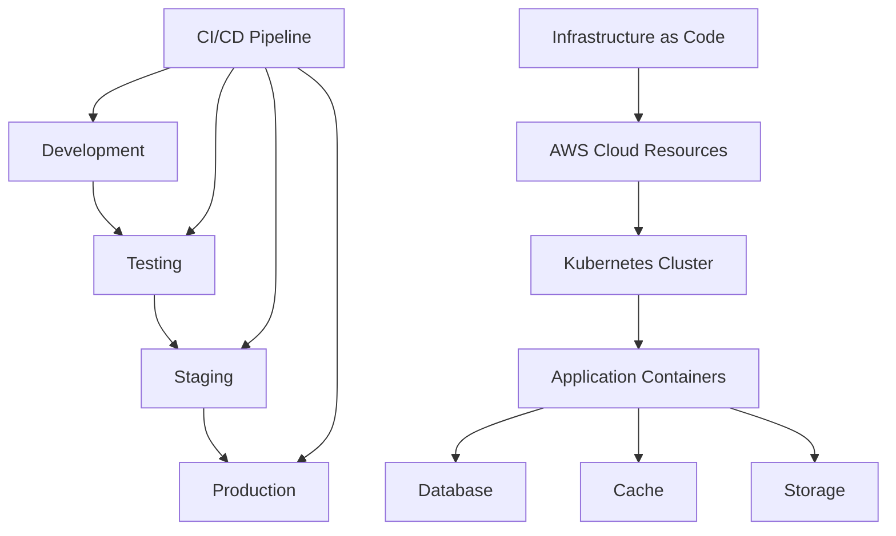
```mermaid
graph TD
    A[Development] --> B[Testing]
    B --> C[Staging]
    C --> D[Production]
    E[CI/CD Pipeline] --> A
    E --> B
    E --> C
    E --> D
    F[Infrastructure as Code] --> G[AWS Cloud Resources]
    G --> H[Kubernetes Cluster]
    H --> I[Application Containers]
    I --> J[Database]
    I --> K[Cache]
    I --> L[Storage]
```

This deployment architecture ensures consistent environments across the development lifecycle while maintaining the security and performance requirements specified for the HCBS Revenue Management System.

### 3.6 SECURITY INFRASTRUCTURE

| Component | Technology | Purpose |
| --- | --- | --- |
| Data Encryption | AES-256 | Encryption for data at rest |
| Transport Security | TLS 1.3 | Secure data transmission |
| API Security | OAuth 2.0 + OIDC | Authentication and authorization |
| Secrets Management | AWS Secrets Manager | Secure credential storage |
| WAF | AWS WAF | Protection against web attacks |
| Vulnerability Scanning | Snyk | Dependency vulnerability scanning |
| Compliance Monitoring | AWS Config | Configuration and compliance monitoring |

The security infrastructure is designed to meet HIPAA requirements for protecting PHI while ensuring the system remains accessible and performant for authorized users.

## 4. PROCESS FLOWCHART

### 4.1 SYSTEM WORKFLOWS

#### 4.1.1 Core Business Processes

**Revenue Cycle Management Workflow**

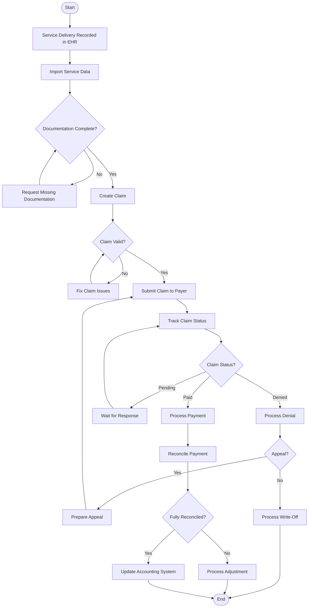
```mermaid
flowchart TD
    Start([Start]) --> ServiceDelivery[Service Delivery Recorded in EHR]
    ServiceDelivery --> DataImport[Import Service Data]
    DataImport --> Validation{Documentation Complete?}
    Validation -->|No| RequestDocs[Request Missing Documentation]
    RequestDocs --> Validation
    Validation -->|Yes| ClaimCreation[Create Claim]
    ClaimCreation --> ClaimValidation{Claim Valid?}
    ClaimValidation -->|No| FixClaim[Fix Claim Issues]
    FixClaim --> ClaimValidation
    ClaimValidation -->|Yes| SubmitClaim[Submit Claim to Payer]
    SubmitClaim --> TrackStatus[Track Claim Status]
    TrackStatus --> ClaimStatus{Claim Status?}
    ClaimStatus -->|Denied| ProcessDenial[Process Denial]
    ProcessDenial --> AppealDecision{Appeal?}
    AppealDecision -->|Yes| PrepareAppeal[Prepare Appeal]
    PrepareAppeal --> SubmitClaim
    AppealDecision -->|No| WriteOff[Process Write-Off]
    WriteOff --> End([End])
    ClaimStatus -->|Pending| WaitForResponse[Wait for Response]
    WaitForResponse --> TrackStatus
    ClaimStatus -->|Paid| ProcessPayment[Process Payment]
    ProcessPayment --> Reconciliation[Reconcile Payment]
    Reconciliation --> ReconcileStatus{Fully Reconciled?}
    ReconcileStatus -->|No| AdjustmentProcess[Process Adjustment]
    AdjustmentProcess --> End
    ReconcileStatus -->|Yes| UpdateAccounting[Update Accounting System]
    UpdateAccounting --> End
```

**Billing Workflow**

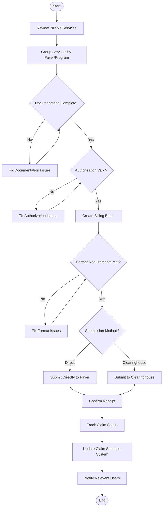
```mermaid
flowchart TD
    Start([Start]) --> ServiceReview[Review Billable Services]
    ServiceReview --> GroupServices[Group Services by Payer/Program]
    GroupServices --> ValidationCheck{Documentation Complete?}
    ValidationCheck -->|No| FixDocumentation[Fix Documentation Issues]
    FixDocumentation --> ValidationCheck
    ValidationCheck -->|Yes| AuthCheck{Authorization Valid?}
    AuthCheck -->|No| FixAuthorization[Fix Authorization Issues]
    FixAuthorization --> AuthCheck
    AuthCheck -->|Yes| CreateBatch[Create Billing Batch]
    CreateBatch --> FormatCheck{Format Requirements Met?}
    FormatCheck -->|No| FixFormat[Fix Format Issues]
    FixFormat --> FormatCheck
    FormatCheck -->|Yes| SubmissionMethod{Submission Method?}
    SubmissionMethod -->|Direct| DirectSubmit[Submit Directly to Payer]
    SubmissionMethod -->|Clearinghouse| ClearinghouseSubmit[Submit to Clearinghouse]
    DirectSubmit --> ConfirmReceipt[Confirm Receipt]
    ClearinghouseSubmit --> ConfirmReceipt
    ConfirmReceipt --> TrackStatus[Track Claim Status]
    TrackStatus --> UpdateSystem[Update Claim Status in System]
    UpdateSystem --> NotifyUsers[Notify Relevant Users]
    NotifyUsers --> End([End])
```

**Payment Reconciliation Workflow**

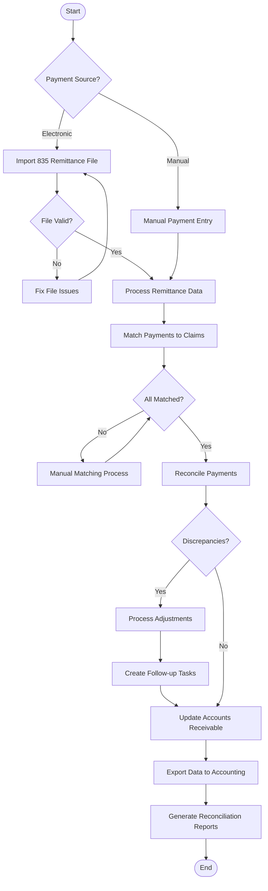
```mermaid
flowchart TD
    Start([Start]) --> PaymentSource{Payment Source?}
    PaymentSource -->|Electronic| Import835[Import 835 Remittance File]
    PaymentSource -->|Manual| ManualEntry[Manual Payment Entry]
    Import835 --> Validation{File Valid?}
    Validation -->|No| FixFile[Fix File Issues]
    FixFile --> Import835
    Validation -->|Yes| ProcessRemittance[Process Remittance Data]
    ManualEntry --> ProcessRemittance
    ProcessRemittance --> MatchClaims[Match Payments to Claims]
    MatchClaims --> MatchStatus{All Matched?}
    MatchStatus -->|No| ManualMatching[Manual Matching Process]
    ManualMatching --> MatchStatus
    MatchStatus -->|Yes| ReconcilePayments[Reconcile Payments]
    ReconcilePayments --> DiscrepancyCheck{Discrepancies?}
    DiscrepancyCheck -->|Yes| ProcessAdjustments[Process Adjustments]
    ProcessAdjustments --> CreateFollowup[Create Follow-up Tasks]
    CreateFollowup --> UpdateAR
    DiscrepancyCheck -->|No| UpdateAR[Update Accounts Receivable]
    UpdateAR --> ExportData[Export Data to Accounting]
    ExportData --> GenerateReports[Generate Reconciliation Reports]
    GenerateReports --> End([End])
```

**Financial Reporting Workflow**

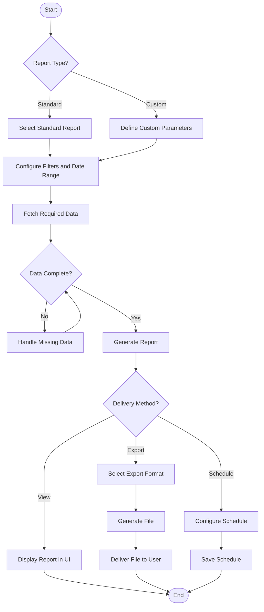
```mermaid
flowchart TD
    Start([Start]) --> ReportType{Report Type?}
    ReportType -->|Standard| SelectReport[Select Standard Report]
    ReportType -->|Custom| DefineParameters[Define Custom Parameters]
    SelectReport --> ConfigureFilters[Configure Filters and Date Range]
    DefineParameters --> ConfigureFilters
    ConfigureFilters --> DataFetch[Fetch Required Data]
    DataFetch --> DataValidation{Data Complete?}
    DataValidation -->|No| HandleMissingData[Handle Missing Data]
    HandleMissingData --> DataValidation
    DataValidation -->|Yes| GenerateReport[Generate Report]
    GenerateReport --> DeliveryMethod{Delivery Method?}
    DeliveryMethod -->|View| DisplayReport[Display Report in UI]
    DeliveryMethod -->|Export| ExportFormat[Select Export Format]
    DeliveryMethod -->|Schedule| ConfigureSchedule[Configure Schedule]
    DisplayReport --> End([End])
    ExportFormat --> GenerateFile[Generate File]
    GenerateFile --> DeliverFile[Deliver File to User]
    DeliverFile --> End
    ConfigureSchedule --> SaveSchedule[Save Schedule]
    SaveSchedule --> End
```

#### 4.1.2 Integration Workflows

**EHR Integration Workflow**

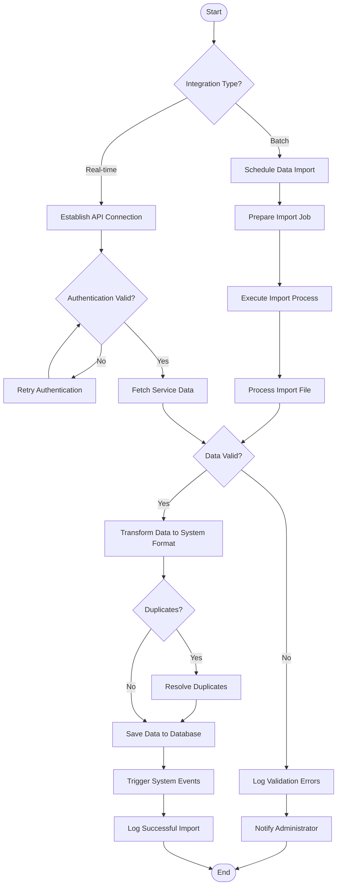
```mermaid
flowchart TD
    Start([Start]) --> IntegrationType{Integration Type?}
    IntegrationType -->|Real-time| APIConnection[Establish API Connection]
    IntegrationType -->|Batch| ScheduleImport[Schedule Data Import]
    APIConnection --> AuthCheck{Authentication Valid?}
    AuthCheck -->|No| RetryAuth[Retry Authentication]
    RetryAuth --> AuthCheck
    AuthCheck -->|Yes| FetchData[Fetch Service Data]
    ScheduleImport --> PrepareImport[Prepare Import Job]
    PrepareImport --> ExecuteImport[Execute Import Process]
    ExecuteImport --> ProcessFile[Process Import File]
    ProcessFile --> ValidationCheck{Data Valid?}
    FetchData --> ValidationCheck
    ValidationCheck -->|No| LogErrors[Log Validation Errors]
    LogErrors --> NotifyAdmin[Notify Administrator]
    NotifyAdmin --> End([End])
    ValidationCheck -->|Yes| TransformData[Transform Data to System Format]
    TransformData --> DuplicateCheck{Duplicates?}
    DuplicateCheck -->|Yes| ResolveDuplicates[Resolve Duplicates]
    ResolveDuplicates --> SaveData
    DuplicateCheck -->|No| SaveData[Save Data to Database]
    SaveData --> TriggerEvents[Trigger System Events]
    TriggerEvents --> LogSuccess[Log Successful Import]
    LogSuccess --> End
```

**Clearinghouse Integration Workflow**

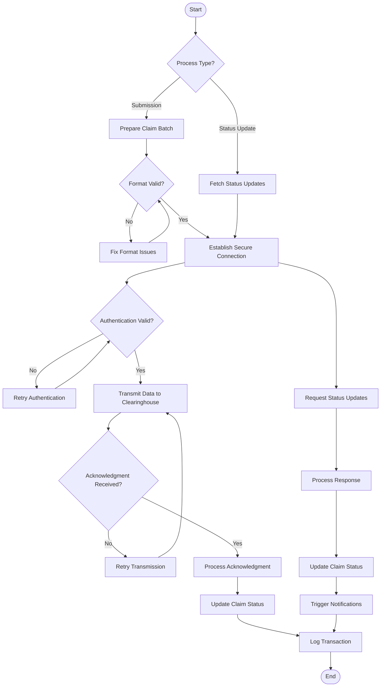
```mermaid
flowchart TD
    Start([Start]) --> ProcessType{Process Type?}
    ProcessType -->|Submission| PrepareSubmission[Prepare Claim Batch]
    ProcessType -->|Status Update| FetchUpdates[Fetch Status Updates]
    PrepareSubmission --> FormatValidation{Format Valid?}
    FormatValidation -->|No| FixFormat[Fix Format Issues]
    FixFormat --> FormatValidation
    FormatValidation -->|Yes| SecureConnection[Establish Secure Connection]
    SecureConnection --> AuthCheck{Authentication Valid?}
    AuthCheck -->|No| RetryAuth[Retry Authentication]
    RetryAuth --> AuthCheck
    AuthCheck -->|Yes| TransmitData[Transmit Data to Clearinghouse]
    TransmitData --> ReceiveAck{Acknowledgment Received?}
    ReceiveAck -->|No| RetryTransmission[Retry Transmission]
    RetryTransmission --> TransmitData
    ReceiveAck -->|Yes| ProcessAck[Process Acknowledgment]
    ProcessAck --> UpdateStatus[Update Claim Status]
    UpdateStatus --> LogTransaction[Log Transaction]
    LogTransaction --> End([End])
    FetchUpdates --> SecureConnection
    SecureConnection --> RequestUpdates[Request Status Updates]
    RequestUpdates --> ProcessResponse[Process Response]
    ProcessResponse --> UpdateClaimStatus[Update Claim Status]
    UpdateClaimStatus --> TriggerNotifications[Trigger Notifications]
    TriggerNotifications --> LogTransaction
```

**Accounting System Integration Workflow**

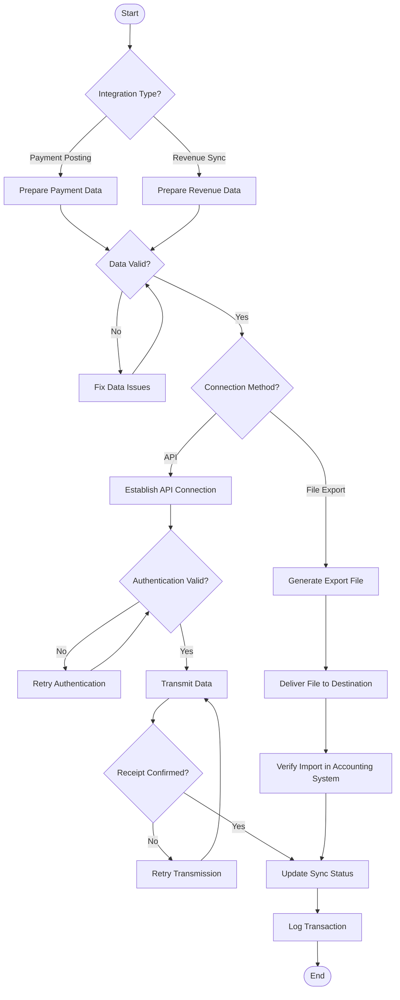
```mermaid
flowchart TD
    Start([Start]) --> IntegrationType{Integration Type?}
    IntegrationType -->|Payment Posting| PreparePaymentData[Prepare Payment Data]
    IntegrationType -->|Revenue Sync| PrepareRevenueData[Prepare Revenue Data]
    PreparePaymentData --> ValidateData{Data Valid?}
    PrepareRevenueData --> ValidateData
    ValidateData -->|No| FixDataIssues[Fix Data Issues]
    FixDataIssues --> ValidateData
    ValidateData -->|Yes| ConnectionMethod{Connection Method?}
    ConnectionMethod -->|API| EstablishAPIConnection[Establish API Connection]
    ConnectionMethod -->|File Export| GenerateExportFile[Generate Export File]
    EstablishAPIConnection --> AuthCheck{Authentication Valid?}
    AuthCheck -->|No| RetryAuth[Retry Authentication]
    RetryAuth --> AuthCheck
    AuthCheck -->|Yes| TransmitData[Transmit Data]
    GenerateExportFile --> DeliverFile[Deliver File to Destination]
    DeliverFile --> VerifyImport[Verify Import in Accounting System]
    TransmitData --> ConfirmReceipt{Receipt Confirmed?}
    ConfirmReceipt -->|No| RetryTransmission[Retry Transmission]
    RetryTransmission --> TransmitData
    ConfirmReceipt -->|Yes| UpdateSyncStatus[Update Sync Status]
    VerifyImport --> UpdateSyncStatus
    UpdateSyncStatus --> LogTransaction[Log Transaction]
    LogTransaction --> End([End])
```

### 4.2 FLOWCHART REQUIREMENTS

#### 4.2.1 Claims Lifecycle Management

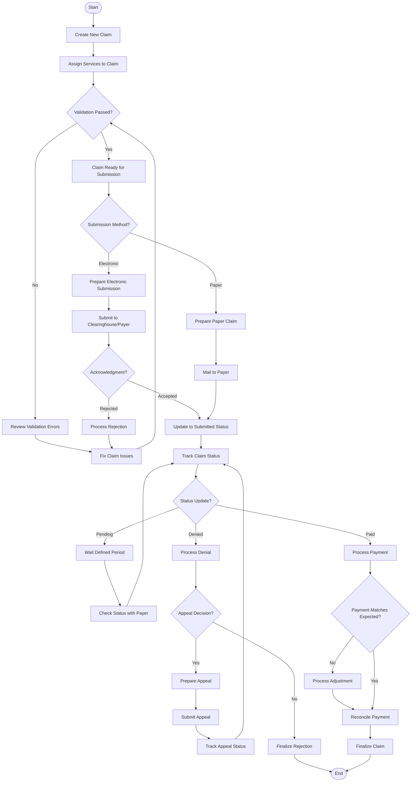
```mermaid
flowchart TD
    Start([Start]) --> CreateClaim[Create New Claim]
    CreateClaim --> AssignServices[Assign Services to Claim]
    AssignServices --> ValidateClaim{Validation Passed?}
    ValidateClaim -->|No| ValidationErrors[Review Validation Errors]
    ValidationErrors --> FixIssues[Fix Claim Issues]
    FixIssues --> ValidateClaim
    ValidateClaim -->|Yes| ClaimReady[Claim Ready for Submission]
    ClaimReady --> SubmissionMethod{Submission Method?}
    SubmissionMethod -->|Electronic| PrepareElectronic[Prepare Electronic Submission]
    SubmissionMethod -->|Paper| PreparePaper[Prepare Paper Claim]
    PrepareElectronic --> SubmitElectronic[Submit to Clearinghouse/Payer]
    PreparePaper --> SubmitPaper[Mail to Payer]
    SubmitElectronic --> ReceiveAck{Acknowledgment?}
    ReceiveAck -->|Rejected| ProcessRejection[Process Rejection]
    ProcessRejection --> FixIssues
    ReceiveAck -->|Accepted| UpdateStatus[Update to Submitted Status]
    SubmitPaper --> UpdateStatus
    UpdateStatus --> TrackClaim[Track Claim Status]
    TrackClaim --> StatusCheck{Status Update?}
    StatusCheck -->|Pending| WaitPeriod[Wait Defined Period]
    WaitPeriod --> CheckStatus[Check Status with Payer]
    CheckStatus --> TrackClaim
    StatusCheck -->|Denied| ProcessDenial[Process Denial]
    ProcessDenial --> AppealDecision{Appeal Decision?}
    AppealDecision -->|Yes| PrepareAppeal[Prepare Appeal]
    PrepareAppeal --> SubmitAppeal[Submit Appeal]
    SubmitAppeal --> TrackAppeal[Track Appeal Status]
    TrackAppeal --> TrackClaim
    AppealDecision -->|No| FinalizeRejection[Finalize Rejection]
    FinalizeRejection --> End([End])
    StatusCheck -->|Paid| ProcessPayment[Process Payment]
    ProcessPayment --> PaymentMatch{Payment Matches Expected?}
    PaymentMatch -->|No| ProcessAdjustment[Process Adjustment]
    ProcessAdjustment --> ReconcilePayment[Reconcile Payment]
    PaymentMatch -->|Yes| ReconcilePayment
    ReconcilePayment --> FinalizeClaim[Finalize Claim]
    FinalizeClaim --> End
```

**Validation Rules for Claims Lifecycle:**

| Step | Business Rules | Data Validation | Authorization Checkpoints | Compliance Checks |
| --- | --- | --- | --- | --- |
| Create Claim | Must have valid client and service data | Client ID, Service Codes must exist | User must have claim creation rights | Service dates within filing limits |
| Validate Claim | Payer-specific rules must be satisfied | Required fields must be present and valid | User must have validation rights | Claim must meet payer format requirements |
| Submit Claim | Claim must be in valid status for submission | Submission data must be complete | User must have submission rights | Submission must follow HIPAA standards |
| Track Claim | Status updates must follow valid progression | Status data must be valid | User must have tracking rights | Status tracking must maintain audit trail |
| Process Denial | Denial reason must be documented | Denial code must be valid | User must have denial processing rights | Appeal timeframes must be observed |
| Process Payment | Payment must be linked to valid claim | Payment amount must be numeric | User must have payment processing rights | Payment posting must follow accounting standards |

#### 4.2.2 Payment Reconciliation Process

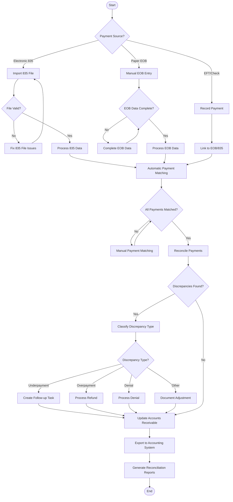
```mermaid
flowchart TD
    Start([Start]) --> PaymentSource{Payment Source?}
    PaymentSource -->|Electronic 835| Import835[Import 835 File]
    PaymentSource -->|Paper EOB| ManualEntry[Manual EOB Entry]
    PaymentSource -->|EFT/Check| RecordPayment[Record Payment]
    Import835 --> Validate835{File Valid?}
    Validate835 -->|No| Fix835[Fix 835 File Issues]
    Fix835 --> Import835
    Validate835 -->|Yes| Process835[Process 835 Data]
    ManualEntry --> ValidateEOB{EOB Data Complete?}
    ValidateEOB -->|No| FixEOB[Complete EOB Data]
    FixEOB --> ValidateEOB
    ValidateEOB -->|Yes| ProcessEOB[Process EOB Data]
    RecordPayment --> LinkEOB[Link to EOB/835]
    Process835 --> AutoMatch[Automatic Payment Matching]
    ProcessEOB --> AutoMatch
    LinkEOB --> AutoMatch
    AutoMatch --> MatchStatus{All Payments Matched?}
    MatchStatus -->|No| ManualMatch[Manual Payment Matching]
    ManualMatch --> MatchStatus
    MatchStatus -->|Yes| ReconcilePayments[Reconcile Payments]
    ReconcilePayments --> DiscrepancyCheck{Discrepancies Found?}
    DiscrepancyCheck -->|Yes| ClassifyDiscrepancy[Classify Discrepancy Type]
    ClassifyDiscrepancy --> DiscrepancyType{Discrepancy Type?}
    DiscrepancyType -->|Underpayment| CreateFollowup[Create Follow-up Task]
    DiscrepancyType -->|Overpayment| ProcessRefund[Process Refund]
    DiscrepancyType -->|Denial| ProcessDenial[Process Denial]
    DiscrepancyType -->|Other| DocumentAdjustment[Document Adjustment]
    CreateFollowup --> UpdateAR
    ProcessRefund --> UpdateAR
    ProcessDenial --> UpdateAR
    DocumentAdjustment --> UpdateAR
    DiscrepancyCheck -->|No| UpdateAR[Update Accounts Receivable]
    UpdateAR --> ExportAccounting[Export to Accounting System]
    ExportAccounting --> GenerateReports[Generate Reconciliation Reports]
    GenerateReports --> End([End])
```

**Validation Rules for Payment Reconciliation:**

| Step | Business Rules | Data Validation | Authorization Checkpoints | Compliance Checks |
| --- | --- | --- | --- | --- |
| Import 835 | File must be from authorized payer | 835 format must be valid | User must have import rights | File must meet HIPAA standards |
| Manual EOB Entry | EOB must have valid payer information | Payment data must be complete | User must have EOB entry rights | EOB data must be accurately transcribed |
| Payment Matching | Payments must link to submitted claims | Payment amounts must match or have valid adjustment | User must have matching rights | Adjustments must have valid reason codes |
| Reconcile Payments | All payments must be accounted for | Reconciliation must balance | User must have reconciliation rights | Adjustments must comply with accounting standards |
| Process Discrepancies | Discrepancies must have documented reason | Adjustment codes must be valid | User must have adjustment rights | Adjustments must follow payer and accounting rules |
| Update AR | AR updates must maintain data integrity | AR calculations must be accurate | User must have AR update rights | AR updates must follow accounting principles |

#### 4.2.3 Billing Workflow Process

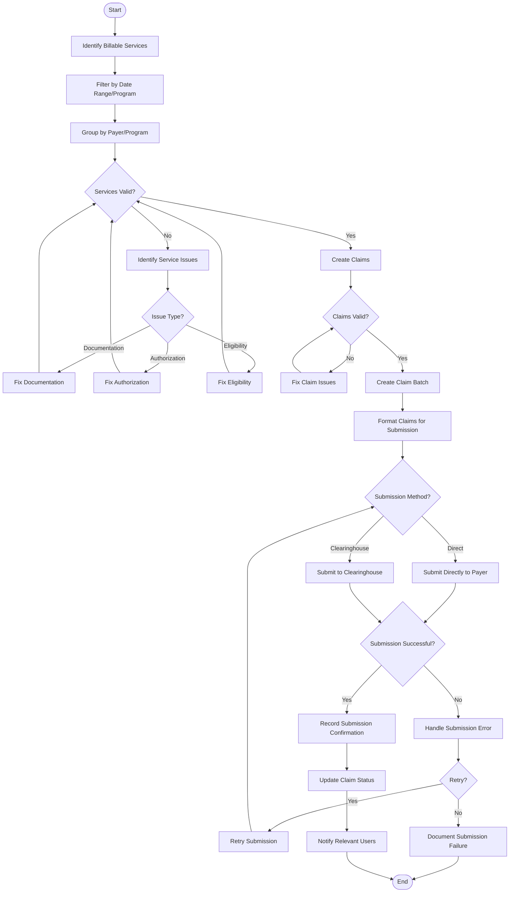
```mermaid
flowchart TD
    Start([Start]) --> IdentifyServices[Identify Billable Services]
    IdentifyServices --> FilterServices[Filter by Date Range/Program]
    FilterServices --> GroupServices[Group by Payer/Program]
    GroupServices --> ServiceValidation{Services Valid?}
    ServiceValidation -->|No| ServiceIssues[Identify Service Issues]
    ServiceIssues --> IssueType{Issue Type?}
    IssueType -->|Documentation| FixDocumentation[Fix Documentation]
    IssueType -->|Authorization| FixAuthorization[Fix Authorization]
    IssueType -->|Eligibility| FixEligibility[Fix Eligibility]
    FixDocumentation --> ServiceValidation
    FixAuthorization --> ServiceValidation
    FixEligibility --> ServiceValidation
    ServiceValidation -->|Yes| CreateClaims[Create Claims]
    CreateClaims --> ClaimValidation{Claims Valid?}
    ClaimValidation -->|No| FixClaims[Fix Claim Issues]
    FixClaims --> ClaimValidation
    ClaimValidation -->|Yes| BatchClaims[Create Claim Batch]
    BatchClaims --> FormatClaims[Format Claims for Submission]
    FormatClaims --> SubmissionMethod{Submission Method?}
    SubmissionMethod -->|Direct| DirectSubmit[Submit Directly to Payer]
    SubmissionMethod -->|Clearinghouse| ClearinghouseSubmit[Submit to Clearinghouse]
    DirectSubmit --> SubmissionStatus{Submission Successful?}
    ClearinghouseSubmit --> SubmissionStatus
    SubmissionStatus -->|No| SubmissionError[Handle Submission Error]
    SubmissionError --> RetryDecision{Retry?}
    RetryDecision -->|Yes| RetrySubmission[Retry Submission]
    RetrySubmission --> SubmissionMethod
    RetryDecision -->|No| DocumentFailure[Document Submission Failure]
    DocumentFailure --> End([End])
    SubmissionStatus -->|Yes| RecordConfirmation[Record Submission Confirmation]
    RecordConfirmation --> UpdateClaimStatus[Update Claim Status]
    UpdateClaimStatus --> NotifyUsers[Notify Relevant Users]
    NotifyUsers --> End
```

**Validation Rules for Billing Workflow:**

| Step | Business Rules | Data Validation | Authorization Checkpoints | Compliance Checks |
| --- | --- | --- | --- | --- |
| Identify Services | Services must be within billing period | Service data must be complete | User must have billing rights | Services must be authorized and documented |
| Create Claims | Services must be grouped by payer rules | Claim data must be complete | User must have claim creation rights | Claims must meet payer requirements |
| Format Claims | Format must match payer specifications | Formatted claims must validate | User must have submission rights | Format must comply with HIPAA standards |
| Submit Claims | Claims must be in valid status for submission | Submission data must be complete | User must have submission rights | Submission must follow security protocols |
| Record Confirmation | Confirmation must be documented | Confirmation data must be valid | User must have confirmation rights | Confirmation must be stored for audit purposes |

### 4.3 TECHNICAL IMPLEMENTATION

#### 4.3.1 State Management

**Claim State Transition Diagram**

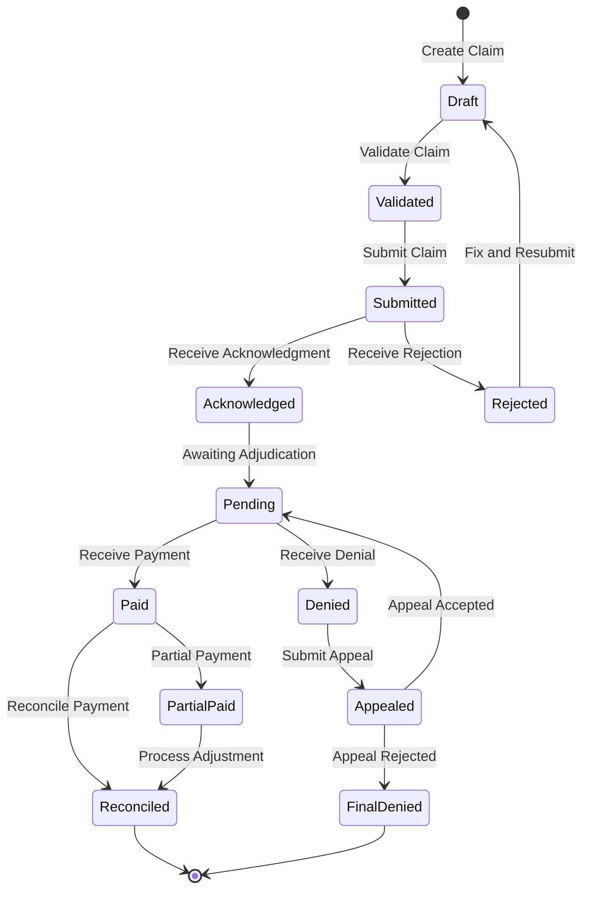
```mermaid
stateDiagram-v2
    [*] --> Draft: Create Claim
    Draft --> Validated: Validate Claim
    Validated --> Submitted: Submit Claim
    Submitted --> Acknowledged: Receive Acknowledgment
    Submitted --> Rejected: Receive Rejection
    Rejected --> Draft: Fix and Resubmit
    Acknowledged --> Pending: Awaiting Adjudication
    Pending --> Denied: Receive Denial
    Pending --> Paid: Receive Payment
    Denied --> Appealed: Submit Appeal
    Appealed --> Pending: Appeal Accepted
    Appealed --> FinalDenied: Appeal Rejected
    Paid --> Reconciled: Reconcile Payment
    Paid --> PartialPaid: Partial Payment
    PartialPaid --> Reconciled: Process Adjustment
    Reconciled --> [*]
    FinalDenied --> [*]
```

**Data Persistence Points:**

| State Transition | Data Persistence | Caching Requirements | Transaction Boundary |
| --- | --- | --- | --- |
| Draft to Validated | Save validation results | Cache validation rules | Single transaction |
| Validated to Submitted | Save submission details | Cache submission data | Start of submission transaction |
| Submitted to Acknowledged | Save acknowledgment | No caching needed | End of submission transaction |
| Pending to Paid/Denied | Save adjudication details | No caching needed | Start of payment transaction |
| Paid to Reconciled | Save reconciliation details | Cache payment matching rules | End of payment transaction |

#### 4.3.2 Error Handling

**Claim Submission Error Handling**

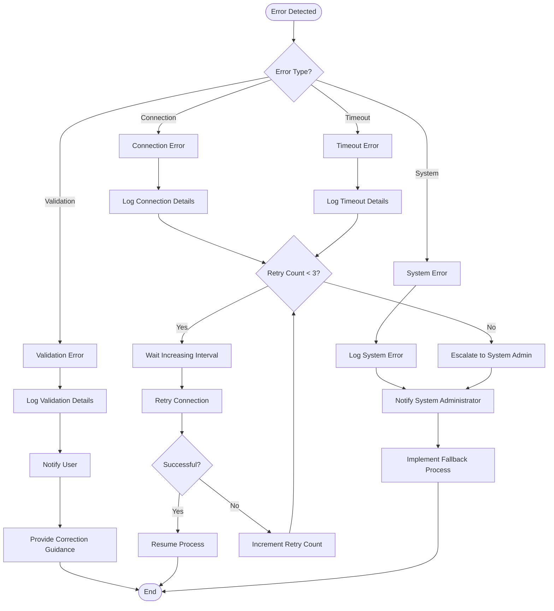
```mermaid
flowchart TD
    Start([Error Detected]) --> ErrorType{Error Type?}
    ErrorType -->|Validation| ValidationError[Validation Error]
    ErrorType -->|Connection| ConnectionError[Connection Error]
    ErrorType -->|Timeout| TimeoutError[Timeout Error]
    ErrorType -->|System| SystemError[System Error]
    ValidationError --> LogValidation[Log Validation Details]
    LogValidation --> NotifyUser[Notify User]
    NotifyUser --> ProvideGuidance[Provide Correction Guidance]
    ProvideGuidance --> End([End])
    ConnectionError --> LogConnection[Log Connection Details]
    LogConnection --> RetryAttempt{Retry Count < 3?}
    RetryAttempt -->|Yes| WaitInterval[Wait Increasing Interval]
    WaitInterval --> RetryConnection[Retry Connection]
    RetryConnection --> RetrySuccess{Successful?}
    RetrySuccess -->|Yes| ResumeProcess[Resume Process]
    ResumeProcess --> End
    RetrySuccess -->|No| IncrementCount[Increment Retry Count]
    IncrementCount --> RetryAttempt
    RetryAttempt -->|No| EscalateIssue[Escalate to System Admin]
    TimeoutError --> LogTimeout[Log Timeout Details]
    LogTimeout --> RetryAttempt
    SystemError --> LogSystem[Log System Error]
    LogSystem --> NotifyAdmin[Notify System Administrator]
    NotifyAdmin --> ImplementFallback[Implement Fallback Process]
    ImplementFallback --> End
    EscalateIssue --> NotifyAdmin
```

**Payment Processing Error Handling**

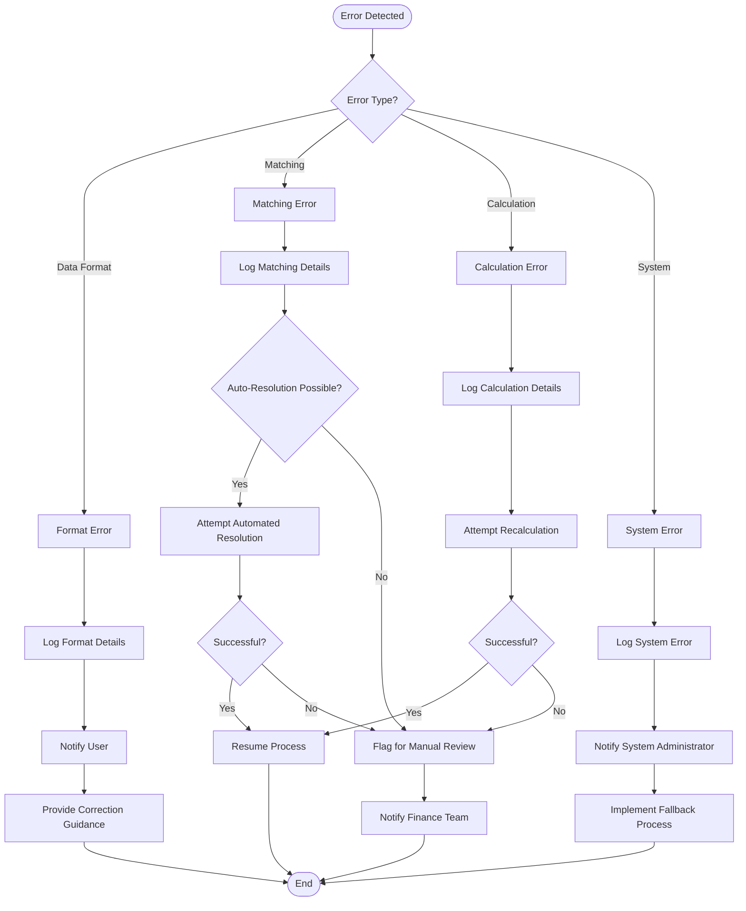
```mermaid
flowchart TD
    Start([Error Detected]) --> ErrorType{Error Type?}
    ErrorType -->|Data Format| FormatError[Format Error]
    ErrorType -->|Matching| MatchingError[Matching Error]
    ErrorType -->|Calculation| CalculationError[Calculation Error]
    ErrorType -->|System| SystemError[System Error]
    FormatError --> LogFormat[Log Format Details]
    LogFormat --> NotifyUser[Notify User]
    NotifyUser --> ProvideGuidance[Provide Correction Guidance]
    ProvideGuidance --> End([End])
    MatchingError --> LogMatching[Log Matching Details]
    LogMatching --> AutoRetry{Auto-Resolution Possible?}
    AutoRetry -->|Yes| AttemptResolution[Attempt Automated Resolution]
    AttemptResolution --> ResolutionSuccess{Successful?}
    ResolutionSuccess -->|Yes| ResumeProcess[Resume Process]
    ResumeProcess --> End
    ResolutionSuccess -->|No| FlagForReview[Flag for Manual Review]
    AutoRetry -->|No| FlagForReview
    FlagForReview --> NotifyFinance[Notify Finance Team]
    NotifyFinance --> End
    CalculationError --> LogCalculation[Log Calculation Details]
    LogCalculation --> RecalculateAttempt[Attempt Recalculation]
    RecalculateAttempt --> RecalcSuccess{Successful?}
    RecalcSuccess -->|Yes| ResumeProcess
    RecalcSuccess -->|No| FlagForReview
    SystemError --> LogSystem[Log System Error]
    LogSystem --> NotifyAdmin[Notify System Administrator]
    NotifyAdmin --> ImplementFallback[Implement Fallback Process]
    ImplementFallback --> End
```

### 4.4 REQUIRED DIAGRAMS

#### 4.4.1 High-Level System Workflow

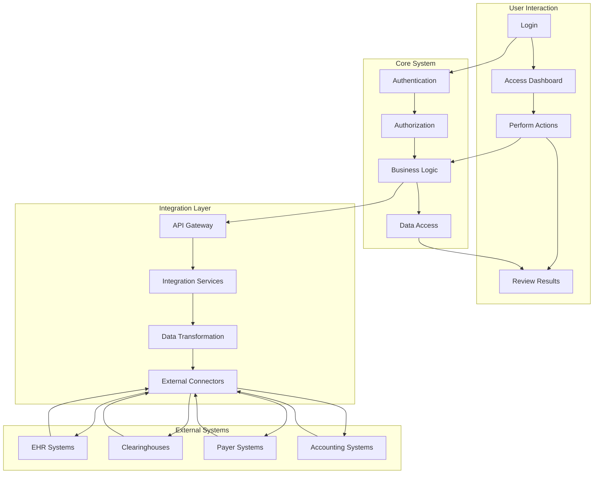
```mermaid
flowchart TD
    subgraph User["User Interaction"]
        U1[Login] --> U2[Access Dashboard]
        U2 --> U3[Perform Actions]
        U3 --> U4[Review Results]
    end
    
    subgraph Core["Core System"]
        C1[Authentication] --> C2[Authorization]
        C2 --> C3[Business Logic]
        C3 --> C4[Data Access]
    end
    
    subgraph Integration["Integration Layer"]
        I1[API Gateway] --> I2[Integration Services]
        I2 --> I3[Data Transformation]
        I3 --> I4[External Connectors]
    end
    
    subgraph External["External Systems"]
        E1[EHR Systems] 
        E2[Clearinghouses]
        E3[Payer Systems]
        E4[Accounting Systems]
    end
    
    U1 --> C1
    U3 --> C3
    C4 --> U4
    C3 --> I1
    I4 --> E1
    I4 --> E2
    I4 --> E3
    I4 --> E4
    E1 --> I4
    E2 --> I4
    E3 --> I4
    E4 --> I4
```

#### 4.4.2 Detailed Process Flow: Revenue Cycle Management

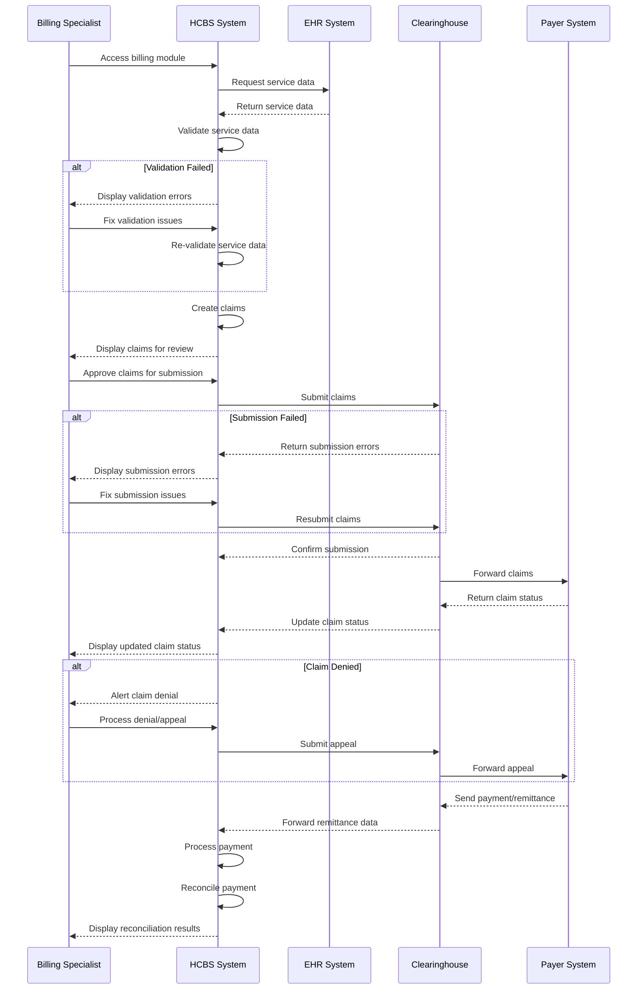
```mermaid
sequenceDiagram
    participant User as Billing Specialist
    participant System as HCBS System
    participant EHR as EHR System
    participant CH as Clearinghouse
    participant Payer as Payer System
    
    User->>System: Access billing module
    System->>EHR: Request service data
    EHR-->>System: Return service data
    System->>System: Validate service data
    
    alt Validation Failed
        System-->>User: Display validation errors
        User->>System: Fix validation issues
        System->>System: Re-validate service data
    end
    
    System->>System: Create claims
    System-->>User: Display claims for review
    User->>System: Approve claims for submission
    System->>CH: Submit claims
    
    alt Submission Failed
        CH-->>System: Return submission errors
        System-->>User: Display submission errors
        User->>System: Fix submission issues
        System->>CH: Resubmit claims
    end
    
    CH-->>System: Confirm submission
    CH->>Payer: Forward claims
    Payer-->>CH: Return claim status
    CH-->>System: Update claim status
    System-->>User: Display updated claim status
    
    alt Claim Denied
        System-->>User: Alert claim denial
        User->>System: Process denial/appeal
        System->>CH: Submit appeal
        CH->>Payer: Forward appeal
    end
    
    Payer-->>CH: Send payment/remittance
    CH-->>System: Forward remittance data
    System->>System: Process payment
    System->>System: Reconcile payment
    System-->>User: Display reconciliation results
```

#### 4.4.3 Error Handling Flowchart: Integration Errors

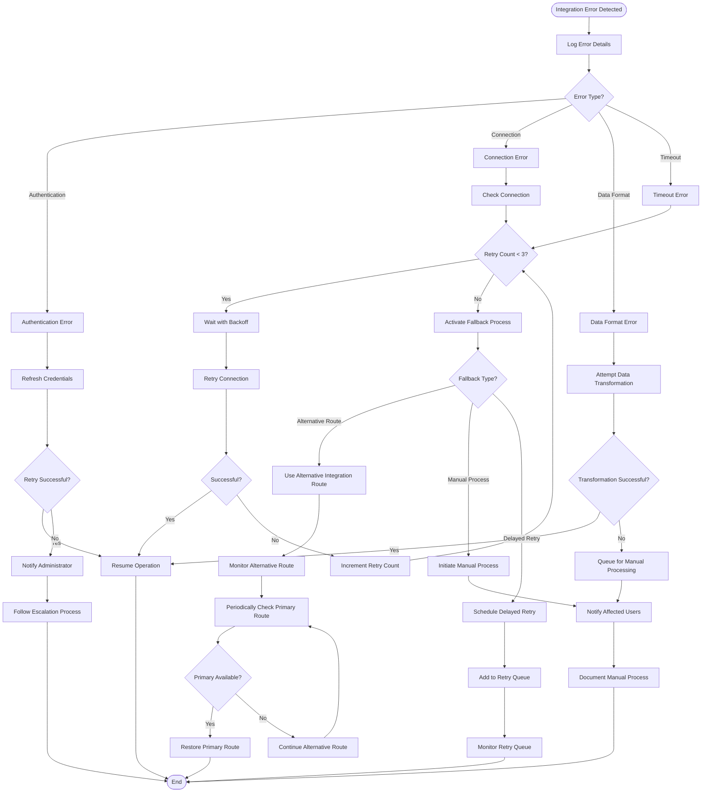
```mermaid
flowchart TD
    Start([Integration Error Detected]) --> LogError[Log Error Details]
    LogError --> ErrorType{Error Type?}
    
    ErrorType -->|Authentication| AuthError[Authentication Error]
    AuthError --> RefreshCreds[Refresh Credentials]
    RefreshCreds --> RetryAuth{Retry Successful?}
    RetryAuth -->|Yes| ResumeOp[Resume Operation]
    RetryAuth -->|No| NotifyAdmin[Notify Administrator]
    
    ErrorType -->|Connection| ConnError[Connection Error]
    ConnError --> CheckConn[Check Connection]
    CheckConn --> RetryConn{Retry Count < 3?}
    RetryConn -->|Yes| WaitBackoff[Wait with Backoff]
    WaitBackoff --> AttemptConn[Retry Connection]
    AttemptConn --> ConnSuccess{Successful?}
    ConnSuccess -->|Yes| ResumeOp
    ConnSuccess -->|No| IncrementRetry[Increment Retry Count]
    IncrementRetry --> RetryConn
    RetryConn -->|No| ActivateFallback[Activate Fallback Process]
    
    ErrorType -->|Data Format| FormatError[Data Format Error]
    FormatError --> AttemptTransform[Attempt Data Transformation]
    AttemptTransform --> TransformSuccess{Transformation Successful?}
    TransformSuccess -->|Yes| ResumeOp
    TransformSuccess -->|No| QueueManual[Queue for Manual Processing]
    
    ErrorType -->|Timeout| TimeoutError[Timeout Error]
    TimeoutError --> RetryConn
    
    NotifyAdmin --> EscalationProcess[Follow Escalation Process]
    ActivateFallback --> FallbackType{Fallback Type?}
    FallbackType -->|Alternative Route| UseAltRoute[Use Alternative Integration Route]
    FallbackType -->|Manual Process| InitiateManual[Initiate Manual Process]
    FallbackType -->|Delayed Retry| ScheduleRetry[Schedule Delayed Retry]
    
    UseAltRoute --> MonitorAlt[Monitor Alternative Route]
    InitiateManual --> NotifyUsers[Notify Affected Users]
    ScheduleRetry --> AddToQueue[Add to Retry Queue]
    
    MonitorAlt --> CheckPrimary[Periodically Check Primary Route]
    NotifyUsers --> DocumentProcess[Document Manual Process]
    AddToQueue --> MonitorQueue[Monitor Retry Queue]
    
    CheckPrimary --> PrimaryStatus{Primary Available?}
    PrimaryStatus -->|Yes| RestorePrimary[Restore Primary Route]
    PrimaryStatus -->|No| ContinueAlt[Continue Alternative Route]
    
    RestorePrimary --> End([End])
    ContinueAlt --> CheckPrimary
    DocumentProcess --> End
    MonitorQueue --> End
    QueueManual --> NotifyUsers
    ResumeOp --> End
    EscalationProcess --> End
```

#### 4.4.4 Integration Sequence Diagram: Payment Processing

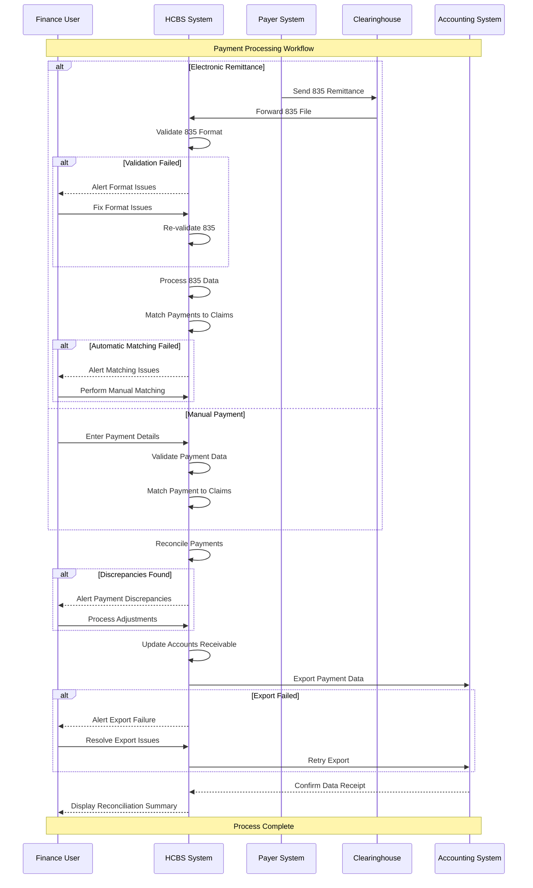
```mermaid
sequenceDiagram
    participant User as Finance User
    participant System as HCBS System
    participant Payer as Payer System
    participant CH as Clearinghouse
    participant Acct as Accounting System
    
    Note over User,Acct: Payment Processing Workflow
    
    alt Electronic Remittance
        Payer->>CH: Send 835 Remittance
        CH->>System: Forward 835 File
        System->>System: Validate 835 Format
        
        alt Validation Failed
            System-->>User: Alert Format Issues
            User->>System: Fix Format Issues
            System->>System: Re-validate 835
        end
        
        System->>System: Process 835 Data
        System->>System: Match Payments to Claims
        
        alt Automatic Matching Failed
            System-->>User: Alert Matching Issues
            User->>System: Perform Manual Matching
        end
    else Manual Payment
        User->>System: Enter Payment Details
        System->>System: Validate Payment Data
        System->>System: Match Payment to Claims
    end
    
    System->>System: Reconcile Payments
    
    alt Discrepancies Found
        System-->>User: Alert Payment Discrepancies
        User->>System: Process Adjustments
    end
    
    System->>System: Update Accounts Receivable
    System->>Acct: Export Payment Data
    
    alt Export Failed
        System-->>User: Alert Export Failure
        User->>System: Resolve Export Issues
        System->>Acct: Retry Export
    end
    
    Acct-->>System: Confirm Data Receipt
    System-->>User: Display Reconciliation Summary
    
    Note over User,Acct: Process Complete
```

#### 4.4.5 State Transition Diagram: Service to Payment

```mermaid
stateDiagram-v2
    [*] --> ServiceDelivered: Service Provided
    
    state "Service Documentation" as ServiceDoc {
        [*] --> Incomplete: Initial Documentation
        Incomplete --> Complete: Documentation Finished
        Complete --> Validated: Documentation Validated
        Validated --> [*]
    }
    
    ServiceDelivered --> ServiceDoc
    
    ServiceDoc --> BillableService: Documentation Complete
    BillableService --> ClaimCreated: Service Added to Claim
    
    state "Claim Processing" as ClaimProc {
        [*] --> Draft: Initial Creation
        Draft --> Validated: Validation Passed
        Validated --> Submitted: Submitted to Payer
        Submitted --> Pending: Acknowledged by Payer
        Pending --> Paid: Payment Received
        Pending --> Denied: Claim Denied
        Denied --> Appealed: Appeal Submitted
        Appealed --> Pending: Appeal Accepted
    }
    
    ClaimCreated --> ClaimProc
    
    state "Payment Processing" as PaymentProc {
        [*] --> Received: Payment Received
        Received --> Matched: Matched to Claim
        Matched --> Reconciled: Payment Reconciled
        Reconciled --> Posted: Posted to Accounting
        Posted --> [*]
    }
    
    ClaimProc --> PaymentProc: Claim Paid
    
    PaymentProc --> [*]: Process Complete
```

## 5. SYSTEM ARCHITECTURE

### 5.1 HIGH-LEVEL ARCHITECTURE

#### 5.1.1 System Overview

The HCBS Revenue Management System employs a multi-tier architecture with a clear separation of concerns to support the complex financial workflows required by HCBS providers. The system follows a modular, service-oriented approach with the following key characteristics:

- **Architectural Style**: The system implements a layered architecture with a React-based presentation layer, a business logic layer, and a data access layer. This separation enables independent scaling and maintenance of each layer.

- **Key Architectural Principles**:

  - Separation of concerns for maintainability and testability
  - Stateless services where possible to support horizontal scaling
  - Domain-driven design for the complex financial domain
  - API-first approach for integration flexibility
  - Event-driven architecture for asynchronous processing of financial transactions

- **System Boundaries**:

  - Frontend boundary: Browser-based UI accessible via web browsers
  - Backend boundary: RESTful APIs for internal and external consumption
  - Integration boundary: Secure interfaces with EHR systems, clearinghouses, and accounting systems
  - Data boundary: Encrypted data storage with strict access controls

- **Major Interfaces**:

  - User interface for financial staff and administrators
  - API interfaces for external system integration
  - Batch processing interfaces for claims and payment reconciliation
  - Reporting interfaces for financial analysis

#### 5.1.2 Core Components Table

| Component Name | Primary Responsibility | Key Dependencies | Critical Considerations |
| --- | --- | --- | --- |
| User Interface | Provide interactive dashboard, forms, and reports | React, Next.js, Material UI | Accessibility, responsive design, performance |
| Authentication Service | Manage user identity and access | Auth provider, user database | Security, compliance, MFA support |
| Claims Management | Process and track claims lifecycle | Validation service, integration service | Data integrity, state management |
| Billing Service | Convert services to billable claims | EHR integration, validation rules | Compliance with billing standards |
| Payment Processing | Reconcile payments with claims | Payment gateway, accounting integration | Transaction integrity, audit trail |
| Reporting Engine | Generate financial reports and analytics | Data warehouse, visualization library | Performance with large datasets |
| Integration Service | Connect with external systems | API gateways, transformation service | Security, reliability, error handling |
| Data Access Layer | Manage database operations | Database, caching service | Performance, data consistency |

#### 5.1.3 Data Flow Description

The HCBS Revenue Management System processes data through several key flows that support the revenue cycle:

1. **Service to Claim Flow**: Service data enters the system either through manual entry or EHR integration. This data is validated against documentation requirements and authorization limits before being transformed into billable claims. The claims are then validated against payer-specific rules before submission.

2. **Claim Processing Flow**: Submitted claims flow through status tracking as they move from submitted to acknowledged, pending, and finally to paid or denied status. Status updates are received through clearinghouse integrations or manual updates, triggering notifications and dashboard updates.

3. **Payment Reconciliation Flow**: Payment data enters the system through 835 remittance files or manual entry. The system matches payments to claims using intelligent matching algorithms, identifies discrepancies, and updates accounts receivable accordingly.

4. **Reporting Flow**: Financial data from claims, payments, and reconciliation processes flows into the reporting engine, where it is aggregated, analyzed, and presented through dashboards and reports. This data may be further exported to accounting systems.

Key data stores include the transactional database for claims and payments, document storage for supporting documentation, and a reporting data warehouse for analytics. Caching is employed at the API layer and for frequently accessed reports to improve performance.

#### 5.1.4 External Integration Points

| System Name | Integration Type | Data Exchange Pattern | Protocol/Format | SLA Requirements |
| --- | --- | --- | --- | --- |
| EHR/EMR Systems | Bidirectional API | Request/Response, Batch | REST, HL7, FHIR | 99.5% uptime, \<2s response |
| Clearinghouses | Bidirectional API | Request/Response, Batch | SOAP/REST, EDI 837/835 | 99.9% uptime, \<5s response |
| Medicaid Portals | Unidirectional Push/Pull | Batch, Polling | SFTP, EDI 837/835 | 99% uptime, 24hr processing |
| Accounting Systems | Bidirectional API | Request/Response, Batch | REST, CSV | 99% uptime, \<3s response |

### 5.2 COMPONENT DETAILS

#### 5.2.1 User Interface Component

- **Purpose**: Provide an intuitive, responsive interface for users to manage revenue cycle operations
- **Technologies**: Next.js, React, Material UI, Chart.js, D3.js
- **Key Interfaces**:
  - Dashboard interface for financial metrics
  - Claims management interface
  - Payment reconciliation interface
  - Reporting and analytics interface
- **Data Persistence**: Client-side state management with Redux Toolkit, browser caching for performance
- **Scaling Considerations**: Server-side rendering for initial load performance, code splitting for optimized bundle sizes

```mermaid
flowchart TD
    subgraph "User Interface Layer"
        A[Dashboard Module] --> B[UI Component Library]
        C[Claims Management UI] --> B
        D[Billing Workflow UI] --> B
        E[Payment Reconciliation UI] --> B
        F[Reporting UI] --> B
        B --> G[State Management]
        G --> H[API Client]
    end
    H --> I[Backend APIs]
```

#### 5.2.2 Claims Management Component

- **Purpose**: Manage the entire lifecycle of claims from creation through adjudication
- **Technologies**: Node.js, Express, TypeScript
- **Key Interfaces**:
  - Claim creation API
  - Claim validation API
  - Claim submission API
  - Claim status tracking API
- **Data Persistence**: Transactional database with claim history and audit trail
- **Scaling Considerations**: Horizontal scaling for batch processing, caching of validation rules

```mermaid
stateDiagram-v2
    [*] --> Draft: Create
    Draft --> Validated: Validate
    Validated --> Submitted: Submit
    Submitted --> Acknowledged: Receive Ack
    Acknowledged --> Pending: Process
    Pending --> Paid: Payment
    Pending --> Denied: Denial
    Denied --> Appealed: Appeal
    Appealed --> Pending: Review
    Paid --> Reconciled: Reconcile
    Reconciled --> [*]
```

#### 5.2.3 Payment Processing Component

- **Purpose**: Process incoming payments and reconcile with submitted claims
- **Technologies**: Node.js, Express, TypeScript
- **Key Interfaces**:
  - Remittance processing API
  - Payment matching API
  - Adjustment processing API
  - Accounts receivable API
- **Data Persistence**: Transactional database with payment history and reconciliation audit trail
- **Scaling Considerations**: Asynchronous processing for large remittance files, optimized matching algorithms

```mermaid
sequenceDiagram
    participant System as HCBS System
    participant CH as Clearinghouse
    participant DB as Database
    
    CH->>System: Send 835 Remittance
    System->>System: Validate Format
    System->>DB: Store Remittance Data
    System->>System: Match Payments to Claims
    alt Automatic Match Successful
        System->>DB: Update Claim Status
        System->>DB: Update AR Balance
    else Match Failed
        System->>System: Queue for Manual Review
    end
    System->>System: Generate Reconciliation Report
```

#### 5.2.4 Integration Service Component

- **Purpose**: Facilitate secure, reliable data exchange with external systems
- **Technologies**: Node.js, Express, TypeScript, Message Queue
- **Key Interfaces**:
  - EHR integration API
  - Clearinghouse integration API
  - Accounting system integration API
  - File import/export API
- **Data Persistence**: Transaction logs, integration state, retry queues
- **Scaling Considerations**: Message queues for asynchronous processing, circuit breakers for external system failures

```mermaid
flowchart TD
    subgraph "Integration Service"
        A[API Gateway] --> B[Authentication/Authorization]
        B --> C[Transformation Service]
        C --> D[Protocol Adapters]
        D --> E1[EHR Adapter]
        D --> E2[Clearinghouse Adapter]
        D --> E3[Accounting Adapter]
        D --> E4[File Adapter]
        F[Retry Queue] --> D
        G[Circuit Breaker] --> D
    end
    E1 --> H1[EHR Systems]
    E2 --> H2[Clearinghouses]
    E3 --> H3[Accounting Systems]
    E4 --> H4[File Storage]
```

#### 5.2.5 Reporting Engine Component

- **Purpose**: Generate financial reports and analytics for business intelligence
- **Technologies**: Node.js, Express, TypeScript, SQL, Chart.js
- **Key Interfaces**:
  - Standard report API
  - Custom report API
  - Dashboard metrics API
  - Export API
- **Data Persistence**: Reporting database/data warehouse, report templates, cached reports
- **Scaling Considerations**: Background processing for complex reports, materialized views for common queries

```mermaid
flowchart TD
    subgraph "Reporting Engine"
        A[Report Definition Service] --> B[Query Builder]
        B --> C[Data Access Layer]
        C --> D[Database]
        A --> E[Report Renderer]
        E --> F[Format Converter]
        G[Scheduling Service] --> A
        H[Caching Service] --> E
    end
    F --> I[PDF]
    F --> J[Excel]
    F --> K[CSV]
    F --> L[JSON]
```

### 5.3 TECHNICAL DECISIONS

#### 5.3.1 Architecture Style Decisions

| Decision Area | Selected Approach | Alternatives Considered | Rationale |
| --- | --- | --- | --- |
| Overall Architecture | Layered with Service Orientation | Microservices, Monolith | Balance of separation of concerns with development simplicity |
| Frontend Architecture | Server-side Rendering with Next.js | SPA, Traditional MVC | Performance benefits for initial load, SEO capabilities |
| API Design | RESTful with JSON | GraphQL, SOAP | Broad compatibility, simplicity, and developer familiarity |
| Processing Model | Hybrid Sync/Async | Fully Synchronous, Event Sourcing | Balance of immediate feedback with scalable processing |

The layered architecture with service orientation was selected to provide clear separation of concerns while avoiding the operational complexity of a full microservices approach. This approach allows for independent scaling of components while maintaining a cohesive codebase that is easier to develop and maintain.

Server-side rendering with Next.js was chosen for the frontend to optimize initial page load performance, which is critical for financial dashboards with complex data visualization. This approach also provides better SEO capabilities and accessibility compared to pure single-page applications.

```mermaid
flowchart TD
    A[Architecture Decision] --> B{Complexity vs Scalability}
    B -->|High Complexity, High Scalability| C[Microservices]
    B -->|Medium Complexity, Medium Scalability| D[Service-Oriented]
    B -->|Low Complexity, Low Scalability| E[Monolith]
    D --> F[Selected Approach]
    A --> G{Development Speed vs Performance}
    G -->|High Performance, Lower Dev Speed| H[Server-side Rendering]
    G -->|Medium Performance, Medium Dev Speed| I[Hybrid Rendering]
    G -->|Lower Performance, Higher Dev Speed| J[Client-side Rendering]
    H --> K[Selected Approach]
```

#### 5.3.2 Data Storage Solution Rationale

| Data Type | Selected Solution | Alternatives Considered | Rationale |
| --- | --- | --- | --- |
| Transactional Data | PostgreSQL | MySQL, MongoDB | ACID compliance, complex query support, JSON capabilities |
| Document Storage | Amazon S3 | File System, Database BLOBs | Scalability, durability, cost-effectiveness |
| Caching | Redis | Memcached, In-memory | Data structure support, persistence options, pub/sub capabilities |
| Search | Elasticsearch | Database Indexing, Solr | Performance for complex searches, analytics capabilities |

PostgreSQL was selected as the primary database due to its robust support for complex financial transactions, strong data integrity features, and ability to handle both structured data and JSON documents. This flexibility is important for supporting the varied data models required by different HCBS programs and payers.

Document storage on Amazon S3 provides a scalable, cost-effective solution for storing supporting documentation such as service notes and remittance advice files. The separation of document storage from transactional data improves database performance while maintaining secure access to documents.

```mermaid
flowchart TD
    A[Data Storage Decision] --> B{Data Characteristics}
    B -->|Transactional, Relational| C[RDBMS Options]
    B -->|Document-oriented, Unstructured| D[Document Storage Options]
    B -->|Temporary, Frequent Access| E[Caching Options]
    C --> F{RDBMS Selection}
    F -->|Complex Queries, ACID, JSON Support| G[PostgreSQL]
    F -->|Simpler Schema, Widespread Use| H[MySQL]
    G --> I[Selected for Transactional Data]
    D --> J{Document Storage Selection}
    J -->|Scalability, Durability, Cost| K[Amazon S3]
    J -->|Simplicity, Local Control| L[File System]
    K --> M[Selected for Document Storage]
```

#### 5.3.3 Caching Strategy Justification

| Cache Type | Implementation | Purpose | Invalidation Strategy |
| --- | --- | --- | --- |
| API Response Cache | Redis | Reduce database load for common queries | Time-based + explicit invalidation |
| Session Cache | Redis | Store user session data | Time-based with sliding expiration |
| UI Component Cache | Browser + CDN | Improve UI performance | Version-based cache busting |
| Validation Rules Cache | In-memory + Redis | Speed up claim validation | Event-based on rule changes |

The caching strategy employs multiple layers to optimize performance while ensuring data consistency. API response caching reduces database load for frequently requested data such as reference data and dashboard metrics. Session caching improves authentication performance while maintaining security.

Validation rules caching is particularly important for the claim validation process, which is computationally intensive and requires checking against numerous payer-specific rules. By caching these rules, validation performance is significantly improved without sacrificing accuracy.

### 5.4 CROSS-CUTTING CONCERNS

#### 5.4.1 Monitoring and Observability Approach

The HCBS Revenue Management System implements a comprehensive monitoring and observability strategy to ensure system health, performance, and security:

- **Application Performance Monitoring**: New Relic is used to track application performance, including response times, error rates, and resource utilization.

- **Real-time Metrics**: Key business and technical metrics are collected and displayed in operational dashboards, including:

  - Claim processing rates and success/failure metrics
  - Payment reconciliation rates and exceptions
  - API response times and error rates
  - Database performance metrics

- **Health Checks**: All critical services implement health check endpoints that are regularly polled to verify system status.

- **Alerting**: Automated alerts are configured for:

  - Service availability issues
  - Performance degradation beyond thresholds
  - Security events and anomalies
  - Business process failures (e.g., failed batch submissions)

#### 5.4.2 Logging and Tracing Strategy

| Log Type | Content | Storage | Retention |
| --- | --- | --- | --- |
| Application Logs | Errors, warnings, info events | Centralized logging service | 90 days |
| Audit Logs | User actions, data changes | Secure database | 7 years |
| Security Logs | Authentication, authorization events | Secure database | 1 year |
| Integration Logs | External system interactions | Centralized logging service | 180 days |

The system implements distributed tracing using unique correlation IDs that flow through all components of a transaction. This enables end-to-end visibility of complex processes like claim submission and payment reconciliation, making it easier to diagnose issues across component boundaries.

Structured logging is employed throughout the system, with standardized log formats that include:

- Timestamp
- Severity level
- Component/service identifier
- Correlation ID
- User context (when applicable)
- Event description
- Relevant data (sanitized of PHI)

#### 5.4.3 Error Handling Patterns

The system implements a consistent error handling strategy across all components:

- **Validation Errors**: Returned to the user with clear messages and suggested corrections
- **Business Rule Violations**: Logged with context and returned with appropriate guidance
- **Integration Failures**: Handled with retry mechanisms and circuit breakers
- **System Errors**: Logged, reported to monitoring, and presented to users with appropriate abstraction

```mermaid
flowchart TD
    A[Error Occurs] --> B{Error Type?}
    B -->|Validation| C[Return Validation Error]
    B -->|Business Rule| D[Return Business Error]
    B -->|Integration| E[Handle Integration Error]
    B -->|System| F[Handle System Error]
    
    C --> G[Log Error Details]
    D --> G
    
    E --> H{Retryable?}
    H -->|Yes| I[Implement Retry with Backoff]
    H -->|No| J[Circuit Breaker Trip]
    I --> K{Retry Successful?}
    K -->|Yes| L[Resume Operation]
    K -->|No| M[Escalate Error]
    J --> M
    
    F --> N[Log Detailed Error]
    F --> O[Send Alert]
    F --> P[Return Generic Error to User]
    
    M --> Q[Log Failure]
    M --> R[Notify Administrator]
    M --> S[Implement Fallback if Available]
```

#### 5.4.4 Authentication and Authorization Framework

The HCBS Revenue Management System implements a robust security framework to protect sensitive healthcare financial data:

- **Authentication**: Multi-factor authentication is supported through integration with Auth0, providing:

  - Username/password authentication
  - SMS or authenticator app second factor
  - SSO options for enterprise customers
  - Password policies compliant with healthcare standards

- **Authorization**: Role-based access control (RBAC) is implemented with the following key roles:

  - Administrator: Full system access
  - Financial Manager: Access to financial reports and dashboards
  - Billing Specialist: Access to claims and billing functions
  - Program Manager: Limited access to program-specific data
  - Read-only User: View-only access to reports and dashboards

- **Session Management**: Secure session handling with:

  - Short session timeouts (15 minutes of inactivity)
  - Secure, HTTP-only cookies
  - Session invalidation on password change
  - Concurrent session limitations

- **API Security**: All APIs are secured with:

  - OAuth 2.0 token-based authentication
  - Rate limiting to prevent abuse
  - Input validation to prevent injection attacks
  - Output encoding to prevent XSS

#### 5.4.5 Performance Requirements and SLAs

| Component | Performance Metric | Target SLA |
| --- | --- | --- |
| Dashboard Loading | Time to interactive | \< 3 seconds |
| Claim Validation | Processing time per claim | \< 2 seconds |
| Batch Claim Submission | Processing time for 100 claims | \< 60 seconds |
| Payment Reconciliation | Processing time for standard 835 file | \< 5 minutes |
| Standard Report Generation | Time to generate | \< 10 seconds |
| API Response Time | 95th percentile | \< 500ms |
| System Availability | Uptime | 99.9% during business hours |

The system is designed to handle the following load characteristics:

- Concurrent users: 50-100 typical, 200 peak
- Daily claim volume: Up to 10,000
- Monthly payment transactions: Up to 50,000
- Document storage: Up to 1TB with 50GB monthly growth

#### 5.4.6 Disaster Recovery Procedures

The HCBS Revenue Management System implements a comprehensive disaster recovery strategy:

- **Backup Strategy**:

  - Database: Full daily backups with hourly transaction log backups
  - Document storage: Continuous replication to secondary region
  - Configuration: Version-controlled and backed up with infrastructure

- **Recovery Time Objectives (RTO)**:

  - Critical functions: 4 hours
  - Non-critical functions: 24 hours

- **Recovery Point Objectives (RPO)**:

  - Database: 1 hour maximum data loss
  - Document storage: 15 minutes maximum data loss

- **Failover Approach**:

  - Database: Standby replica in secondary region
  - Application: Blue-green deployment with rapid switching
  - Load balancing: Automatic health checks and rerouting

- **Testing Schedule**:

  - Backup restoration testing: Monthly
  - Full DR simulation: Quarterly
  - Failover testing: Semi-annually

## 6. SYSTEM COMPONENTS DESIGN

### 6.1 FRONTEND COMPONENTS

#### 6.1.1 Component Hierarchy

```mermaid
graph TD
    A[App] --> B[Layout]
    B --> C[Navigation]
    B --> D[Main Content Area]
    B --> E[Footer]
    
    D --> F[Dashboard]
    D --> G[Claims Management]
    D --> H[Billing Workflow]
    D --> I[Payment Reconciliation]
    D --> J[Financial Reporting]
    D --> K[Administration]
    
    F --> F1[Financial Overview]
    F --> F2[Revenue Metrics]
    F --> F3[Claims Status]
    F --> F4[Alerts]
    
    G --> G1[Claims List]
    G --> G2[Claim Detail]
    G --> G3[Claim Creation]
    G --> G4[Batch Processing]
    
    H --> H1[Service Review]
    H --> H2[Documentation Validation]
    H --> H3[Claim Generation]
    H --> H4[Submission Management]
    
    I --> I1[Payment List]
    I --> I2[Remittance Processing]
    I --> I3[Payment Matching]
    I --> I4[Reconciliation]
    
    J --> J1[Standard Reports]
    J --> J2[Custom Reports]
    J --> J3[Scheduled Reports]
    J --> J4[Export Management]
    
    K --> K1[User Management]
    K --> K2[Role Management]
    K --> K3[System Configuration]
    K --> K4[Integration Settings]
```

#### 6.1.2 Reusable UI Components

| Component | Description | Props | Usage Locations |
| --- | --- | --- | --- |
| DataTable | Sortable, filterable table with pagination | columns, data, filters, onRowClick | Claims List, Payment List, Reports |
| StatusBadge | Visual indicator for status values | status, type | Claims Status, Payment Status |
| MetricCard | Card displaying a key metric with trend | title, value, trend, icon | Dashboard, Reports |
| FilterPanel | Collapsible panel with filter controls | filters, onFilterChange | All list views |
| ActionButton | Button with icon and optional confirmation | label, icon, action, confirmText | Throughout application |
| DateRangePicker | Control for selecting date ranges | startDate, endDate, onChange | Reports, Dashboard filters |
| FileUploader | Component for file uploads with validation | acceptedTypes, maxSize, onUpload | Remittance Processing, Documentation |
| AlertNotification | Styled alert with severity levels | message, severity, onDismiss | Throughout application |
| SearchInput | Search field with suggestions | placeholder, onSearch, suggestions | All list views |
| TabNavigation | Horizontal tab navigation | tabs, activeTab, onChange | Detail views, Settings |

#### 6.1.3 Page Layouts

**Dashboard Layout**

```mermaid
graph TD
    A[Dashboard Page] --> B[Header with Filters]
    A --> C[Metrics Row]
    A --> D[Revenue Charts Section]
    A --> E[Claims Status Section]
    A --> F[Alerts Section]
    
    B --> B1[Date Range Selector]
    B --> B2[Program Filter]
    B --> B3[Payer Filter]
    B --> B4[Facility Filter]
    
    C --> C1[Total Revenue Metric]
    C --> C2[Outstanding Claims Metric]
    C --> C3[Denial Rate Metric]
    C --> C4[DSO Metric]
    
    D --> D1[Revenue by Program Chart]
    D --> D2[Revenue by Payer Chart]
    D --> D3[Revenue Trend Chart]
    
    E --> E1[Claims by Status Chart]
    E --> E2[Recent Claims Table]
    
    F --> F1[Critical Alerts]
    F --> F2[Warning Alerts]
```

**Claims Management Layout**

```mermaid
graph TD
    A[Claims Management Page] --> B[Action Bar]
    A --> C[Filter Panel]
    A --> D[Claims Table]
    A --> E[Summary Footer]
    
    B --> B1[Create Claim Button]
    B --> B2[Batch Actions]
    B --> B3[Export Button]
    B --> B4[Refresh Button]
    
    C --> C1[Status Filter]
    C --> C2[Date Range Filter]
    C --> C3[Payer Filter]
    C --> C4[Program Filter]
    C --> C5[Search Field]
    
    D --> D1[Claim Number Column]
    D --> D2[Client Column]
    D --> D3[Service Date Column]
    D --> D4[Amount Column]
    D --> D5[Status Column]
    D --> D6[Payer Column]
    D --> D7[Actions Column]
    
    E --> E1[Selected Items Count]
    E --> E2[Total Amount]
    E --> E3[Pagination Controls]
```

**Payment Reconciliation Layout**

```mermaid
graph TD
    A[Payment Reconciliation Page] --> B[Action Bar]
    A --> C[Filter Panel]
    A --> D[Tabs Section]
    
    B --> B1[Import Remittance Button]
    B --> B2[Manual Entry Button]
    B --> B3[Export Button]
    B --> B4[Refresh Button]
    
    C --> C1[Status Filter]
    C --> C2[Date Range Filter]
    C --> C3[Payer Filter]
    C --> C4[Search Field]
    
    D --> D1[Unreconciled Tab]
    D --> D2[Reconciled Tab]
    D --> D3[Exceptions Tab]
    
    D1 --> E1[Unreconciled Payments Table]
    D2 --> E2[Reconciled Payments Table]
    D3 --> E3[Exception Items Table]
    
    E1 --> F1[Payment Details]
    E1 --> F2[Matching Claims]
    E1 --> F3[Reconciliation Actions]
```

### 6.2 BACKEND COMPONENTS

#### 6.2.1 Service Layer Architecture

```mermaid
graph TD
    A[API Controllers] --> B[Service Layer]
    B --> C[Data Access Layer]
    C --> D[Database]
    
    B --> E[Validation Services]
    B --> F[Integration Services]
    B --> G[Business Logic Services]
    B --> H[Utility Services]
    
    E --> E1[Input Validation]
    E --> E2[Business Rule Validation]
    E --> E3[Claim Validation]
    
    F --> F1[EHR Integration]
    F --> F2[Clearinghouse Integration]
    F --> F3[Accounting Integration]
    
    G --> G1[Claim Processing]
    G --> G2[Payment Processing]
    G --> G3[Reporting]
    G --> G4[Dashboard Metrics]
    
    H --> H1[File Processing]
    H --> H2[Notification]
    H --> H3[Scheduling]
    H --> H4[Export Generation]
```

#### 6.2.2 Core Services

| Service | Responsibility | Key Methods | Dependencies |
| --- | --- | --- | --- |
| ClaimService | Manage claim lifecycle | createClaim, validateClaim, submitClaim, updateStatus | ValidationService, IntegrationService |
| PaymentService | Process and reconcile payments | processRemittance, matchPayments, reconcilePayment | ClaimService, AccountingService |
| BillingService | Convert services to claims | generateClaims, validateBilling, submitBatch | ValidationService, ClaimService |
| ReportingService | Generate financial reports | generateReport, scheduleReport, exportReport | DataAccessService, ExportService |
| ValidationService | Validate data and business rules | validateInput, validateClaim, validateService | RuleEngineService |
| IntegrationService | Manage external system integration | sendToEHR, sendToClearinghouse, sendToAccounting | HttpClientService, TransformationService |
| AuthenticationService | Manage user authentication | authenticateUser, validateToken, refreshToken | UserService, TokenService |
| AuthorizationService | Control access to resources | checkPermission, getRolePermissions, validateAccess | UserService, RoleService |
| NotificationService | Send notifications to users | sendAlert, sendEmail, sendInApp | EmailService, PushService |
| FileProcessingService | Handle file imports and exports | processImport, generateExport, validateFile | ValidationService, TransformationService |

#### 6.2.3 API Endpoints Design

**Authentication API**

| Endpoint | Method | Request Body | Response | Description |
| --- | --- | --- | --- | --- |
| /api/auth/login | POST | { username, password } | { token, user } | Authenticate user and return token |
| /api/auth/refresh | POST | { refreshToken } | { token } | Refresh authentication token |
| /api/auth/logout | POST | { token } | { success } | Invalidate authentication token |
| /api/auth/password-reset | POST | { email } | { success } | Initiate password reset process |
| /api/auth/password-reset/confirm | POST | { token, password } | { success } | Complete password reset |

**Claims API**

| Endpoint | Method | Request Body | Response | Description |
| --- | --- | --- | --- | --- |
| /api/claims | GET | - | { claims, pagination } | Get list of claims with pagination |
| /api/claims/:id | GET | - | { claim } | Get claim details by ID |
| /api/claims | POST | { claim } | { claim } | Create new claim |
| /api/claims/:id | PUT | { claim } | { claim } | Update existing claim |
| /api/claims/batch | POST | { claims } | { results } | Process batch of claims |
| /api/claims/:id/submit | POST | - | { result } | Submit claim to payer |
| /api/claims/:id/validate | POST | - | { validationResults } | Validate claim before submission |
| /api/claims/status | GET | - | { statusCounts } | Get counts of claims by status |

**Payment API**

| Endpoint | Method | Request Body | Response | Description |
| --- | --- | --- | --- | --- |
| /api/payments | GET | - | { payments, pagination } | Get list of payments with pagination |
| /api/payments/:id | GET | - | { payment } | Get payment details by ID |
| /api/payments | POST | { payment } | { payment } | Record new payment |
| /api/payments/remittance | POST | { file } | { processingResults } | Process remittance advice file |
| /api/payments/:id/match | POST | { claimIds } | { matchResults } | Match payment to claims |
| /api/payments/:id/reconcile | POST | { reconciliationData } | { result } | Reconcile payment |
| /api/payments/unreconciled | GET | - | { payments } | Get unreconciled payments |

**Reporting API**

| Endpoint | Method | Request Body | Response | Description |
| --- | --- | --- | --- | --- |
| /api/reports/standard/:type | GET | - | { report } | Generate standard report |
| /api/reports/custom | POST | { parameters } | { report } | Generate custom report |
| /api/reports/scheduled | GET | - | { scheduledReports } | Get list of scheduled reports |
| /api/reports/scheduled | POST | { schedule, parameters } | { scheduledReport } | Create scheduled report |
| /api/reports/:id/export/:format | GET | - | File | Export report in specified format |
| /api/reports/dashboard/metrics | GET | - | { metrics } | Get dashboard metrics |

#### 6.2.4 Data Access Layer

```mermaid
graph TD
    A[Data Access Layer] --> B[Repository Pattern]
    B --> C[Entity Framework Core]
    C --> D[Database]
    
    A --> E[Query Objects]
    E --> F[Specification Pattern]
    F --> C
    
    A --> G[Caching Layer]
    G --> H[Redis Cache]
    
    A --> I[Transaction Management]
    I --> C
    
    B --> B1[ClientRepository]
    B --> B2[ClaimRepository]
    B --> B3[PaymentRepository]
    B --> B4[ServiceRepository]
    B --> B5[UserRepository]
    
    E --> E1[ClaimQueries]
    E --> E2[PaymentQueries]
    E --> E3[ReportQueries]
    E --> E4[DashboardQueries]
```

### 6.3 INTEGRATION COMPONENTS

#### 6.3.1 External System Integrations

| Integration | Purpose | Integration Method | Data Flow | Error Handling |
| --- | --- | --- | --- | --- |
| EHR/EMR Systems | Import service data | REST API, FHIR, HL7 | Bidirectional | Retry with exponential backoff, Circuit breaker |
| Clearinghouses | Submit claims, receive status | SOAP/REST API, SFTP for EDI | Bidirectional | Queued retries, Manual intervention |
| Medicaid Portals | Eligibility verification, claim submission | Web API, SFTP for batch files | Bidirectional | Error logging, Alert notifications |
| Accounting Systems | Payment posting, financial reconciliation | REST API, CSV import/export | Bidirectional | Transaction rollback, Reconciliation reports |
| Document Management | Store supporting documentation | REST API, Direct file access | Unidirectional | Retry mechanism, Local caching |

#### 6.3.2 Integration Patterns

```mermaid
graph TD
    A[Integration Service] --> B[Adapter Pattern]
    B --> B1[EHR Adapter]
    B --> B2[Clearinghouse Adapter]
    B --> B3[Accounting Adapter]
    
    A --> C[Transformation Layer]
    C --> C1[Data Mapping]
    C --> C2[Format Conversion]
    
    A --> D[Message Queue]
    D --> D1[Integration Events]
    
    A --> E[Circuit Breaker]
    E --> E1[Failure Detection]
    E --> E2[Fallback Mechanism]
    
    A --> F[Retry Pattern]
    F --> F1[Exponential Backoff]
    F --> F2[Dead Letter Queue]
    
    A --> G[Bulk Synchronization]
    G --> G1[Batch Processing]
    G --> G2[Reconciliation]
```

#### 6.3.3 File Processing Components

| Component | Responsibility | Supported Formats | Processing Steps |
| --- | --- | --- | --- |
| Remittance Processor | Process payment remittance files | 835 EDI, CSV, PDF | Validation, Parsing, Normalization, Storage |
| Claim Submission | Generate claim submission files | 837P EDI, CMS-1500 | Data Collection, Validation, Formatting, Submission |
| Document Importer | Import supporting documentation | PDF, JPEG, PNG, TIFF | Validation, Metadata Extraction, Storage, Linking |
| Report Exporter | Export reports in various formats | PDF, Excel, CSV, JSON | Data Retrieval, Formatting, Generation, Delivery |
| Eligibility Verification | Process eligibility responses | 271 EDI, JSON | Request Formatting, Response Parsing, Status Updating |

#### 6.3.4 API Gateway Design

```mermaid
graph TD
    A[API Gateway] --> B[Authentication]
    A --> C[Rate Limiting]
    A --> D[Request Routing]
    A --> E[Response Caching]
    A --> F[Request/Response Transformation]
    A --> G[Logging and Monitoring]
    
    B --> B1[JWT Validation]
    B --> B2[API Key Validation]
    
    C --> C1[Per-User Limits]
    C --> C2[Per-Endpoint Limits]
    
    D --> D1[Internal Services]
    D --> D2[External Services]
    
    E --> E1[Cache Rules]
    E --> E2[Cache Invalidation]
    
    F --> F1[Request Enrichment]
    F --> F2[Response Filtering]
    
    G --> G1[Request Logging]
    G --> G2[Performance Metrics]
```

### 6.4 SECURITY COMPONENTS

#### 6.4.1 Authentication Components

| Component | Responsibility | Implementation Approach | Security Considerations |
| --- | --- | --- | --- |
| User Authentication | Verify user identity | JWT-based authentication with refresh tokens | Token expiration, Secure storage, HTTPS only |
| Multi-factor Authentication | Provide additional security layer | Time-based OTP via authenticator app or SMS | Fallback mechanisms, Rate limiting |
| Single Sign-On | Support enterprise authentication | OAuth 2.0/OIDC integration with identity providers | Token validation, Proper scoping |
| Password Management | Secure password handling | Bcrypt hashing, password policies | Salt uniqueness, Work factor tuning |
| Session Management | Track user sessions | Server-side session with client cookie | Secure cookies, Inactivity timeout |

#### 6.4.2 Authorization Components

```mermaid
graph TD
    A[Authorization Service] --> B[Role-Based Access Control]
    B --> B1[Role Definitions]
    B --> B2[Permission Sets]
    B --> B3[Role Assignments]
    
    A --> C[Resource-Based Authorization]
    C --> C1[Resource Ownership]
    C --> C2[Resource Permissions]
    
    A --> D[Policy Enforcement]
    D --> D1[API Endpoint Policies]
    D --> D2[UI Component Policies]
    D --> D3[Data Access Policies]
    
    A --> E[Context-Based Rules]
    E --> E1[Time Restrictions]
    E --> E2[IP Restrictions]
    E --> E3[Feature Flags]
```

#### 6.4.3 Data Protection Components

| Component | Responsibility | Implementation Approach | Compliance Considerations |
| --- | --- | --- | --- |
| Data Encryption | Protect sensitive data | AES-256 for data at rest, TLS 1.3 for transit | HIPAA compliance, Key management |
| PHI Handling | Secure protected health information | Minimal collection, Proper access controls | HIPAA compliance, Audit logging |
| Data Masking | Hide sensitive data in UI/logs | Pattern-based masking, Role-based visibility | Consistent application, No client-side unmasking |
| Audit Logging | Track data access and changes | Comprehensive logging of all PHI access | Tamper-evident logs, Retention policies |
| Secure File Handling | Protect uploaded/downloaded files | Virus scanning, Access controls, Encryption | Temporary storage policies, Secure deletion |

#### 6.4.4 Security Monitoring Components

```mermaid
graph TD
    A[Security Monitoring] --> B[Authentication Monitoring]
    B --> B1[Failed Login Detection]
    B --> B2[Unusual Access Patterns]
    
    A --> C[Authorization Monitoring]
    C --> C1[Access Violations]
    C --> C2[Privilege Escalation Attempts]
    
    A --> D[Data Access Monitoring]
    D --> D1[PHI Access Logging]
    D --> D2[Bulk Data Access Alerts]
    
    A --> E[Threat Detection]
    E --> E1[SQL Injection Attempts]
    E --> E2[XSS Attack Detection]
    E --> E3[Rate Limit Violations]
    
    A --> F[Alerting System]
    F --> F1[Real-time Alerts]
    F --> F2[Escalation Procedures]
    F --> F3[Incident Response]
```

### 6.5 REPORTING COMPONENTS

#### 6.5.1 Report Generation Engine

```mermaid
graph TD
    A[Report Engine] --> B[Report Definition]
    B --> B1[Standard Reports]
    B --> B2[Custom Reports]
    
    A --> C[Data Source Connectors]
    C --> C1[Database Connector]
    C --> C2[API Connector]
    C --> C3[File Connector]
    
    A --> D[Query Builder]
    D --> D1[SQL Generation]
    D --> D2[Parameter Handling]
    D --> D3[Data Filtering]
    
    A --> E[Report Processor]
    E --> E1[Data Aggregation]
    E --> E2[Calculation Engine]
    E --> E3[Data Transformation]
    
    A --> F[Output Formatters]
    F --> F1[PDF Generator]
    F --> F2[Excel Generator]
    F --> F3[CSV Generator]
    F --> F4[JSON Generator]
    
    A --> G[Delivery Mechanisms]
    G --> G1[Email Delivery]
    G --> G2[Download]
    G --> G3[API Response]
    G --> G4[Scheduled Distribution]
```

#### 6.5.2 Standard Reports

| Report Name | Purpose | Data Sources | Key Metrics | Visualization Types |
| --- | --- | --- | --- | --- |
| Revenue by Program | Track revenue across programs | Claims, Payments, Programs | Total revenue, Average per client, YoY growth | Bar charts, Trend lines |
| Claims Status Report | Monitor claim processing | Claims | Count by status, Average processing time, Denial rate | Pie chart, Status timeline |
| Aging Accounts Receivable | Track outstanding payments | Claims, Payments | 0-30, 31-60, 61-90, 90+ day buckets | Stacked bar chart, Heat map |
| Denial Analysis | Analyze claim denials | Claims, Denial Codes | Denial reasons, Frequency, Financial impact | Pareto chart, Trend analysis |
| Payer Performance | Compare payer metrics | Claims, Payments, Payers | Processing time, Payment rate, Denial rate | Comparison table, Radar chart |
| Service Utilization | Track service delivery | Services, Authorizations | Units delivered, Authorization utilization % | Bar charts, Utilization gauges |

#### 6.5.3 Dashboard Components

| Component | Purpose | Data Refresh Rate | Interactivity Features |
| --- | --- | --- | --- |
| Revenue Summary | Show key revenue metrics | Daily | Period comparison, Drill-down to details |
| Claims Pipeline | Visualize claims by status | Hourly | Filter by payer/program, Click for details |
| Denial Tracking | Monitor claim denials | Daily | Filter by reason, Trend over time |
| Accounts Receivable | Show AR aging | Daily | Filter by payer/program, Drill-down to claims |
| Key Performance Indicators | Display critical metrics | Daily | Historical comparison, Target indicators |
| Alert Feed | Show system alerts | Real-time | Filter by severity, Mark as resolved |

#### 6.5.4 Analytics Components

```mermaid
graph TD
    A[Analytics Engine] --> B[Data Collection]
    B --> B1[Transactional Data]
    B --> B2[User Activity Data]
    B --> B3[System Performance Data]
    
    A --> C[Data Processing]
    C --> C1[ETL Processes]
    C --> C2[Data Aggregation]
    C --> C3[Statistical Analysis]
    
    A --> D[Metric Calculation]
    D --> D1[Financial Metrics]
    D --> D2[Operational Metrics]
    D --> D3[Compliance Metrics]
    
    A --> E[Visualization]
    E --> E1[Interactive Dashboards]
    E --> E2[Trend Analysis]
    E --> E3[Comparative Analysis]
    
    A --> F[Export Capabilities]
    F --> F1[Data Export]
    F --> F2[Report Export]
    F --> F3[Dashboard Export]
```

### 6.6 NOTIFICATION COMPONENTS

#### 6.6.1 Alert System

| Alert Type | Trigger Conditions | Delivery Methods | User Actions |
| --- | --- | --- | --- |
| Claim Denial | Claim status changed to denied | In-app, Email | View details, Appeal, Mark resolved |
| Authorization Expiring | Auth within 15 days of expiration | In-app, Email | Renew auth, Acknowledge |
| Payment Discrepancy | Payment amount differs from expected | In-app, Email | Review, Reconcile, Dispute |
| Filing Deadline | Claims approaching timely filing limit | In-app, Email | Submit claim, Extend deadline, Dismiss |
| System Error | Integration failure, Processing error | In-app, Email, SMS | View details, Contact support |
| Compliance Alert | Missing documentation, Billing rule violation | In-app, Email | Fix issue, Override with reason, Dismiss |

#### 6.6.2 Notification Delivery

```mermaid
graph TD
    A[Notification Service] --> B[Notification Generation]
    B --> B1[System Events]
    B --> B2[Business Rules]
    B --> B3[Scheduled Triggers]
    
    A --> C[User Preferences]
    C --> C1[Delivery Methods]
    C --> C2[Notification Types]
    C --> C3[Frequency Settings]
    
    A --> D[Delivery Channels]
    D --> D1[In-App Notifications]
    D --> D2[Email Notifications]
    D --> D3[SMS Notifications]
    D --> D4[Mobile Push Notifications]
    
    A --> E[Notification Management]
    E --> E1[Read Status Tracking]
    E --> E2[Action Tracking]
    E --> E3[Notification History]
    
    A --> F[Batching and Throttling]
    F --> F1[Digest Creation]
    F --> F2[Rate Limiting]
    F --> F3[Priority Handling]
```

#### 6.6.3 User Subscription Management

| Component | Responsibility | User Controls | Default Settings |
| --- | --- | --- | --- |
| Notification Types | Manage categories of notifications | Enable/disable by type | Critical alerts enabled |
| Delivery Preferences | Control how notifications are delivered | Select channels by notification type | In-app for all, email for critical |
| Frequency Settings | Control notification frequency | Real-time, Digest (daily/weekly) | Real-time for critical, daily digest for others |
| Quiet Hours | Prevent notifications during certain times | Set time ranges for quiet hours | No quiet hours for critical alerts |
| Temporary Muting | Temporarily disable notifications | Mute for specified duration | Cannot mute critical system alerts |

### 6.7 WORKFLOW COMPONENTS

#### 6.7.1 Workflow Engine

```mermaid
graph TD
    A[Workflow Engine] --> B[Workflow Definitions]
    B --> B1[Claim Processing Workflow]
    B --> B2[Payment Reconciliation Workflow]
    B --> B3[Billing Workflow]
    
    A --> C[State Management]
    C --> C1[Current State]
    C --> C2[State Transitions]
    C --> C3[State History]
    
    A --> D[Task Assignment]
    D --> D1[Role-Based Assignment]
    D --> D2[Load Balancing]
    D --> D3[Escalation Rules]
    
    A --> E[Activity Tracking]
    E --> E1[Audit Trail]
    E --> E2[SLA Monitoring]
    E --> E3[Bottleneck Detection]
    
    A --> F[Integration Points]
    F --> F1[Event Triggers]
    F --> F2[External System Calls]
    F --> F3[Notification Generation]
```

#### 6.7.2 Business Process Workflows

| Workflow | States | Transitions | Actions | Roles |
| --- | --- | --- | --- | --- |
| Claim Processing | Draft, Validated, Submitted, Acknowledged, Pending, Paid, Denied, Appealed | Draft → Validated, Validated → Submitted, etc. | Validate, Submit, Track, Appeal | Billing Specialist, Financial Manager |
| Payment Reconciliation | Received, Matched, Reconciled, Posted, Exception | Received → Matched, Matched → Reconciled, etc. | Match, Reconcile, Post, Handle Exception | Financial Manager, Billing Specialist |
| Service to Billing | Documented, Validated, Billable, Billed | Documented → Validated, Validated → Billable, etc. | Validate, Convert to Claim, Submit | Service Provider, Billing Specialist |
| Authorization Management | Requested, Approved, Active, Expiring, Expired | Requested → Approved, Approved → Active, etc. | Request, Track, Renew | Program Manager, Billing Specialist |

#### 6.7.3 Task Management

| Component | Responsibility | User Interaction | Automation Capabilities |
| --- | --- | --- | --- |
| Task Queue | Manage pending tasks | View, claim, complete tasks | Auto-assignment, Priority sorting |
| Task Assignment | Assign tasks to users | Accept, reassign, escalate | Role-based routing, Load balancing |
| Task Tracking | Monitor task progress | Update status, add notes | SLA monitoring, Escalation |
| Task Notification | Alert users of tasks | Receive, acknowledge notifications | Reminder generation, Escalation alerts |
| Task Reporting | Report on task metrics | View performance metrics | Bottleneck identification, Trend analysis |

### 6.8 BATCH PROCESSING COMPONENTS

#### 6.8.1 Batch Job Framework

```mermaid
graph TD
    A[Batch Processing Framework] --> B[Job Definitions]
    B --> B1[Claim Submission Jobs]
    B --> B2[Payment Processing Jobs]
    B --> B3[Report Generation Jobs]
    
    A --> C[Scheduling]
    C --> C1[Time-Based Scheduling]
    C --> C2[Event-Based Triggers]
    C --> C3[Manual Execution]
    
    A --> D[Execution Engine]
    D --> D1[Job Partitioning]
    D --> D2[Parallel Processing]
    D --> D3[Resource Management]
    
    A --> E[Error Handling]
    E --> E1[Retry Logic]
    E --> E2[Partial Success Handling]
    E --> E3[Failure Notification]
    
    A --> F[Monitoring]
    F --> F1[Progress Tracking]
    F --> F2[Performance Metrics]
    F --> F3[Completion Notification]
```

#### 6.8.2 Scheduled Jobs

| Job Name | Purpose | Schedule | Dependencies | Error Handling |
| --- | --- | --- | --- | --- |
| Claim Batch Submission | Submit pending claims to payers | Daily at 6 PM | Validated claims ready | Retry failed submissions, notify on threshold |
| Remittance Processing | Process incoming 835 files | Hourly | New files in import directory | Log errors, queue for manual review |
| Eligibility Verification | Verify client eligibility | Weekly on Sunday | Active clients | Flag expired eligibility, notify case managers |
| Aging Report Generation | Generate AR aging reports | Daily at 5 AM | Payment data up to date | Continue with available data, note missing data |
| Data Synchronization | Sync with external systems | Every 4 hours | External system availability | Circuit breaker pattern, retry with backoff |
| Database Maintenance | Optimize database performance | Weekly on Saturday 11 PM | Low system usage | Timeout limits, rollback capability |

#### 6.8.3 Batch Processing Monitoring

| Monitoring Aspect | Metrics | Alerting Conditions | Reporting |
| --- | --- | --- | --- |
| Job Status | Running, Completed, Failed, Pending | Job failure, Stuck jobs | Status dashboard, Daily summary |
| Performance | Processing time, Items processed, Throughput | Exceeding time thresholds, Low throughput | Performance trends, Bottleneck analysis |
| Error Rates | Errors per job, Error categories | Error rate above threshold | Error summary, Trend analysis |
| Resource Utilization | CPU, Memory, Disk, Network | Resource constraints | Utilization charts, Capacity planning |
| Business Impact | Successful claims, Processed payments | Business metric anomalies | Business impact reports |

## 6.1 CORE SERVICES ARCHITECTURE

### 6.1.1 SERVICE COMPONENTS

The HCBS Revenue Management System employs a modular service-oriented architecture that divides the system into distinct service boundaries while maintaining a cohesive application structure. This approach balances separation of concerns with operational simplicity.

#### Service Boundaries and Responsibilities

| Service | Primary Responsibility | Key Functions | Data Domain |
| --- | --- | --- | --- |
| Authentication Service | User identity and access management | Login, token validation, MFA | Users, roles, permissions |
| Claims Service | End-to-end claim lifecycle management | Creation, validation, submission, tracking | Claims, claim history |
| Billing Service | Convert services to billable claims | Service validation, claim generation | Services, billing rules |
| Payment Service | Payment processing and reconciliation | Remittance processing, payment matching | Payments, adjustments |
| Reporting Service | Financial reporting and analytics | Report generation, data aggregation | Reporting data, templates |
| Integration Service | External system communication | Data transformation, protocol handling | Integration logs, mappings |

#### Inter-service Communication Patterns

```mermaid
graph TD
    A[Client Application] --> B[API Gateway]
    B --> C[Authentication Service]
    B --> D[Claims Service]
    B --> E[Billing Service]
    B --> F[Payment Service]
    B --> G[Reporting Service]
    B --> H[Integration Service]
    
    E --> D
    F --> D
    G --> D
    G --> F
    H --> D
    H --> E
    H --> F
    
    I[External Systems] <--> H
```

The system uses a combination of synchronous and asynchronous communication patterns:

| Pattern | Implementation | Use Cases |
| --- | --- | --- |
| REST API | HTTP/JSON | User interactions, CRUD operations |
| Message Queue | Redis Pub/Sub | Batch processing, notifications |
| Event Bus | Custom events | Cross-service state updates |
| Webhooks | HTTP callbacks | External system notifications |

#### Service Discovery and Load Balancing

For the initial MVP, the system uses a simplified service discovery approach with DNS-based resolution and a reverse proxy for load balancing:

| Component | Implementation | Purpose |
| --- | --- | --- |
| Service Registry | Configuration-based | Map service names to endpoints |
| Load Balancer | NGINX | Distribute traffic across service instances |
| Health Checks | HTTP endpoints | Verify service availability |

The load balancing strategy employs:

- Round-robin distribution for stateless services
- Session affinity for stateful operations
- Health-based routing to avoid failed instances

#### Circuit Breaker and Resilience Patterns

```mermaid
graph TD
    A[Service Call] --> B{Circuit State?}
    B -->|Closed| C[Execute Call]
    B -->|Open| D[Return Fallback]
    B -->|Half-Open| E[Limited Calls]
    
    C --> F{Success?}
    F -->|Yes| G[Record Success]
    F -->|No| H[Record Failure]
    
    G --> I[Keep/Close Circuit]
    H --> J{Failure Threshold?}
    J -->|Exceeded| K[Open Circuit]
    J -->|Not Exceeded| L[Keep Circuit Closed]
    
    E --> M{Success?}
    M -->|Yes| N[Close Circuit]
    M -->|No| O[Open Circuit]
```

The system implements circuit breaker patterns for external integrations:

| Pattern | Implementation | Configuration |
| --- | --- | --- |
| Circuit Breaker | Resilience4j | 50% failure threshold, 30s reset timeout |
| Retry Mechanism | Exponential backoff | Max 3 retries, starting at 1s |
| Fallback Strategy | Cached data or degraded mode | Service-specific fallbacks |

### 6.1.2 SCALABILITY DESIGN

The HCBS Revenue Management System is designed to scale efficiently to accommodate growing user bases and increasing data volumes.

#### Scaling Approach

```mermaid
graph TD
    subgraph "Load Balancer"
        LB[NGINX]
    end
    
    subgraph "Web Tier"
        W1[Web Instance 1]
        W2[Web Instance 2]
        W3[Web Instance N]
    end
    
    subgraph "Service Tier"
        S1[Claims Service 1]
        S2[Claims Service 2]
        S3[Billing Service 1]
        S4[Payment Service 1]
    end
    
    subgraph "Data Tier"
        D1[(Primary DB)]
        D2[(Read Replica)]
        C1[(Redis Cache)]
    end
    
    LB --> W1
    LB --> W2
    LB --> W3
    
    W1 --> S1
    W1 --> S3
    W1 --> S4
    W2 --> S1
    W2 --> S2
    W2 --> S3
    W2 --> S4
    W3 --> S2
    W3 --> S3
    W3 --> S4
    
    S1 --> D1
    S1 --> C1
    S2 --> D1
    S2 --> C1
    S3 --> D1
    S3 --> C1
    S4 --> D1
    S4 --> C1
    
    D1 --> D2
```

The system employs a hybrid scaling approach:

| Component | Scaling Method | Rationale |
| --- | --- | --- |
| Web Tier | Horizontal | Stateless design allows easy scaling |
| Service Tier | Horizontal | Services can be independently scaled |
| Database | Vertical + Read Replicas | Maintain data consistency while scaling reads |
| Cache | Horizontal | Distributed caching for performance |

#### Auto-scaling Configuration

| Tier | Scaling Trigger | Scale-Out Rule | Scale-In Rule |
| --- | --- | --- | --- |
| Web | CPU Utilization | \>70% for 5 minutes | \<30% for 15 minutes |
| Claims Service | Queue Depth | \>100 items for 2 minutes | \<10 items for 10 minutes |
| Billing Service | CPU Utilization | \>60% for 3 minutes | \<20% for 10 minutes |
| Payment Service | Scheduled | Scale up during remittance processing | Scale down after completion |

#### Resource Allocation Strategy

The system allocates resources based on service criticality and performance requirements:

| Service | CPU Allocation | Memory Allocation | Disk I/O Priority |
| --- | --- | --- | --- |
| Claims Service | High | Medium | Medium |
| Billing Service | Medium | High | Low |
| Payment Service | Medium | High | High |
| Reporting Service | Low (burst) | High | Medium |

#### Performance Optimization Techniques

| Technique | Implementation | Target Component |
| --- | --- | --- |
| Caching | Redis for API responses | All services |
| Query Optimization | Indexed views, optimized queries | Database |
| Connection Pooling | Database connection management | All services |
| Asynchronous Processing | Background jobs for intensive tasks | Billing, Reporting |

### 6.1.3 RESILIENCE PATTERNS

The HCBS Revenue Management System implements multiple resilience patterns to ensure high availability and data integrity.

#### Fault Tolerance Mechanisms

```mermaid
flowchart TD
    A[Request] --> B{Primary Available?}
    B -->|Yes| C[Process on Primary]
    B -->|No| D{Failover Configured?}
    D -->|Yes| E[Switch to Backup]
    D -->|No| F{Degraded Mode Available?}
    F -->|Yes| G[Enter Degraded Mode]
    F -->|No| H[Return Error]
    
    E --> I[Process on Backup]
    G --> J[Process with Limited Functionality]
    
    C --> K[Return Response]
    I --> K
    J --> K
    H --> L[Notify Administrator]
```

| Mechanism | Implementation | Recovery Time |
| --- | --- | --- |
| Service Redundancy | Multiple instances behind load balancer | Seconds |
| Database Failover | Primary-replica configuration | \<1 minute |
| Degraded Mode | Limited functionality during outages | Immediate |
| Request Queuing | Buffer requests during high load | Varies by load |

#### Disaster Recovery Procedures

| Scenario | Recovery Procedure | RTO | RPO |
| --- | --- | --- | --- |
| Service Failure | Auto-restart and health check | 1 minute | 0 |
| Instance Failure | Auto-scaling replacement | 3 minutes | 0 |
| Zone Failure | Cross-zone failover | 5 minutes | \<1 minute |
| Region Failure | Cross-region recovery | 30 minutes | \<15 minutes |

#### Data Redundancy Approach

```mermaid
graph TD
    subgraph "Primary Region"
        A[(Primary DB)] --> B[(Read Replica)]
        A --> C[Transaction Logs]
        C --> D[Backup Storage]
    end
    
    subgraph "Secondary Region"
        E[(Standby DB)]
        F[Restored Backups]
    end
    
    C --> E
    D --> F
```

| Data Type | Redundancy Method | Backup Frequency | Retention |
| --- | --- | --- | --- |
| Transactional Data | Synchronous replication | Real-time | N/A |
| Database Backups | Full + incremental | Daily full, hourly incremental | 30 days |
| Document Storage | Cross-region replication | Real-time | N/A |
| Configuration | Version-controlled repository | On change | Indefinite |

#### Service Degradation Policies

The system implements graceful degradation to maintain core functionality during partial outages:

| Service | Critical Functions | Degradable Functions | Fallback Mechanism |
| --- | --- | --- | --- |
| Claims Service | Status tracking | Batch submission | Queue for later processing |
| Billing Service | Validation | Automated generation | Manual mode with templates |
| Payment Service | Basic reconciliation | Automatic matching | Manual matching interface |
| Reporting Service | Basic reports | Custom analytics | Cached reports with staleness indicator |

When degradation occurs, the system:

1. Notifies users of limited functionality
2. Prioritizes critical business functions
3. Queues non-critical operations for later processing
4. Provides manual alternatives where possible

### 6.1.4 SERVICE INTERACTION PATTERNS

```mermaid
sequenceDiagram
    participant User
    participant Gateway as API Gateway
    participant Auth as Authentication Service
    participant Claims as Claims Service
    participant Billing as Billing Service
    participant Payment as Payment Service
    participant Integration as Integration Service
    participant External as External System
    
    User->>Gateway: Request with token
    Gateway->>Auth: Validate token
    Auth-->>Gateway: Token valid
    
    alt Claims Submission Flow
        User->>Gateway: Submit service for billing
        Gateway->>Billing: Process service
        Billing->>Claims: Generate claim
        Claims->>Integration: Prepare for submission
        Integration->>External: Submit claim
        External-->>Integration: Acknowledgment
        Integration-->>Claims: Update status
        Claims-->>Billing: Confirm submission
        Billing-->>Gateway: Return result
        Gateway-->>User: Display confirmation
    end
    
    alt Payment Processing Flow
        External->>Integration: Send remittance
        Integration->>Payment: Process remittance
        Payment->>Claims: Match to claims
        Claims-->>Payment: Claim details
        Payment->>Payment: Reconcile
        Payment-->>Gateway: Update dashboard
        Gateway-->>User: Show reconciliation
    end
```

This diagram illustrates the interaction between services during two key workflows: claims submission and payment processing. The architecture enables both synchronous communication for user-facing operations and asynchronous processing for background tasks.

### 6.1.5 CAPACITY PLANNING GUIDELINES

| Metric | Initial Capacity | Growth Trigger | Scaling Action |
| --- | --- | --- | --- |
| Concurrent Users | 50-100 | \>80% of capacity for 1 week | Add web instances |
| Database Connections | 200 | \>70% utilization | Increase connection pool |
| Database Size | 100GB | \>70% storage used | Increase storage |
| Cache Hit Ratio | 80% | \<60% for 3 days | Increase cache size |

Capacity planning follows these principles:

1. Monitor key performance indicators continuously
2. Establish baseline performance metrics
3. Project growth based on user adoption rates
4. Plan scaling actions before capacity limits are reached
5. Test scaled configurations in staging environment
6. Implement scaling with minimal user impact

By following these guidelines, the HCBS Revenue Management System can maintain performance and reliability as usage grows, ensuring a consistent user experience throughout the application lifecycle.

## 6.2 DATABASE DESIGN

### 6.2.1 SCHEMA DESIGN

The HCBS Revenue Management System requires a robust database architecture to support complex financial operations, maintain data integrity, and ensure compliance with healthcare regulations.

#### Entity Relationships

```mermaid
erDiagram
    Client ||--o{ ServiceAuthorization : has
    Client ||--o{ Service : receives
    Program ||--o{ ServiceAuthorization : authorizes
    Program ||--o{ Service : defines
    Service }o--|| ServiceType : categorized_by
    Service }o--|| Facility : delivered_at
    Service }o--|| Staff : delivered_by
    Service ||--o{ Claim : billed_through
    Claim }o--|| Payer : submitted_to
    Claim ||--o{ Payment : receives
    Payment }o--|| Payer : comes_from
    User }|--|| Role : has
    Role }o--o{ Permission : includes
```

#### Primary Data Models

| Entity | Description | Key Attributes | Relationships |
| --- | --- | --- | --- |
| Client | Individuals receiving services | ClientID, MedicaidID, Demographics | Services, Authorizations |
| Service | Delivered care activities | ServiceID, Date, Units, Rate | Client, Claims, Staff |
| Claim | Billable submission to payer | ClaimID, Status, Amount | Services, Payments, Payer |
| Payment | Funds received from payers | PaymentID, Amount, Date | Claims, Payer |
| Payer | Funding sources | PayerID, Type, Requirements | Claims, Payments |
| Program | Service programs offered | ProgramID, Type, Funding | Services, Authorizations |
| Facility | Service delivery locations | FacilityID, License, Address | Services |
| User | System users | UserID, Credentials, Status | Roles, Permissions |

#### Detailed Schema Structure

**Client Table**

| Column | Type | Constraints | Description |
| --- | --- | --- | --- |
| client_id | UUID | PK | Unique identifier |
| first_name | VARCHAR(100) | NOT NULL | Client's first name |
| last_name | VARCHAR(100) | NOT NULL | Client's last name |
| date_of_birth | DATE | NOT NULL | Client's birth date |
| medicaid_id | VARCHAR(50) | UNIQUE | Medicaid identifier |
| medicare_id | VARCHAR(50) | UNIQUE | Medicare identifier |
| address | JSONB |  | Structured address data |
| contact_info | JSONB |  | Contact information |
| status | VARCHAR(20) | NOT NULL | Active, Inactive, etc. |
| created_at | TIMESTAMP | NOT NULL | Record creation time |
| updated_at | TIMESTAMP | NOT NULL | Last update time |

**Service Table**

| Column | Type | Constraints | Description |
| --- | --- | --- | --- |
| service_id | UUID | PK | Unique identifier |
| client_id | UUID | FK, NOT NULL | Reference to client |
| service_type_id | UUID | FK, NOT NULL | Type of service |
| service_code | VARCHAR(20) | NOT NULL | Billing code |
| service_date | DATE | NOT NULL | Date of service |
| units | DECIMAL(8,2) | NOT NULL | Service units |
| rate | DECIMAL(10,2) | NOT NULL | Rate per unit |
| staff_id | UUID | FK | Service provider |
| facility_id | UUID | FK | Service location |
| documentation_status | VARCHAR(20) | NOT NULL | Complete, Incomplete |
| billing_status | VARCHAR(20) | NOT NULL | Unbilled, Billed, etc. |
| notes | TEXT |  | Service notes |
| created_at | TIMESTAMP | NOT NULL | Record creation time |
| updated_at | TIMESTAMP | NOT NULL | Last update time |

**Claim Table**

| Column | Type | Constraints | Description |
| --- | --- | --- | --- |
| claim_id | UUID | PK | Unique identifier |
| claim_number | VARCHAR(50) | UNIQUE | External claim number |
| payer_id | UUID | FK, NOT NULL | Reference to payer |
| submission_date | DATE |  | Date submitted |
| claim_status | VARCHAR(20) | NOT NULL | Draft, Submitted, etc. |
| total_amount | DECIMAL(10,2) | NOT NULL | Claim amount |
| adjudication_date | DATE |  | Date adjudicated |
| denial_reason | VARCHAR(100) |  | Reason if denied |
| adjustment_codes | JSONB |  | Adjustment codes |
| created_at | TIMESTAMP | NOT NULL | Record creation time |
| updated_at | TIMESTAMP | NOT NULL | Last update time |

**Service_Claim Junction Table**

| Column | Type | Constraints | Description |
| --- | --- | --- | --- |
| service_claim_id | UUID | PK | Unique identifier |
| service_id | UUID | FK, NOT NULL | Reference to service |
| claim_id | UUID | FK, NOT NULL | Reference to claim |
| service_line_number | INTEGER | NOT NULL | Line number on claim |
| billed_units | DECIMAL(8,2) | NOT NULL | Units billed |
| billed_amount | DECIMAL(10,2) | NOT NULL | Amount billed |
| created_at | TIMESTAMP | NOT NULL | Record creation time |

**Payment Table**

| Column | Type | Constraints | Description |
| --- | --- | --- | --- |
| payment_id | UUID | PK | Unique identifier |
| payer_id | UUID | FK, NOT NULL | Reference to payer |
| payment_date | DATE | NOT NULL | Date received |
| payment_amount | DECIMAL(10,2) | NOT NULL | Amount received |
| payment_method | VARCHAR(20) | NOT NULL | Check, EFT, etc. |
| reference_number | VARCHAR(50) |  | Check/EFT number |
| remittance_id | VARCHAR(50) |  | 835 identifier |
| reconciliation_status | VARCHAR(20) | NOT NULL | Unreconciled, Reconciled |
| created_at | TIMESTAMP | NOT NULL | Record creation time |
| updated_at | TIMESTAMP | NOT NULL | Last update time |

**Claim_Payment Junction Table**

| Column | Type | Constraints | Description |
| --- | --- | --- | --- |
| claim_payment_id | UUID | PK | Unique identifier |
| claim_id | UUID | FK, NOT NULL | Reference to claim |
| payment_id | UUID | FK, NOT NULL | Reference to payment |
| paid_amount | DECIMAL(10,2) | NOT NULL | Amount applied |
| adjustment_codes | JSONB |  | Adjustment codes |
| created_at | TIMESTAMP | NOT NULL | Record creation time |

#### Indexing Strategy

| Table | Index Type | Columns | Purpose |
| --- | --- | --- | --- |
| client | B-tree | client_id | Primary key lookup |
| client | B-tree | medicaid_id, medicare_id | Identifier searches |
| client | B-tree | last_name, first_name | Name searches |
| service | B-tree | service_id | Primary key lookup |
| service | B-tree | client_id | Client services lookup |
| service | B-tree | service_date | Date range queries |
| service | B-tree | billing_status | Unbilled services queries |
| claim | B-tree | claim_id | Primary key lookup |
| claim | B-tree | claim_number | External reference lookup |
| claim | B-tree | claim_status | Status filtering |
| claim | B-tree | submission_date | Date range queries |
| payment | B-tree | payment_id | Primary key lookup |
| payment | B-tree | reconciliation_status | Unreconciled payments |
| payment | B-tree | payment_date | Date range queries |

#### Partitioning Approach

The database will implement time-based partitioning for high-volume tables to improve query performance and maintenance operations:

| Table | Partition Type | Partition Key | Retention Policy |
| --- | --- | --- | --- |
| service | Range | service_date | Monthly partitions, 7 years |
| claim | Range | submission_date | Monthly partitions, 7 years |
| payment | Range | payment_date | Monthly partitions, 7 years |
| audit_log | Range | event_timestamp | Monthly partitions, 7 years |

#### Replication Configuration

```mermaid
graph TD
    A[(Primary DB)] -->|Synchronous Replication| B[(Standby DB)]
    A -->|Asynchronous Replication| C[(Reporting DB)]
    A -->|Continuous Backup| D[Backup Storage]
    D -->|Point-in-Time Recovery| E[Disaster Recovery]
```

The database employs a multi-tier replication strategy:

| Replication Type | Purpose | Configuration | Failover Strategy |
| --- | --- | --- | --- |
| Synchronous | High availability | Primary with hot standby | Automatic failover |
| Asynchronous | Reporting workloads | Read-only replicas | Manual promotion |
| Logical | Data warehousing | Filtered replication | Not applicable |

#### Backup Architecture

| Backup Type | Frequency | Retention | Storage |
| --- | --- | --- | --- |
| Full Database | Daily | 30 days | Encrypted cloud storage |
| Incremental | Hourly | 7 days | Encrypted cloud storage |
| Transaction Logs | Continuous | 7 days | Encrypted cloud storage |
| Schema Backup | On change | 90 days | Version control system |

### 6.2.2 DATA MANAGEMENT

#### Migration Procedures

The system implements a robust migration framework to manage schema changes:

| Migration Type | Tool | Validation Process | Rollback Strategy |
| --- | --- | --- | --- |
| Schema Changes | Flyway | Pre/post validation | Revertible migrations |
| Data Migrations | Custom scripts | Checksums, record counts | Backup restoration |
| Code Deployments | CI/CD pipeline | Automated tests | Blue-green deployment |

Migration workflow:

1. Develop migration in development environment
2. Test in staging environment with production-like data
3. Schedule maintenance window if necessary
4. Apply migration to production with automated rollback triggers
5. Verify migration success with validation scripts
6. Monitor system performance post-migration

#### Versioning Strategy

| Component | Versioning Approach | Change Management | Compatibility |
| --- | --- | --- | --- |
| Database Schema | Sequential versioning | Migration scripts | Backward compatible |
| Data Models | Semantic versioning | Code repository | API versioning |
| Stored Procedures | Semantic versioning | Migration scripts | Dual version support |

#### Archival Policies

| Data Type | Archival Trigger | Storage Method | Retrieval Process |
| --- | --- | --- | --- |
| Client Records | 7 years inactive | Compressed, encrypted | Admin request |
| Service Records | 7 years old | Compressed, encrypted | Admin request |
| Claims/Payments | 7 years old | Compressed, encrypted | Admin request |
| Audit Logs | 7 years old | Compressed, encrypted | Legal request only |

#### Data Storage and Retrieval Mechanisms

```mermaid
graph TD
    A[Application] --> B[Connection Pool]
    B --> C[Database Access Layer]
    C --> D[Query Builder]
    C --> E[ORM]
    D --> F[(Primary Database)]
    E --> F
    D --> G[(Read Replica)]
    A --> H[Cache Layer]
    H --> I[Redis Cache]
    A --> J[Document Storage]
    J --> K[S3 Storage]
```

| Data Type | Storage Mechanism | Access Pattern | Performance Considerations |
| --- | --- | --- | --- |
| Transactional Data | PostgreSQL | ACID transactions | Connection pooling, query optimization |
| Document Storage | S3-compatible | Object storage | CDN for frequent access |
| Temporary Data | Redis | In-memory | TTL-based expiration |
| Reporting Data | PostgreSQL read replica | Read-only queries | Materialized views, query optimization |

#### Caching Policies

| Cache Type | Implementation | Invalidation Strategy | TTL |
| --- | --- | --- | --- |
| Query Results | Redis | Time-based + explicit | 15 minutes |
| Reference Data | Redis | Event-based | 1 hour |
| User Sessions | Redis | Explicit logout + timeout | 30 minutes |
| API Responses | Redis | Resource-based | 5 minutes |

### 6.2.3 COMPLIANCE CONSIDERATIONS

#### Data Retention Rules

| Data Category | Retention Period | Regulatory Basis | Disposal Method |
| --- | --- | --- | --- |
| PHI/Client Records | 7 years minimum | HIPAA, State regulations | Secure deletion |
| Financial Records | 7 years minimum | IRS, Medicaid requirements | Secure deletion |
| Authentication Logs | 2 years | Security best practices | Secure deletion |
| System Logs | 1 year | Operational requirements | Secure deletion |

#### Backup and Fault Tolerance Policies

| Component | Fault Tolerance Approach | Recovery Time Objective | Recovery Point Objective |
| --- | --- | --- | --- |
| Database | Synchronous replication | \< 5 minutes | Zero data loss |
| Document Storage | Multi-region replication | \< 15 minutes | \< 5 minutes |
| Application Servers | Load-balanced redundancy | \< 2 minutes | Zero data loss |
| Cache Layer | Clustered redundancy | \< 1 minute | Acceptable data loss |

#### Privacy Controls

| Control Type | Implementation | Scope | Verification Method |
| --- | --- | --- | --- |
| Data Encryption | AES-256 | All PHI, PII | Regular security audits |
| Data Masking | Pattern-based | UI, logs, exports | Automated scanning |
| Minimum Necessary | Role-based access | All PHI access | Access reviews |
| Consent Management | Explicit tracking | All client data | Compliance audits |

#### Audit Mechanisms

```mermaid
graph TD
    A[User Action] --> B[Application Logic]
    B --> C[Audit Interceptor]
    C --> D[Audit Service]
    D --> E[(Audit Database)]
    D --> F[Real-time Alerts]
    E --> G[Compliance Reports]
    E --> H[Security Analysis]
```

| Audit Type | Captured Data | Storage | Reporting |
| --- | --- | --- | --- |
| Data Access | Who, what, when, why | Append-only table | Access reports |
| Data Modification | Before/after values | Append-only table | Change reports |
| Authentication | Success/failure, method | Append-only table | Security reports |
| System Events | Event type, outcome | Append-only table | System reports |

#### Access Controls

| Access Level | Implementation | Authentication | Authorization |
| --- | --- | --- | --- |
| Database | Role-based | Service accounts | Least privilege |
| Application | Role-based | JWT tokens | Permission-based |
| API | Token-based | OAuth 2.0 | Scoped access |
| Reporting | View-based | SSO | Data-level filtering |

### 6.2.4 PERFORMANCE OPTIMIZATION

#### Query Optimization Patterns

| Pattern | Implementation | Use Cases | Benefits |
| --- | --- | --- | --- |
| Materialized Views | Scheduled refresh | Reporting, dashboards | Reduced computation |
| Covering Indexes | Strategic columns | Frequent queries | Reduced I/O |
| Query Rewriting | ORM optimization | Complex joins | Improved execution |
| Execution Plans | Regular analysis | All queries | Performance tuning |

Key optimization techniques:

1. Use of prepared statements to reduce parsing overhead
2. Strategic denormalization for reporting tables
3. Partial indexes for filtered queries
4. Function-based indexes for complex conditions
5. Regular VACUUM and ANALYZE operations

#### Caching Strategy

```mermaid
graph TD
    A[Client Request] --> B{Cache Hit?}
    B -->|Yes| C[Return Cached Data]
    B -->|No| D[Query Database]
    D --> E[Process Data]
    E --> F[Store in Cache]
    F --> G[Return Data]
    
    H[Data Change] --> I[Invalidate Cache]
    I --> J[Update Cache]
```

| Cache Level | Implementation | Data Types | Invalidation |
| --- | --- | --- | --- |
| Application | In-memory | Configuration, reference data | On update |
| Distributed | Redis | Query results, session data | TTL + explicit |
| Database | PgCache | Query plans, table statistics | Automatic |
| HTTP | CDN | Static assets, public data | Version-based |

#### Connection Pooling

| Pool Type | Size | Timeout | Monitoring |
| --- | --- | --- | --- |
| Application Pool | 10-50 connections | 30 second wait | Connection usage metrics |
| Read Replica Pool | 5-20 connections | 15 second wait | Pool saturation alerts |
| Reporting Pool | 5-10 connections | 60 second wait | Long-running query alerts |

Connection pool configuration is dynamically adjusted based on:

- Current active user count
- Query complexity and duration
- Server resource utilization
- Peak usage patterns

#### Read/Write Splitting

```mermaid
graph TD
    A[Application Request] --> B{Read or Write?}
    B -->|Write| C[Primary Database]
    B -->|Read| D{Query Type?}
    D -->|Transactional| C
    D -->|Reporting| E[Read Replica]
    D -->|Dashboard| F[Reporting Database]
```

| Query Type | Database Target | Routing Logic | Fallback Strategy |
| --- | --- | --- | --- |
| Writes | Primary | Direct routing | Retry with backoff |
| Transactional reads | Primary | Transaction context | None |
| Standard reads | Read replica | Round-robin | Primary database |
| Reporting reads | Reporting database | Query classification | Read replica |

#### Batch Processing Approach

| Process Type | Implementation | Scheduling | Error Handling |
| --- | --- | --- | --- |
| Claim Generation | Background jobs | Configurable schedule | Retry with notification |
| Payment Processing | Queue-based workers | Event-triggered | Dead letter queue |
| Report Generation | Scheduled tasks | Time-based | Fallback to cached data |
| Data Archiving | Maintenance jobs | Off-peak hours | Incremental processing |

Batch processing optimizations:

1. Chunked processing to manage memory usage
2. Parallel execution where possible
3. Transaction management to ensure consistency
4. Progress tracking for long-running jobs
5. Automatic retry for transient failures

### 6.2.5 DATABASE FLOW DIAGRAMS

#### Data Flow: Service to Payment

```mermaid
graph TD
    A[Service Delivery] --> B[Service Record]
    B --> C{Documentation Complete?}
    C -->|No| D[Request Documentation]
    D --> B
    C -->|Yes| E[Create Claim]
    E --> F[Submit Claim]
    F --> G[Track Claim Status]
    G --> H{Claim Status?}
    H -->|Denied| I[Process Denial]
    I --> J{Appeal?}
    J -->|Yes| K[Submit Appeal]
    K --> G
    J -->|No| L[Write Off]
    H -->|Paid| M[Record Payment]
    M --> N[Match to Claim]
    N --> O[Reconcile Payment]
    O --> P[Update AR]
```

#### Replication and Backup Architecture

```mermaid
graph TD
    subgraph "Primary Region"
        A[(Primary DB)] -->|Synchronous| B[(Standby DB)]
        A -->|Transaction Logs| C[WAL Archive]
        A -->|Scheduled| D[Full Backups]
    end
    
    subgraph "Secondary Region"
        E[(DR Standby)] 
        F[Backup Storage]
    end
    
    C -->|Streaming| E
    D -->|Copy| F
    
    subgraph "Reporting Infrastructure"
        G[(Reporting DB)]
        H[(Data Warehouse)]
    end
    
    A -->|Asynchronous| G
    G -->|ETL| H
```

#### Database Access Patterns

```mermaid
graph TD
    subgraph "Application Layer"
        A[Web Server]
        B[API Server]
        C[Background Workers]
    end
    
    subgraph "Data Access Layer"
        D[Connection Pool]
        E[Query Builder]
        F[ORM]
        G[Stored Procedures]
    end
    
    subgraph "Database Layer"
        H[(Primary DB)]
        I[(Read Replica)]
        J[(Reporting DB)]
    end
    
    A --> D
    B --> D
    C --> D
    
    D --> E
    D --> F
    D --> G
    
    E --> H
    E --> I
    F --> H
    F --> I
    G --> H
    
    E --> J
```

## 6.3 INTEGRATION ARCHITECTURE

The HCBS Revenue Management System requires robust integration capabilities to connect with various external systems including EHR/EMR systems, clearinghouses, payer systems, and accounting platforms. This section outlines the integration architecture that enables seamless data exchange while maintaining security, reliability, and performance.

### 6.3.1 API DESIGN

#### Protocol Specifications

| Protocol | Usage | Implementation Details |
| --- | --- | --- |
| REST | Primary API protocol | JSON payloads, standard HTTP methods (GET, POST, PUT, DELETE) |
| SOAP | Legacy healthcare systems | XML payloads, primarily for clearinghouse integration |
| SFTP | Batch file transfers | Secure file transfer for EDI files (837/835) |
| HL7 FHIR | Healthcare data exchange | REST-based implementation for EHR integration |

The system primarily uses REST APIs with JSON for most integrations, with support for SOAP and SFTP where required by external systems. All APIs follow standard HTTP status codes and include comprehensive error responses.

#### Authentication Methods

| Method | Use Case | Security Features |
| --- | --- | --- |
| OAuth 2.0 + OIDC | Primary authentication | JWT tokens, refresh token rotation |
| API Keys | Simple integrations | Key rotation, usage tracking |
| Mutual TLS | High-security integrations | Certificate validation, automatic renewal |
| SAML | Enterprise SSO | Federation with identity providers |

OAuth 2.0 with OpenID Connect is the primary authentication method for all API integrations, providing secure token-based authentication with proper scoping and expiration.

#### Authorization Framework

```mermaid
graph TD
    A[API Request] --> B[Authentication]
    B --> C[Token Validation]
    C --> D[Scope Verification]
    D --> E[Role-Based Access]
    E --> F[Resource-Level Permissions]
    F --> G[Data-Level Filtering]
    G --> H[API Response]
```

The authorization framework implements multiple layers of security:

| Layer | Implementation | Purpose |
| --- | --- | --- |
| Scope Verification | OAuth scopes | Limit API access to authorized operations |
| Role-Based Access | Role mappings | Control access based on user/service roles |
| Resource Permissions | ACL system | Fine-grained control over specific resources |
| Data Filtering | Query interceptors | Ensure users only see authorized data |

#### Rate Limiting Strategy

| Limit Type | Default Limit | Customization | Enforcement |
| --- | --- | --- | --- |
| Requests per second | 10 RPS | Configurable by client | Token bucket algorithm |
| Concurrent requests | 5 requests | Configurable by endpoint | Connection limiting |
| Daily quota | 10,000 requests | Configurable by subscription | Counter with reset |

Rate limits are enforced at the API gateway level with appropriate headers to indicate limits and remaining quota. Responses include standard `Retry-After` headers when limits are exceeded.

#### Versioning Approach

| Aspect | Strategy | Implementation |
| --- | --- | --- |
| Version Identifier | URI path versioning | `/api/v1/resource` |
| Compatibility | Backward compatible changes | Add optional fields, preserve existing behavior |
| Breaking Changes | New version required | Maintain previous versions with deprecation notices |
| Deprecation | 12-month timeline | Warning headers, documentation notices |

The system maintains at least one previous API version when introducing breaking changes, with clear deprecation timelines communicated to integration partners.

#### Documentation Standards

| Documentation Type | Format | Delivery Method |
| --- | --- | --- |
| API Reference | OpenAPI 3.0 | Interactive Swagger UI |
| Integration Guides | Markdown | Developer portal |
| Code Samples | Multiple languages | GitHub repositories |
| Webhooks | Event catalog | Developer portal |

All APIs are documented using OpenAPI 3.0 specifications, with interactive documentation available through Swagger UI. Integration guides include step-by-step instructions and code samples in multiple languages.

### 6.3.2 MESSAGE PROCESSING

#### Event Processing Patterns

```mermaid
graph TD
    A[Event Source] --> B[Event Bus]
    B --> C[Event Handler]
    B --> D[Event Logger]
    B --> E[Event Archiver]
    C --> F[Business Logic]
    F --> G[State Change]
    G --> H[New Event]
    H --> B
```

The system implements an event-driven architecture for key business processes:

| Event Type | Examples | Processing Pattern |
| --- | --- | --- |
| Domain Events | ClaimSubmitted, PaymentReceived | Publish-subscribe |
| Integration Events | EHRDataReceived, RemittanceImported | Reliable delivery |
| System Events | UserLoggedIn, APIRateLimited | Logging and monitoring |
| Scheduled Events | DailyReportGenerated, WeeklyBilling | Time-triggered |

#### Message Queue Architecture

```mermaid
graph TD
    A[Producer] --> B[Message Broker]
    B --> C[Consumer Group 1]
    B --> D[Consumer Group 2]
    B --> E[Dead Letter Queue]
    C --> F[Processing Success]
    C --> G[Processing Failure]
    G --> E
    E --> H[Error Handler]
    H --> I[Retry Processor]
    I --> B
    H --> J[Manual Resolution]
```

| Queue Type | Implementation | Use Case |
| --- | --- | --- |
| Task Queues | Redis | Short-lived processing tasks |
| Durable Queues | RabbitMQ | Critical business operations |
| Dead Letter Queues | RabbitMQ | Failed message handling |
| Priority Queues | RabbitMQ | Time-sensitive operations |

Message queues are used for asynchronous processing of resource-intensive operations such as batch claim submission, remittance processing, and report generation.

#### Stream Processing Design

| Stream Type | Data Flow | Processing Pattern |
| --- | --- | --- |
| Claim Status Updates | Clearinghouse → System | Real-time processing |
| Payment Notifications | Payment Gateway → System | Event-driven updates |
| Service Documentation | EHR → System | Validation and transformation |
| Audit Events | System → Compliance Storage | Append-only logging |

Stream processing is implemented for continuous data flows that require real-time processing and updates to the system.

#### Batch Processing Flows

```mermaid
graph TD
    A[Data Source] --> B[Extract]
    B --> C[Validate]
    C --> D{Valid?}
    D -->|Yes| E[Transform]
    D -->|No| F[Error Handling]
    E --> G[Load]
    G --> H[Reconcile]
    H --> I[Notify]
    F --> J[Error Queue]
    J --> K[Manual Resolution]
    K --> B
```

| Batch Process | Schedule | Volume | Error Handling |
| --- | --- | --- | --- |
| Claim Submission | Daily at 6 PM | Up to 1,000 claims | Partial success, retry failed |
| Remittance Processing | Hourly | Up to 500 payments | Item-level validation |
| Eligibility Verification | Weekly | All active clients | Exception reporting |
| Financial Reporting | Daily at 5 AM | All financial data | Degraded reports with warnings |

Batch processes include checkpoints, transaction boundaries, and comprehensive logging to ensure data integrity and recoverability.

#### Error Handling Strategy

| Error Type | Detection | Response | Recovery |
| --- | --- | --- | --- |
| Validation Errors | Pre-processing validation | Detailed error messages | Manual correction |
| Integration Failures | Timeouts, error codes | Circuit breaker pattern | Exponential backoff retry |
| Data Inconsistencies | Reconciliation checks | Quarantine invalid data | Manual resolution workflow |
| System Errors | Exception monitoring | Graceful degradation | Automatic retry with limits |

All integration errors are logged with correlation IDs, contextual information, and severity levels to facilitate troubleshooting and resolution.

### 6.3.3 EXTERNAL SYSTEMS

#### Third-party Integration Patterns

```mermaid
graph TD
    subgraph "HCBS Revenue Management System"
        A[Integration Gateway]
        B[Adapter Layer]
        C[Transformation Layer]
        D[Business Services]
    end
    
    subgraph "External Systems"
        E[EHR/EMR Systems]
        F[Clearinghouses]
        G[Payer Systems]
        H[Accounting Systems]
    end
    
    E <--> B
    F <--> B
    G <--> B
    H <--> B
    
    B <--> C
    C <--> D
    A --- B
```

| Integration Pattern | Implementation | Use Case |
| --- | --- | --- |
| Adapter Pattern | System-specific adapters | Connect to diverse external systems |
| Gateway Pattern | Centralized integration point | Unified security and monitoring |
| Transformation Pattern | Data mapping services | Convert between data formats |
| Circuit Breaker | Resilience4j | Prevent cascade failures |

The system uses a combination of integration patterns to provide flexibility, resilience, and maintainability when connecting with external systems.

#### Legacy System Interfaces

| Legacy System Type | Integration Method | Data Exchange Format |
| --- | --- | --- |
| Legacy EHR Systems | HL7 v2 messages | Pipe-delimited text |
| Older Clearinghouses | SFTP file transfer | X12 EDI files |
| State Medicaid Systems | Batch file exchange | Fixed-width text files |
| Accounting Systems | CSV file import/export | Comma-separated values |

Legacy system integration includes special handling for character encoding, field truncation, and data type conversion to ensure compatibility.

#### API Gateway Configuration

```mermaid
graph TD
    A[Client] --> B[API Gateway]
    B --> C[Authentication]
    B --> D[Rate Limiting]
    B --> E[Request Routing]
    B --> F[Response Transformation]
    B --> G[Logging/Monitoring]
    
    C --> H[Internal APIs]
    D --> H
    E --> H
    F --> H
    G --> H
    
    E --> I[External Services]
```

| Gateway Feature | Implementation | Purpose |
| --- | --- | --- |
| Request Routing | Path-based routing | Direct requests to appropriate services |
| Traffic Management | Rate limiting, throttling | Protect services from overload |
| Security | Authentication, authorization | Enforce access controls |
| Monitoring | Request logging, metrics | Track usage and performance |

The API gateway serves as the single entry point for all external integrations, providing consistent security, monitoring, and traffic management.

#### External Service Contracts

| External System | Contract Type | SLA Requirements |
| --- | --- | --- |
| EHR/EMR Systems | REST API, HL7 FHIR | 99.5% uptime, \<2s response |
| Clearinghouses | SOAP API, EDI | 99.9% uptime, \<5s response |
| Payer Systems | Batch files, Web services | 99% uptime, 24hr processing |
| Accounting Systems | REST API, File exchange | 99% uptime, \<3s response |

Service contracts define the technical and operational requirements for each integration, including data formats, protocols, authentication methods, and performance expectations.

### 6.3.4 INTEGRATION FLOWS

#### EHR Integration Flow

```mermaid
sequenceDiagram
    participant EHR as EHR System
    participant Gateway as API Gateway
    participant Adapter as EHR Adapter
    participant Transform as Transformation Service
    participant Service as Service Management
    participant Billing as Billing Service
    
    EHR->>Gateway: Send service data
    Gateway->>Adapter: Route request
    Adapter->>Transform: Convert format
    Transform->>Service: Validate service data
    
    alt Valid Service Data
        Service->>Service: Store service data
        Service->>Billing: Notify of billable service
        Billing->>Billing: Queue for claim generation
        Service-->>Transform: Confirm storage
        Transform-->>Adapter: Format response
        Adapter-->>Gateway: Send response
        Gateway-->>EHR: Confirm receipt
    else Invalid Service Data
        Service-->>Transform: Return validation errors
        Transform-->>Adapter: Format error response
        Adapter-->>Gateway: Send error response
        Gateway-->>EHR: Return validation errors
    end
```

#### Clearinghouse Integration Flow

```mermaid
sequenceDiagram
    participant Billing as Billing Service
    participant Claims as Claims Service
    participant Queue as Message Queue
    participant Adapter as Clearinghouse Adapter
    participant CH as Clearinghouse
    
    Billing->>Claims: Generate claims batch
    Claims->>Queue: Queue for submission
    
    Note over Queue,Adapter: Asynchronous Processing
    
    Queue->>Adapter: Process claim batch
    Adapter->>Adapter: Format for clearinghouse
    Adapter->>CH: Submit claims
    
    alt Successful Submission
        CH-->>Adapter: Submission acknowledgment
        Adapter->>Claims: Update claim status
        Claims->>Claims: Set to "Submitted"
    else Failed Submission
        CH-->>Adapter: Submission errors
        Adapter->>Claims: Update with errors
        Claims->>Claims: Set to "Submission Failed"
        Claims->>Queue: Queue for retry
    end
    
    Note over CH,Adapter: Asynchronous Status Updates
    
    CH->>Adapter: Send claim status update
    Adapter->>Claims: Update claim status
    Claims->>Claims: Set to new status
```

#### Payment Processing Integration Flow

```mermaid
sequenceDiagram
    participant Payer as Payer System
    participant SFTP as SFTP Server
    participant Processor as Remittance Processor
    participant Payment as Payment Service
    participant Claims as Claims Service
    participant Accounting as Accounting System
    
    Payer->>SFTP: Upload 835 file
    
    Note over SFTP,Processor: Scheduled Job
    
    Processor->>SFTP: Retrieve 835 files
    Processor->>Processor: Parse and validate
    
    alt Valid Remittance
        Processor->>Payment: Create payment records
        Payment->>Claims: Match to claims
        
        alt Successful Matching
            Claims->>Claims: Update claim status
            Payment->>Payment: Reconcile payment
            Payment->>Accounting: Export payment data
            Accounting-->>Payment: Confirm receipt
        else Matching Exceptions
            Payment->>Payment: Flag for review
        end
    else Invalid Remittance
        Processor->>Processor: Log errors
        Processor->>Processor: Queue for manual review
    end
```

### 6.3.5 API ARCHITECTURE

```mermaid
graph TD
    subgraph "Client Applications"
        A[Web Application]
        B[Mobile Application]
        C[Integration Partners]
    end
    
    subgraph "API Gateway Layer"
        D[API Gateway]
        E[Authentication Service]
        F[Rate Limiting]
        G[Request Routing]
    end
    
    subgraph "API Services Layer"
        H[Client API]
        I[Service API]
        J[Claim API]
        K[Payment API]
        L[Report API]
    end
    
    subgraph "Business Logic Layer"
        M[Client Service]
        N[Billing Service]
        O[Claims Service]
        P[Payment Service]
        Q[Reporting Service]
    end
    
    subgraph "Integration Layer"
        R[EHR Adapter]
        S[Clearinghouse Adapter]
        T[Accounting Adapter]
        U[Payer Adapter]
    end
    
    A --> D
    B --> D
    C --> D
    
    D --> E
    D --> F
    D --> G
    
    G --> H
    G --> I
    G --> J
    G --> K
    G --> L
    
    H --> M
    I --> N
    J --> O
    K --> P
    L --> Q
    
    M --> R
    N --> S
    O --> S
    P --> T
    P --> U
```

This diagram illustrates the layered API architecture of the HCBS Revenue Management System, showing how client applications interact with the system through the API gateway, which routes requests to appropriate API services. These services then leverage the business logic layer, which in turn connects to external systems through the integration layer.

### 6.3.6 EXTERNAL DEPENDENCIES

| System Category | Specific Systems | Integration Purpose | Data Exchange |
| --- | --- | --- | --- |
| EHR/EMR Systems | Therap, Sandata, AlayaCare | Service data import | Client data, service documentation |
| Clearinghouses | Change Healthcare, Availity | Claim submission | Claims, status updates, remittances |
| Payer Systems | State Medicaid portals, MCOs | Eligibility verification, claim submission | Eligibility data, claims, payments |
| Accounting Systems | QuickBooks, Sage, NetSuite | Financial reconciliation | Payment data, invoices, GL entries |

The system's integration architecture is designed to be adaptable to various external systems within each category, using standardized adapters and transformation services to handle the specific requirements of each integration partner.

## 6.4 SECURITY ARCHITECTURE

### 6.4.1 AUTHENTICATION FRAMEWORK

The HCBS Revenue Management System implements a comprehensive authentication framework to protect sensitive healthcare financial data while ensuring appropriate access for authorized users.

#### Identity Management

```mermaid
graph TD
    A[User Registration] --> B[Identity Verification]
    B --> C[Account Creation]
    C --> D[Role Assignment]
    D --> E[Access Provisioning]
    
    F[User Management] --> G[Account Updates]
    F --> H[Status Changes]
    F --> I[Role Modifications]
    
    J[Account Recovery] --> K[Identity Verification]
    K --> L[Temporary Access]
    L --> M[Credential Reset]
```

| Component | Implementation | Security Controls |
| --- | --- | --- |
| User Directory | Auth0 with custom database | Encrypted storage, audit logging |
| Identity Verification | Email verification, admin approval | Multi-step verification process |
| Account Lifecycle | Automated provisioning/deprovisioning | Immediate access revocation |
| Federation | SAML/OIDC support for enterprise SSO | Secure token validation |

#### Multi-Factor Authentication

The system enforces MFA for all users accessing sensitive financial and PHI data, with the following implementation:

| MFA Method | Use Case | Security Considerations |
| --- | --- | --- |
| Time-based OTP | Primary second factor | Secure seed storage, drift tolerance |
| SMS Verification | Backup method | SIM-swap mitigation, rate limiting |
| Email Magic Links | Account recovery | Limited validity, single-use tokens |
| Push Notifications | Mobile app users | Secure device registration, encryption |

MFA is required for:

- Initial login from new devices
- Password changes
- Access to sensitive financial reports
- Administrative functions
- After extended periods of inactivity

#### Session Management

```mermaid
graph TD
    A[User Login] --> B[Authentication]
    B --> C[Session Creation]
    C --> D[Session Token Issuance]
    D --> E[Activity Monitoring]
    
    E --> F{Inactivity?}
    F -->|Yes| G[Session Timeout]
    F -->|No| E
    
    H[User Actions] --> I{Session Valid?}
    I -->|Yes| J[Process Request]
    I -->|No| K[Redirect to Login]
    
    L[User Logout] --> M[Session Termination]
    M --> N[Token Invalidation]
```

| Session Control | Implementation | Configuration |
| --- | --- | --- |
| Session Timeout | Sliding expiration | 15 minutes inactivity |
| Token Storage | HTTP-only, secure cookies | SameSite=Strict |
| Concurrent Sessions | Limited to 3 active sessions | Oldest session terminated |
| Forced Logout | Administrative capability | Immediate effect |

#### Token Handling

| Token Type | Purpose | Security Controls |
| --- | --- | --- |
| Access Token | API authorization | Short expiration (15 min), JWE encryption |
| Refresh Token | Session renewal | Rotation on use, fingerprinting |
| ID Token | User identity | Audience validation, signature verification |
| API Keys | System integration | IP restriction, usage monitoring |

All tokens implement:

- Digital signatures using RS256
- Encryption of sensitive claims
- Strict validation of all claims
- Secure storage with appropriate protections

#### Password Policies

| Policy Element | Requirement | Enforcement |
| --- | --- | --- |
| Minimum Length | 12 characters | Registration and change validation |
| Complexity | Upper, lower, number, symbol | Visual strength meter, validation |
| History | No reuse of last 10 passwords | Secure hash comparison |
| Expiration | 90 days with notification | Forced change on expiration |
| Lockout | 5 failed attempts | Progressive delays, admin unlock |

### 6.4.2 AUTHORIZATION SYSTEM

#### Role-Based Access Control

```mermaid
graph TD
    A[User] -->|has| B[Role]
    B -->|contains| C[Permissions]
    C -->|grants access to| D[Resources]
    D -->|protected by| E[Policies]
    
    F[Administrator] -->|manages| B
    F -->|defines| C
    F -->|configures| E
    
    G[System] -->|enforces| E
    G -->|logs| H[Access Events]
```

| Role | Description | Access Level |
| --- | --- | --- |
| Administrator | System administration | Full system access |
| Financial Manager | Financial oversight | All financial data, reports |
| Billing Specialist | Claims management | Claims, billing, payments |
| Program Manager | Program oversight | Program-specific data |
| Read-Only User | Reporting access | View-only access to reports |

#### Permission Management

The system implements a granular permission model that controls access to specific functions and data:

| Permission Category | Examples | Inheritance |
| --- | --- | --- |
| Data Access | View clients, View claims, View payments | Role-based |
| Operations | Create claims, Submit claims, Process payments | Role-based |
| Administration | Manage users, Configure system, Audit logs | Role-based |
| Reporting | Run reports, Export data, Schedule reports | Role-based |

Permissions are assigned to roles, and users inherit permissions from their assigned roles. The system supports multiple roles per user with permission aggregation.

#### Resource Authorization

```mermaid
graph TD
    A[Request] --> B[Authentication Check]
    B --> C[Role Verification]
    C --> D[Permission Check]
    D --> E[Resource Policy Evaluation]
    E --> F[Data Filtering]
    F --> G[Response]
    
    H[User Context] --> E
    I[Resource Metadata] --> E
    J[Environmental Factors] --> E
```

Resource authorization is implemented at multiple levels:

| Level | Implementation | Example |
| --- | --- | --- |
| API Endpoint | Route middleware | Verify permission for claim submission |
| Service Layer | Business logic | Check authorization for payment processing |
| Data Layer | Query filtering | Limit data to authorized programs |
| UI Components | Conditional rendering | Hide administrative functions |

#### Policy Enforcement Points

The system implements policy enforcement at multiple points in the request flow:

| Enforcement Point | Implementation | Protection |
| --- | --- | --- |
| API Gateway | Token validation, scope checking | Unauthorized API access |
| Backend Services | Permission verification | Unauthorized operations |
| Database Queries | Row-level security | Unauthorized data access |
| File Operations | Access control checks | Unauthorized document access |

#### Audit Logging

| Audit Event | Data Captured | Retention |
| --- | --- | --- |
| Authentication | User, timestamp, IP, success/failure | 2 years |
| Authorization | User, resource, action, result | 2 years |
| Data Access | User, data accessed, timestamp | 7 years |
| Data Changes | User, before/after values, timestamp | 7 years |
| Security Events | Event type, context, severity | 7 years |

Audit logs are:

- Stored in a separate, append-only database
- Digitally signed to prevent tampering
- Encrypted at rest
- Accessible only to authorized security personnel
- Regularly backed up and archived

### 6.4.3 DATA PROTECTION

#### Encryption Standards

```mermaid
graph TD
    A[Data Classification] --> B{Sensitivity Level}
    B -->|PHI/PII| C[Strong Encryption]
    B -->|Financial| D[Strong Encryption]
    B -->|Operational| E[Standard Encryption]
    B -->|Public| F[No Encryption Required]
    
    C --> G[AES-256]
    D --> G
    E --> H[AES-128]
    
    I[Data State] --> J{Storage Type}
    J -->|At Rest| K[Transparent Data Encryption]
    J -->|In Transit| L[TLS 1.3]
    J -->|In Use| M[Application-Level Encryption]
```

| Data Category | At Rest | In Transit | In Use |
| --- | --- | --- | --- |
| PHI/PII | AES-256 | TLS 1.3 | Field-level encryption |
| Financial | AES-256 | TLS 1.3 | Field-level encryption |
| Authentication | Bcrypt (work factor 12) | TLS 1.3 | Memory protection |
| Operational | AES-128 | TLS 1.3 | Standard protection |

#### Key Management

| Key Type | Generation | Storage | Rotation |
| --- | --- | --- | --- |
| Database Encryption | CSPRNG, 256-bit | HSM | Annual |
| TLS Certificates | RSA 2048-bit | Secure certificate store | 90 days |
| API Tokens | CSPRNG, 256-bit | Secure token service | Per session |
| Backup Encryption | CSPRNG, 256-bit | HSM with offline backup | Annual |

Key management procedures include:

- Secure key generation using cryptographically secure random number generators
- Separation of duties for key custodians
- Automated key rotation schedules
- Secure key distribution mechanisms
- Key revocation procedures for compromised keys
- Regular key inventory and audit

#### Data Masking Rules

| Data Element | Masking Rule | Display Format | Exceptions |
| --- | --- | --- | --- |
| SSN | Show last 4 digits | XXX-XX-1234 | Financial staff with explicit permission |
| Credit Card | Show last 4 digits | XXXX-XXXX-XXXX-1234 | Payment processing function |
| Date of Birth | Show only year | XXXX-XX-XX | Clinical context with permission |
| Address | Show only city/state | XXXXX, City, State | Billing staff for claim submission |

Data masking is applied:

- In user interfaces based on user role
- In reports and exports based on purpose
- In logs and audit trails
- In development and test environments

#### Secure Communication

```mermaid
graph TD
    A[Client] -->|TLS 1.3| B[Load Balancer]
    B -->|TLS 1.3| C[API Gateway]
    C -->|TLS 1.3| D[Application Servers]
    D -->|TLS 1.3| E[Database]
    D -->|TLS 1.3| F[External Services]
    
    G[Admin] -->|TLS 1.3 + MFA| H[Admin Interface]
    H -->|TLS 1.3| D
    
    I[Integration Partner] -->|TLS 1.3 + mTLS| J[Integration API]
    J -->|TLS 1.3| D
```

| Communication Path | Protocol | Authentication | Additional Controls |
| --- | --- | --- | --- |
| Client to Application | TLS 1.3 | JWT | HSTS, CSP headers |
| Service to Service | TLS 1.3 | Service tokens | IP restrictions, mTLS |
| Application to Database | TLS 1.3 | Certificate | Connection encryption |
| External Integrations | TLS 1.3 | OAuth 2.0 + mTLS | IP whitelisting, rate limiting |

#### Compliance Controls

| Requirement | Implementation | Verification |
| --- | --- | --- |
| HIPAA Privacy | Role-based access, minimum necessary | Access reviews, audit logs |
| HIPAA Security | Encryption, access controls, audit | Security assessments |
| HITECH | Breach notification procedures | Incident response testing |
| PCI DSS | Cardholder data protection | PCI self-assessment |

The system implements a comprehensive set of controls to ensure compliance with healthcare regulations:

- Business Associate Agreements with all service providers
- Regular HIPAA risk assessments
- Documented security policies and procedures
- Security awareness training for all staff
- Incident response and breach notification procedures
- Regular security testing and vulnerability management

### 6.4.4 SECURITY ZONES AND NETWORK ARCHITECTURE

```mermaid
graph TD
    subgraph "Public Zone"
        A[End Users] --> B[CDN]
        A --> C[Load Balancer]
    end
    
    subgraph "DMZ"
        C --> D[Web Application Firewall]
        D --> E[API Gateway]
    end
    
    subgraph "Application Zone"
        E --> F[Application Servers]
        F --> G[Cache Servers]
    end
    
    subgraph "Data Zone"
        F --> H[Database Servers]
        F --> I[Document Storage]
    end
    
    subgraph "Integration Zone"
        F --> J[Integration Services]
        J --> K[External Systems]
    end
    
    subgraph "Management Zone"
        L[Administrators] --> M[Management Services]
        M --> F
        M --> H
        M --> J
    end
```

| Security Zone | Access Controls | Monitoring | Data Sensitivity |
| --- | --- | --- | --- |
| Public Zone | IP filtering, rate limiting | Traffic analysis | Public data only |
| DMZ | Firewall rules, TLS termination | Deep packet inspection | Authentication data |
| Application Zone | Network ACLs, service mesh | Application monitoring | PHI, financial data |
| Data Zone | Strict ACLs, encryption | Database activity monitoring | PHI, financial data |
| Integration Zone | Mutual TLS, API keys | API monitoring | Transformed data |
| Management Zone | MFA, VPN, jump servers | Privileged access monitoring | Administrative access |

### 6.4.5 SECURITY MONITORING AND INCIDENT RESPONSE

```mermaid
graph TD
    A[Security Events] --> B[SIEM Collection]
    B --> C[Correlation Engine]
    C --> D[Alert Generation]
    D --> E{Severity?}
    
    E -->|Critical| F[Immediate Response]
    E -->|High| G[Urgent Response]
    E -->|Medium| H[Standard Response]
    E -->|Low| I[Scheduled Review]
    
    F --> J[Incident Response Team]
    G --> J
    H --> K[Security Team]
    I --> L[Automated Analysis]
    
    J --> M[Containment]
    J --> N[Eradication]
    J --> O[Recovery]
    
    K --> P[Investigation]
    K --> Q[Remediation]
    
    L --> R[Pattern Analysis]
    L --> S[Threat Intelligence]
```

| Monitoring Type | Tools | Detection Capabilities |
| --- | --- | --- |
| Network Monitoring | IDS/IPS, Flow Analysis | Unusual traffic, known attacks |
| Application Monitoring | WAF, RASP | Injection attacks, abnormal behavior |
| User Monitoring | UEBA, Access Logs | Account takeover, privilege abuse |
| Data Monitoring | DAM, DLP | Data exfiltration, unauthorized access |

The system implements a comprehensive incident response plan with the following components:

- 24/7 security monitoring and alerting
- Defined incident severity levels and response procedures
- Documented containment, eradication, and recovery procedures
- Regular incident response drills and tabletop exercises
- Post-incident analysis and lessons learned
- Integration with breach notification procedures

### 6.4.6 SECURITY COMPLIANCE MATRIX

| Control Category | Control Objective | Implementation | Compliance Mapping |
| --- | --- | --- | --- |
| Access Control | Limit system access to authorized users | RBAC, MFA, least privilege | HIPAA §164.312(a)(1) |
| Audit Controls | Record and examine activity | Comprehensive audit logging | HIPAA §164.312(b) |
| Integrity | Protect data from improper alteration | Checksums, digital signatures | HIPAA §164.312(c)(1) |
| Authentication | Verify identity of persons or entities | Strong authentication, MFA | HIPAA §164.312(d) |
| Transmission Security | Guard against unauthorized access | TLS 1.3, encryption | HIPAA §164.312(e)(1) |
| Risk Analysis | Assess security risks | Regular assessments | HIPAA §164.308(a)(1)(ii)(A) |
| Contingency Plan | Respond to emergencies | DR/BC plans, backups | HIPAA §164.308(a)(7) |

The security architecture is designed to meet or exceed all applicable regulatory requirements while providing a secure yet usable system for managing sensitive healthcare financial data.

## 6.5 MONITORING AND OBSERVABILITY

### 6.5.1 MONITORING INFRASTRUCTURE

The HCBS Revenue Management System implements a comprehensive monitoring infrastructure to ensure system reliability, performance, and security while providing visibility into business operations.

#### Metrics Collection

```mermaid
graph TD
    A[Application Servers] -->|Metrics| B[Metrics Collector]
    C[Database Servers] -->|Metrics| B
    D[Integration Services] -->|Metrics| B
    E[Load Balancers] -->|Metrics| B
    B -->|Store| F[Time Series Database]
    F -->|Query| G[Monitoring Dashboard]
    F -->|Evaluate| H[Alert Manager]
    H -->|Notify| I[Alert Channels]
```

| Metric Type | Collection Method | Sampling Rate | Retention Period |
| --- | --- | --- | --- |
| System Metrics | Agent-based collection | 15 seconds | 30 days |
| Application Metrics | SDK instrumentation | 30 seconds | 90 days |
| Business Metrics | Custom events | Event-driven | 1 year |
| Integration Metrics | API instrumentation | Per request | 90 days |

The system uses New Relic as the primary APM solution, with custom instrumentation for business-specific metrics. Key system metrics are collected from all infrastructure components, while application metrics focus on API performance, error rates, and user experience.

#### Log Aggregation

```mermaid
graph TD
    A[Application Logs] -->|Forward| B[Log Shipper]
    C[System Logs] -->|Forward| B
    D[Database Logs] -->|Forward| B
    E[Integration Logs] -->|Forward| B
    B -->|Index| F[Log Storage]
    F -->|Search| G[Log Explorer]
    F -->|Pattern Detection| H[Anomaly Detection]
    H -->|Trigger| I[Alert Manager]
```

| Log Type | Format | Collection Method | Retention |
| --- | --- | --- | --- |
| Application Logs | Structured JSON | Filebeat | 90 days |
| System Logs | Syslog | Filebeat | 30 days |
| Security Logs | CEF | Filebeat | 1 year |
| Audit Logs | Structured JSON | Direct API | 7 years |

The system implements centralized logging using the ELK stack (Elasticsearch, Logstash, Kibana) with structured logging patterns to enable efficient searching and analysis. All logs include correlation IDs to facilitate tracing across components.

#### Distributed Tracing

```mermaid
graph TD
    A[User Request] -->|Generate Trace ID| B[API Gateway]
    B -->|Propagate Trace| C[Application Services]
    C -->|Propagate Trace| D[Database]
    C -->|Propagate Trace| E[External Services]
    B -->|Capture Span| F[Trace Collector]
    C -->|Capture Span| F
    D -->|Capture Span| F
    E -->|Capture Span| F
    F -->|Store| G[Trace Storage]
    G -->|Visualize| H[Trace Explorer]
```

Distributed tracing is implemented using OpenTelemetry to provide end-to-end visibility of request flows across system components. Each request is assigned a unique trace ID that is propagated through all services, enabling:

- Complete request path visualization
- Latency analysis at each processing step
- Dependency mapping
- Error correlation across services
- Performance bottleneck identification

#### Alert Management

```mermaid
graph TD
    A[Alert Rules] -->|Evaluate| B[Alert Manager]
    C[Metrics] -->|Trigger| B
    D[Logs] -->|Trigger| B
    E[Traces] -->|Trigger| B
    F[Synthetic Tests] -->|Trigger| B
    
    B -->|Route| G{Severity?}
    G -->|Critical| H[PagerDuty]
    G -->|High| I[Email + SMS]
    G -->|Medium| J[Email]
    G -->|Low| K[Dashboard]
    
    H -->|Notify| L[On-call Team]
    I -->|Notify| M[Service Owner]
    J -->|Notify| N[Development Team]
```

| Alert Severity | Response Time | Notification Channels | Auto-remediation |
| --- | --- | --- | --- |
| Critical | 15 minutes | PagerDuty, SMS, Email | Restart services |
| High | 1 hour | SMS, Email | None |
| Medium | 4 hours | Email | None |
| Low | 24 hours | Dashboard | None |

The alert management system uses a combination of threshold-based and anomaly-based alerting to detect issues. Alerts are categorized by severity and routed to appropriate teams through multiple notification channels.

#### Dashboard Design

```mermaid
graph TD
    A[Data Sources] --> B[Dashboard Service]
    B --> C[Executive Dashboard]
    B --> D[Operational Dashboard]
    B --> E[Technical Dashboard]
    B --> F[Security Dashboard]
    
    C --> C1[Business KPIs]
    C --> C2[Revenue Metrics]
    C --> C3[SLA Compliance]
    
    D --> D1[Claims Processing]
    D --> D2[Payment Reconciliation]
    D --> D3[Integration Status]
    
    E --> E1[System Health]
    E --> E2[Performance Metrics]
    E --> E3[Resource Utilization]
    
    F --> F1[Security Events]
    F --> F2[Access Patterns]
    F --> F3[Compliance Status]
```

The system provides multiple dashboard views tailored to different user roles:

1. **Executive Dashboard**: High-level business metrics and KPIs
2. **Operational Dashboard**: Day-to-day operational metrics for support teams
3. **Technical Dashboard**: Detailed system performance for IT teams
4. **Security Dashboard**: Security events and compliance status

Dashboards are built using Grafana with role-based access control to ensure users see only relevant information.

### 6.5.2 OBSERVABILITY PATTERNS

#### Health Checks

The system implements multi-level health checks to verify the operational status of all components:

| Health Check Type | Frequency | Verification | Response |
| --- | --- | --- | --- |
| Shallow Health | 30 seconds | Service reachability | Auto-restart if failed |
| Deep Health | 2 minutes | Functional verification | Alert if failed |
| Dependency Health | 1 minute | External system connectivity | Alert if failed |
| Database Health | 1 minute | Connection and query execution | Failover if critical |

Health check endpoints follow these patterns:

- `/health/live`: Basic liveness check (is the service running?)
- `/health/ready`: Readiness check (can the service accept traffic?)
- `/health/deep`: Comprehensive health check (are all functions working?)

#### Performance Metrics

```mermaid
graph TD
    subgraph "User Experience"
        A1[Page Load Time]
        A2[Time to Interactive]
        A3[API Response Time]
    end
    
    subgraph "Application Performance"
        B1[Request Throughput]
        B2[Error Rate]
        B3[Apdex Score]
    end
    
    subgraph "Resource Utilization"
        C1[CPU Usage]
        C2[Memory Usage]
        C3[Disk I/O]
        C4[Network I/O]
    end
    
    subgraph "Database Performance"
        D1[Query Execution Time]
        D2[Connection Pool Usage]
        D3[Transaction Rate]
        D4[Lock Contention]
    end
```

| Metric Category | Key Metrics | Thresholds | Visualization |
| --- | --- | --- | --- |
| Frontend | Page load time, TTFB | \< 2s, \< 200ms | Timeline, Heatmap |
| API | Response time, Error rate | \< 500ms, \< 1% | Timeline, Counter |
| Database | Query time, Connection usage | \< 100ms, \< 80% | Timeline, Gauge |
| Infrastructure | CPU, Memory, Disk, Network | \< 70%, \< 80%, \< 70%, \< 60% | Gauge, Timeline |

Performance metrics are collected at all levels of the stack to provide a comprehensive view of system performance and enable quick identification of bottlenecks.

#### Business Metrics

| Metric Category | Key Metrics | Purpose | Data Source |
| --- | --- | --- | --- |
| Claims | Submission rate, Success rate | Track billing efficiency | Claims service |
| Payments | Reconciliation rate, DSO | Track revenue cycle | Payment service |
| User Activity | Active users, Feature usage | Track adoption | User service |
| Integration | Success rate, Processing time | Track external systems | Integration service |

Business metrics provide visibility into the operational effectiveness of the system and help identify process improvements. These metrics are displayed on executive and operational dashboards.

#### SLA Monitoring

```mermaid
graph TD
    A[SLA Definitions] --> B[SLA Monitoring Service]
    C[System Metrics] --> B
    D[Business Metrics] --> B
    E[Availability Data] --> B
    
    B --> F[SLA Compliance Dashboard]
    B --> G[SLA Violation Alerts]
    B --> H[SLA Reporting]
    
    F --> I[Current Status]
    F --> J[Historical Trends]
    F --> K[Improvement Opportunities]
```

| SLA Category | Target | Measurement Method | Reporting Frequency |
| --- | --- | --- | --- |
| System Availability | 99.9% uptime | Synthetic monitoring | Daily |
| API Response Time | 95% \< 500ms | Real user monitoring | Hourly |
| Claim Processing | 95% \< 24 hours | Business process tracking | Daily |
| Critical Issue Resolution | 90% \< 4 hours | Incident management | Weekly |

SLA monitoring provides continuous visibility into system performance against defined service level objectives. Violations trigger alerts and initiate response procedures based on severity.

#### Capacity Tracking

```mermaid
graph TD
    A[Resource Utilization] --> B[Capacity Analysis]
    C[Growth Trends] --> B
    D[Seasonal Patterns] --> B
    
    B --> E[Current Capacity Status]
    B --> F[Capacity Forecasting]
    B --> G[Scaling Recommendations]
    
    E --> H[Utilization Dashboards]
    F --> I[Capacity Planning Reports]
    G --> J[Auto-scaling Policies]
```

| Resource | Capacity Metrics | Thresholds | Scaling Trigger |
| --- | --- | --- | --- |
| Web Tier | CPU, Memory, Request rate | 70%, 80%, 100 req/s | \> 70% for 5 minutes |
| Application Tier | CPU, Memory, Active sessions | 70%, 80%, 200 sessions | \> 70% for 5 minutes |
| Database | CPU, Memory, Connections | 70%, 80%, 80% pool | \> 70% for 10 minutes |
| Storage | Disk usage, I/O rate | 80%, 5000 IOPS | \> 80% usage |

Capacity tracking monitors resource utilization and growth trends to predict future capacity needs. This information drives both automated scaling decisions and long-term infrastructure planning.

### 6.5.3 INCIDENT RESPONSE

#### Alert Routing

```mermaid
graph TD
    A[Alert Triggered] --> B{Severity Level?}
    
    B -->|Critical| C[On-Call Engineer]
    B -->|High| D[Service Team]
    B -->|Medium| E[Development Team]
    B -->|Low| F[Monitoring Dashboard]
    
    C --> G[Immediate Response]
    D --> H[Same-Day Response]
    E --> I[Planned Response]
    F --> J[Regular Review]
    
    G --> K[Incident Management]
    H --> K
    I --> K
    
    K --> L[Resolution]
    L --> M[Post-Mortem]
```

| Alert Category | Primary Responder | Secondary Responder | Response Time |
| --- | --- | --- | --- |
| System Availability | On-call Engineer | Operations Manager | 15 minutes |
| Performance Degradation | Service Team | On-call Engineer | 1 hour |
| Security Events | Security Team | On-call Engineer | 30 minutes |
| Integration Failures | Integration Team | Service Team | 1 hour |

Alert routing ensures that notifications reach the appropriate teams based on the nature and severity of the issue. Escalation paths are defined for situations where primary responders are unavailable or unable to resolve the issue.

#### Escalation Procedures

| Escalation Level | Trigger | Responders | Communication Channel |
| --- | --- | --- | --- |
| Level 1 | Initial alert | On-call Engineer | PagerDuty, Slack |
| Level 2 | 30 min without acknowledgment | Team Lead, Secondary On-call | Phone, SMS, Slack |
| Level 3 | 1 hour without resolution | Operations Manager, CTO | Phone, Email, Slack |
| Level 4 | Business impact \> 4 hours | Executive Team | Email, Phone, War Room |

Escalation procedures ensure that critical issues receive appropriate attention and resources. Each escalation level includes specific actions, communication requirements, and decision-making authority.

#### Runbooks

```mermaid
graph TD
    A[Incident Detected] --> B[Identify Incident Type]
    B --> C[Access Relevant Runbook]
    C --> D[Follow Diagnostic Steps]
    D --> E{Issue Identified?}
    
    E -->|Yes| F[Apply Resolution Steps]
    E -->|No| G[Escalate to Next Level]
    
    F --> H{Issue Resolved?}
    H -->|Yes| I[Document Resolution]
    H -->|No| G
    
    G --> J[Engage Additional Resources]
    J --> D
    
    I --> K[Update Runbook if Needed]
    I --> L[Close Incident]
```

The system maintains comprehensive runbooks for common incident types:

1. **System Outages**: Steps to diagnose and recover from service failures
2. **Performance Issues**: Procedures for identifying and resolving bottlenecks
3. **Data Integrity Issues**: Methods for detecting and correcting data problems
4. **Integration Failures**: Troubleshooting steps for external system connectivity
5. **Security Incidents**: Response procedures for potential security breaches

Runbooks are stored in a centralized knowledge base and regularly updated based on incident learnings.

#### Post-Mortem Processes

| Post-Mortem Element | Description | Timeline | Participants |
| --- | --- | --- | --- |
| Incident Timeline | Chronological record of events | Within 24 hours | Incident Responders |
| Root Cause Analysis | Investigation of underlying causes | Within 3 days | Technical Team, Stakeholders |
| Impact Assessment | Evaluation of business impact | Within 3 days | Product Owner, Business Analysts |
| Corrective Actions | Specific improvements to prevent recurrence | Within 5 days | Technical Team, Operations |

The post-mortem process follows a blameless approach focused on system improvement rather than individual fault. All incidents of severity High or Critical require a formal post-mortem with documented action items.

#### Improvement Tracking

```mermaid
graph TD
    A[Post-Mortem Findings] --> B[Action Items]
    B --> C[Prioritization]
    C --> D[Implementation Planning]
    D --> E[Execution]
    E --> F[Verification]
    F --> G[Effectiveness Review]
    
    H[Incident Trends] --> I[Systemic Improvements]
    I --> C
    
    J[SLA Violations] --> K[Performance Improvements]
    K --> C
    
    L[User Feedback] --> M[Experience Improvements]
    M --> C
```

Improvement tracking ensures that lessons learned from incidents lead to concrete system enhancements:

1. Action items are tracked in the development backlog with appropriate priority
2. Regular reviews assess progress on improvement initiatives
3. Effectiveness of implemented changes is measured through relevant metrics
4. Recurring issues trigger deeper architectural reviews
5. Quarterly reports summarize incident trends and improvement outcomes

### 6.5.4 MONITORING DASHBOARD LAYOUTS

#### Executive Dashboard Layout

```mermaid
graph TD
    subgraph "Executive Dashboard"
        A[Revenue Metrics] --- B[Claims Processing KPIs]
        A --- C[SLA Compliance]
        B --- D[System Health Summary]
        C --- D
        
        A --> A1[Current Revenue]
        A --> A2[Revenue Trends]
        A --> A3[Revenue by Program]
        
        B --> B1[Claims Success Rate]
        B --> B2[Processing Time]
        B --> B3[Denial Rate]
        
        C --> C1[System Availability]
        C --> C2[Performance Metrics]
        C --> C3[Issue Resolution]
        
        D --> D1[Overall Health]
        D --> D2[Critical Alerts]
        D --> D3[Incident Status]
    end
```

#### Technical Operations Dashboard Layout

```mermaid
graph TD
    subgraph "Technical Operations Dashboard"
        A[System Health] --- B[Performance Metrics]
        A --- C[Resource Utilization]
        B --- D[Error Monitoring]
        C --- D
        
        A --> A1[Service Status]
        A --> A2[Dependency Status]
        A --> A3[Recent Deployments]
        
        B --> B1[Response Times]
        B --> B2[Throughput]
        B --> B3[Apdex Score]
        
        C --> C1[CPU/Memory]
        C --> C2[Disk/Network]
        C --> C3[Database Metrics]
        
        D --> D1[Error Rates]
        D --> D2[Exception Types]
        D --> D3[Failed Transactions]
    end
```

#### Business Operations Dashboard Layout

```mermaid
graph TD
    subgraph "Business Operations Dashboard"
        A[Claims Processing] --- B[Payment Reconciliation]
        A --- C[Integration Status]
        B --- D[User Activity]
        C --- D
        
        A --> A1[Claims by Status]
        A --> A2[Submission Volume]
        A --> A3[Processing Bottlenecks]
        
        B --> B1[Reconciliation Rate]
        B --> B2[Payment Exceptions]
        B --> B3[Aging Receivables]
        
        C --> C1[EHR Integration]
        C --> C2[Clearinghouse Status]
        C --> C3[Accounting Integration]
        
        D --> D1[Active Users]
        D --> D2[Feature Usage]
        D --> D3[User Satisfaction]
    end
```

### 6.5.5 ALERT THRESHOLD MATRIX

| Metric | Warning Threshold | Critical Threshold | Duration | Business Hours Only |
| --- | --- | --- | --- | --- |
| System Availability | \< 99.9% | \< 99.5% | 5 minutes | No |
| API Response Time | \> 500ms | \> 1000ms | 10 minutes | No |
| Error Rate | \> 1% | \> 5% | 5 minutes | No |
| CPU Utilization | \> 70% | \> 90% | 15 minutes | No |
| Memory Utilization | \> 80% | \> 95% | 15 minutes | No |
| Disk Space | \> 80% | \> 90% | 30 minutes | No |
| Database Connections | \> 70% | \> 90% | 10 minutes | No |
| Queue Depth | \> 100 | \> 500 | 15 minutes | No |
| Failed Logins | \> 10 in 5 min | \> 50 in 5 min | 5 minutes | No |
| Claim Submission Failures | \> 5% | \> 10% | 30 minutes | Yes |
| Integration Failures | \> 5% | \> 20% | 15 minutes | Yes |

This matrix defines the thresholds that trigger alerts at different severity levels. Thresholds are regularly reviewed and adjusted based on operational experience and changing business requirements.

### 6.5.6 SLA REQUIREMENTS

| Service | Availability Target | Performance Target | Measurement Method |
| --- | --- | --- | --- |
| Web Application | 99.9% uptime | 95% of page loads \< 2s | Synthetic monitoring |
| API Services | 99.95% uptime | 95% of requests \< 500ms | Real user monitoring |
| Database | 99.99% uptime | 95% of queries \< 100ms | Database monitoring |
| Integration Services | 99.9% uptime | 95% of operations \< 5s | Service instrumentation |
| Claim Processing | 99% completion | 95% processed within 24h | Business process tracking |
| Payment Reconciliation | 99% accuracy | 95% completed within 48h | Business process tracking |

These SLA requirements define the expected service levels for different components of the system. Regular SLA reports track compliance with these targets and identify areas for improvement.

## 6.6 TESTING STRATEGY

### 6.6.1 TESTING APPROACH

#### Unit Testing

| Aspect | Implementation | Details |
| --- | --- | --- |
| Testing Frameworks | Jest, React Testing Library | Jest for JavaScript/TypeScript logic, React Testing Library for component testing |
| Test Organization | Feature-based structure | Tests organized by feature directory matching source code structure |
| Mocking Strategy | Jest mock functions, MSW | Mock API calls, external dependencies, and services |
| Code Coverage | 80% minimum coverage | Focus on business logic, financial calculations, and validation rules |

**Test Structure and Naming Conventions:**

- File naming: `[component/function].test.ts(x)`
- Test naming: `describe('ComponentName', () => { it('should behavior when condition', () => {}) })`
- Group tests by feature, component, or function behavior

**Test Data Management:**

- Static test fixtures stored in `__fixtures__` directories
- Factory functions for generating test data with controlled variations
- Separate test data for happy paths, edge cases, and error scenarios
- Sanitized production-like data for complex financial scenarios

#### Integration Testing

| Aspect | Implementation | Details |
| --- | --- | --- |
| API Testing | Supertest, Postman | Validate API contracts, response formats, and error handling |
| Service Integration | Jest with integration setup | Test service interactions with proper dependency injection |
| Database Testing | Test database with seeded data | Verify data persistence, retrieval, and integrity |
| External Services | Mock Service Worker (MSW) | Simulate external API responses for clearinghouses, EHR systems |

**API Testing Strategy:**

- Test all API endpoints for correct responses, status codes, and payload formats
- Validate authentication and authorization controls
- Test error handling and edge cases
- Verify rate limiting and security controls

**Database Integration Approach:**

- Use test database instance with migrations
- Seed test data before test execution
- Clean up test data after tests complete
- Test complex queries and transactions
- Verify data integrity constraints

#### End-to-End Testing

| Aspect | Implementation | Details |
| --- | --- | --- |
| E2E Framework | Cypress | Browser-based testing of critical user flows |
| Test Scenarios | User journey-based | Focus on critical revenue management workflows |
| Data Management | Seeded test database | Reset to known state before each test run |
| Performance Testing | k6, Lighthouse | Load testing APIs and performance metrics for UI |

**Critical E2E Test Scenarios:**

1. Complete claim submission workflow
2. Payment reconciliation process
3. Financial dashboard data validation
4. Report generation and export
5. User authentication and authorization flows

**UI Automation Approach:**

- Page Object Model for UI element management
- Custom commands for common operations
- Visual regression testing for critical UI components
- Accessibility testing integrated into E2E tests

### 6.6.2 TEST AUTOMATION

```mermaid
flowchart TD
    A[Code Commit] --> B[Static Analysis]
    B --> C{Linting/Type Checks}
    C -->|Pass| D[Unit Tests]
    C -->|Fail| E[Fail Build]
    D --> F{Unit Tests Pass?}
    F -->|Yes| G[Integration Tests]
    F -->|No| E
    G --> H{Integration Tests Pass?}
    H -->|Yes| I[E2E Tests]
    H -->|No| E
    I --> J{E2E Tests Pass?}
    J -->|Yes| K[Deploy to Staging]
    J -->|No| E
    K --> L[Performance Tests]
    L --> M{Performance Tests Pass?}
    M -->|Yes| N[Ready for Production]
    M -->|No| O[Performance Review]
```

| Automation Aspect | Implementation | Details |
| --- | --- | --- |
| CI/CD Integration | GitHub Actions | Automated pipeline for build, test, and deployment |
| Test Triggers | On commit, scheduled, manual | Run unit tests on every commit, full suite on PR |
| Parallel Execution | Jest workers, Cypress parallelization | Run tests in parallel to reduce execution time |
| Reporting | Jest HTML Reporter, Cypress Dashboard | Generate detailed test reports with failure analysis |

**Failed Test Handling:**

- Immediate notification to development team
- Detailed failure reports with screenshots and logs
- Retry mechanism for potentially flaky tests (max 2 retries)
- Quarantine mechanism for consistently failing tests

**Flaky Test Management:**

- Tag known flaky tests with `@flaky` annotation
- Monitor flaky test occurrence rate
- Prioritize fixing tests with high flakiness
- Isolate flaky tests to separate test runs when necessary

### 6.6.3 TEST ENVIRONMENTS

```mermaid
graph TD
    subgraph "Development Environment"
        A[Local Dev] --> B[Mock Services]
        A --> C[Test Database]
    end
    
    subgraph "CI Environment"
        D[CI Pipeline] --> E[Containerized Tests]
        E --> F[Ephemeral Test DB]
        E --> G[Mocked External Services]
    end
    
    subgraph "Staging Environment"
        H[Staging Deployment] --> I[Test Data]
        H --> J[Sandboxed External Services]
    end
    
    subgraph "Production-like Environment"
        K[Performance Testing] --> L[Production-scale Data]
        K --> M[Simulated Load]
    end
```

| Environment | Purpose | Configuration |
| --- | --- | --- |
| Development | Local testing | Local services, mock external dependencies |
| CI | Automated testing | Containerized, ephemeral, isolated |
| Staging | Integration validation | Production-like with test data |
| Performance | Load testing | Production-scale with synthetic load |

**Test Data Management Across Environments:**

- Development: Locally seeded test data
- CI: Automatically generated test data sets
- Staging: Anonymized production-like data
- Performance: Scaled data matching production volumes

### 6.6.4 QUALITY METRICS

| Metric | Target | Measurement Method |
| --- | --- | --- |
| Code Coverage | 80% overall, 90% for core services | Jest coverage reports |
| Test Success Rate | 100% pass rate for all tests | CI pipeline reports |
| UI Performance | 90+ Lighthouse score | Automated Lighthouse testing |
| API Performance | 95% of requests \< 500ms | k6 load testing |

**Quality Gates:**

- All unit and integration tests must pass before merging PRs
- Code coverage must meet minimum thresholds
- No critical or high security vulnerabilities
- Accessibility compliance (WCAG 2.1 AA)
- Performance metrics within acceptable ranges

**Documentation Requirements:**

- Test plans for major features
- Test cases for critical business flows
- API test documentation with examples
- Performance test scenarios and results
- Security test findings and mitigations

### 6.6.5 SPECIALIZED TESTING

#### Security Testing

| Test Type | Tools | Frequency |
| --- | --- | --- |
| SAST | ESLint security plugins, SonarQube | Every commit |
| Dependency Scanning | npm audit, Snyk | Daily |
| DAST | OWASP ZAP | Weekly on staging |
| Penetration Testing | Manual testing | Quarterly |

**Security Testing Focus Areas:**

- Authentication and authorization mechanisms
- Data encryption in transit and at rest
- Input validation and sanitization
- API security controls
- HIPAA compliance requirements

#### Accessibility Testing

| Test Type | Tools | Standards |
| --- | --- | --- |
| Automated Checks | axe-core, Lighthouse | WCAG 2.1 AA |
| Screen Reader Testing | NVDA, VoiceOver | Keyboard navigation |
| Manual Testing | Checklist-based | Color contrast, focus states |

#### Data Validation Testing

| Test Type | Approach | Focus Areas |
| --- | --- | --- |
| Financial Calculations | Precision testing | Claim amounts, payment reconciliation |
| Data Integrity | Database constraints | Referential integrity, business rules |
| Edge Cases | Boundary testing | Date ranges, currency limits, authorization limits |

### 6.6.6 TEST DATA FLOW

```mermaid
flowchart TD
    A[Test Data Sources] --> B{Data Type}
    B -->|Static Fixtures| C[JSON/YAML Files]
    B -->|Generated Data| D[Factory Functions]
    B -->|Anonymized Production| E[Sanitized Exports]
    
    C --> F[Unit Tests]
    D --> F
    D --> G[Integration Tests]
    E --> G
    E --> H[E2E Tests]
    
    F --> I[Test Execution]
    G --> I
    H --> I
    
    I --> J[Test Results]
    J --> K[Coverage Reports]
    J --> L[Performance Metrics]
    J --> M[Error Reports]
    
    N[Test Data Management] --> O[Data Seeding]
    N --> P[Data Cleanup]
    O --> G
    O --> H
    P --> G
    P --> H
```

**Test Data Requirements:**

| Data Category | Volume | Characteristics | Generation Method |
| --- | --- | --- | --- |
| Clients | 100-500 | Diverse demographics | Faker.js + custom rules |
| Services | 1,000-5,000 | Various service types | Generated from templates |
| Claims | 5,000-10,000 | Multiple statuses | Derived from services |
| Payments | 1,000-5,000 | Various payment types | Generated with business rules |

### 6.6.7 TESTING RESPONSIBILITIES

| Role | Testing Responsibilities |
| --- | --- |
| Developers | Unit tests, integration tests, fixing test failures |
| QA Engineers | E2E test automation, test plans, exploratory testing |
| DevOps | Test environment maintenance, CI/CD pipeline |
| Security Team | Security testing, vulnerability assessment |

**Testing Workflow:**

1. Developers write unit and integration tests alongside code
2. QA engineers develop E2E tests based on requirements
3. Automated tests run in CI pipeline
4. QA performs exploratory testing on new features
5. Performance and security testing conducted on release candidates
6. Test results reviewed in regular quality meetings

### 6.6.8 RISK-BASED TESTING STRATEGY

| Risk Area | Risk Level | Testing Approach |
| --- | --- | --- |
| Financial Calculations | High | Extensive unit testing, reconciliation validation |
| Claim Submission | High | Integration testing with clearinghouse simulators |
| Payment Processing | High | End-to-end workflow testing, edge cases |
| Data Security | High | Security testing, encryption verification |
| UI Usability | Medium | User acceptance testing, accessibility testing |
| Report Generation | Medium | Output validation, performance testing |
| System Integration | Medium | Mock service testing, contract validation |

The testing strategy prioritizes high-risk areas with more comprehensive test coverage and frequent execution. Critical financial workflows receive the highest level of testing rigor to ensure accuracy and compliance.

## 7. USER INTERFACE DESIGN

The HCBS Revenue Management System requires a comprehensive, intuitive user interface that enables financial managers, billing specialists, and executives to efficiently manage revenue cycles. The UI design follows a clean, professional aesthetic with consistent navigation patterns and responsive layouts to support various device sizes.

### 7.1 DESIGN SYSTEM

#### 7.1.1 Typography

| Element | Font | Size | Weight |
| --- | --- | --- | --- |
| Page Titles | Inter | 24px | 600 |
| Section Headers | Inter | 18px | 600 |
| Body Text | Inter | 14px | 400 |
| Small Text/Labels | Inter | 12px | 400 |
| Table Headers | Inter | 14px | 600 |
| Button Text | Inter | 14px | 500 |

#### 7.1.2 Color Palette

| Usage | Color | Hex Code | Application |
| --- | --- | --- | --- |
| Primary | Blue | #0F52BA | Primary buttons, links, key indicators |
| Secondary | Green | #4CAF50 | Success states, positive metrics |
| Accent | Orange | #FF6B35 | Calls to action, highlights |
| Neutral Light | Light Gray | #F5F7FA | Backgrounds, cards |
| Neutral Medium | Medium Gray | #E4E7EB | Borders, dividers |
| Neutral Dark | Dark Gray | #616E7C | Secondary text, icons |
| Success | Green | #4CAF50 | Success messages, positive states |
| Warning | Amber | #FFC107 | Warnings, alerts requiring attention |
| Error | Red | #F44336 | Error messages, critical alerts |
| Info | Blue | #2196F3 | Informational messages, help text |

#### 7.1.3 Component Library

The UI will utilize Material UI components with custom styling to maintain consistency across the application. Key components include:

- Cards for content grouping
- Data tables with sorting, filtering, and pagination
- Form controls with validation
- Charts and visualizations
- Navigation components
- Modal dialogs
- Notification system

### 7.2 WIREFRAMES

#### 7.2.1 Dashboard

```
+------------------------------------------------------------------------------+
| HCBS Revenue Management                                [@] Account  [=] Menu |
+------------------------------------------------------------------------------+
| [#] Dashboard  [$$] Claims  [+] Billing  [$] Payments  [*] Reports           |
+------------------------------------------------------------------------------+
| Dashboard                                                                    |
|                                                                              |
| Date Range: [Last 30 Days v]  Program: [All Programs v]  Payer: [All v]      |
|                                                                              |
| +----------------------------+ +----------------------------+ +-------------+ |
| | Revenue                    | | Claims Status              | | Alerts [!]  | |
| | $1,245,678                 | |                            | |             | |
| | +12% from previous period  | | [====] 75% Clean Claims    | | [!] 5 claims| |
| |                            | |                            | | approaching | |
| | [Chart: Revenue by Month]  | | [Pie Chart: Claim Status]  | | filing      | |
| |                            | |                            | | deadline    | |
| |                            | | Submitted: 120             | |             | |
| |                            | | Pending:   45              | | [!] 3 denied| |
| |                            | | Paid:      210             | | claims need | |
| |                            | | Denied:    15              | | attention   | |
| +----------------------------+ +----------------------------+ +-------------+ |
|                                                                              |
| +----------------------------+ +----------------------------+ +-------------+ |
| | Revenue by Program         | | Aging Receivables          | | Quick      | |
| |                            | |                            | | Actions     | |
| | [Bar Chart: Programs]      | | [Bar Chart: Aging Buckets] | |             | |
| |                            | |                            | | [+] Create  | |
| | Personal Care: $456,789    | | 0-30 days:  $245,678       | | Claim       | |
| | Residential:   $345,678    | | 31-60 days: $123,456       | |             | |
| | Day Services:  $234,567    | | 61-90 days: $78,901        | | [^] Import  | |
| | Respite:       $123,456    | | 90+ days:   $45,678        | | Remittance  | |
| | Other:         $85,188     | |                            | |             | |
| +----------------------------+ +----------------------------+ +-------------+ |
|                                                                              |
| Recent Claims                                                                |
| +--------+-------------+----------+--------+----------+-------------+-------+|
| | Claim# | Client      | Service  | Amount | Status   | Payer       | Age   ||
| +--------+-------------+----------+--------+----------+-------------+-------+|
| | C10045 | Smith, John | Personal | $1,245 | Pending  | Medicaid    | 5 days||
| | C10044 | Doe, Jane   | Respite  | $2,340 | Paid     | Medicaid    | 8 days||
| | C10043 | Brown, Bob  | Day Svc  | $1,890 | Denied   | Medicare    | 12 day||
| | C10042 | Lee, Anna   | Resident | $3,450 | Submitted| Medicaid    | 2 days||
| | C10041 | Chen, Mike  | Personal | $1,120 | Paid     | Private Pay | 15 day||
| +--------+-------------+----------+--------+----------+-------------+-------+|
| [View All Claims]                                                            |
+------------------------------------------------------------------------------+
```

**Key:**

- `[@]` - User profile icon
- `[=]` - Menu icon
- `[#]` - Dashboard icon
- `[$$]` - Claims icon
- `[+]` - Billing/Create icon
- `[$]` - Payments icon
- `[*]` - Reports/Star icon
- `[!]` - Alert icon
- `[v]` - Dropdown selector
- `[====]` - Progress bar
- `[Chart/Pie Chart/Bar Chart]` - Data visualization placeholder

#### 7.2.2 Claims Management

```
+------------------------------------------------------------------------------+
| HCBS Revenue Management                                [@] Account  [=] Menu |
+------------------------------------------------------------------------------+
| [#] Dashboard  [$$] Claims  [+] Billing  [$] Payments  [*] Reports           |
+------------------------------------------------------------------------------+
| Claims Management                                                            |
|                                                                              |
| [+ New Claim]  [^ Batch Upload]  [Export v]                                  |
|                                                                              |
| Filters:                                                                     |
| Status: [All v]  Date Range: [Last 30 Days v]  Payer: [All v]  [...Search]  |
|                                                                              |
| +--------+-------------+----------+----------+----------+-------------+------+
| | Claim# | Client      | Service  | Amount   | Status   | Payer       | Age  |
| +--------+-------------+----------+----------+----------+-------------+------+
| | [ ] C10045 | Smith, John | Personal | $1,245.00 | Pending  | Medicaid    | 5d  |
| | [ ] C10044 | Doe, Jane   | Respite  | $2,340.00 | Paid     | Medicaid    | 8d  |
| | [ ] C10043 | Brown, Bob  | Day Svc  | $1,890.00 | Denied   | Medicare    | 12d |
| | [ ] C10042 | Lee, Anna   | Resident | $3,450.00 | Submitted| Medicaid    | 2d  |
| | [ ] C10041 | Chen, Mike  | Personal | $1,120.00 | Paid     | Private Pay | 15d |
| | [ ] C10040 | Garcia, Eva | Day Svc  | $2,780.00 | Pending  | Medicaid    | 7d  |
| | [ ] C10039 | Kim, David  | Respite  | $1,560.00 | Denied   | Medicare    | 20d |
| | [ ] C10038 | Wu, Sarah   | Personal | $1,340.00 | Paid     | Medicaid    | 25d |
| | [ ] C10037 | Jones, Tom  | Resident | $4,230.00 | Pending  | Medicaid    | 10d |
| | [ ] C10036 | Ali, Fatima | Day Svc  | $2,190.00 | Submitted| Private Pay | 3d  |
| +--------+-------------+----------+----------+----------+-------------+------+
|                                                                              |
| Showing 1-10 of 243 claims  [< 1 2 3 ... 25 >]                              |
|                                                                              |
| With selected: [Submit Claims v]  [Change Status v]  [Export Selected v]     |
|                                                                              |
| Claims Summary                                                               |
| +----------------------------+ +----------------------------+                |
| | Status Breakdown           | | Financial Summary          |                |
| |                            | |                            |                |
| | Draft:     24              | | Total Amount:  $345,678.00 |                |
| | Submitted: 56              | | Paid:          $210,456.00 |                |
| | Pending:   45              | | Outstanding:   $135,222.00 |                |
| | Paid:      98              | |                            |                |
| | Denied:    20              | | Denial Rate:   8.2%        |                |
| +----------------------------+ +----------------------------+                |
+------------------------------------------------------------------------------+
```

**Key:**

- `[@]` - User profile icon
- `[=]` - Menu icon
- `[#]` - Dashboard icon
- `[$$]` - Claims icon
- `[+]` - Billing/Create icon
- `[$]` - Payments icon
- `[*]` - Reports/Star icon
- `[v]` - Dropdown selector
- `[^]` - Upload icon
- `[< >]` - Pagination navigation
- `[ ]` - Checkbox for selection
- `[...Search]` - Search input field

#### 7.2.3 Claim Detail View

```
+------------------------------------------------------------------------------+
| HCBS Revenue Management                                [@] Account  [=] Menu |
+------------------------------------------------------------------------------+
| [#] Dashboard  [$$] Claims  [+] Billing  [$] Payments  [*] Reports           |
+------------------------------------------------------------------------------+
| Claims > Claim #C10043                                                       |
|                                                                              |
| +----------------------------+ +----------------------------+                |
| | Claim Information          | | Status Timeline            |                |
| |                            | |                            |                |
| | Claim #: C10043            | | O---------O---------O--X  |                |
| | Client: Brown, Bob         | | Created   Submitted  Denied|                |
| | Service Type: Day Services | |                            |                |
| | Date of Service: 05/15/2023| | Created:   05/18/2023     |                |
| | Units: 8                   | | Submitted: 05/19/2023     |                |
| | Rate: $236.25/unit         | | Denied:    05/25/2023     |                |
| | Total Amount: $1,890.00    | |                            |                |
| | Payer: Medicare            | | Denial Reason:             |                |
| | Submission Date: 05/19/2023| | Service not authorized     |                |
| +----------------------------+ +----------------------------+                |
|                                                                              |
| [Edit Claim]  [Resubmit Claim]  [Void Claim]  [Print Claim]                 |
|                                                                              |
| Claim Details                                                                |
| +--------------------------------------------------------------------------+ |
| | Tabs: | Services | Documentation | Payments | Notes | History |           | |
| +--------------------------------------------------------------------------+ |
| |                                                                          | |
| | Services                                                                 | |
| | +--------+-------------+----------+--------+----------+---------------+  | |
| | | Svc ID | Service     | Date     | Units  | Rate     | Amount        |  | |
| | +--------+-------------+----------+--------+----------+---------------+  | |
| | | S20089 | Day Program | 05/15/23 | 8      | $236.25  | $1,890.00     |  | |
| | +--------+-------------+----------+--------+----------+---------------+  | |
| |                                                                          | |
| | Service Authorization                                                    | |
| | Authorization #: AUTH2023-456                                            | |
| | Authorized Units: 160 units/month                                        | |
| | Used Units: 152 units                                                    | |
| | Remaining Units: 8 units                                                 | |
| | Expiration Date: 06/30/2023                                              | |
| |                                                                          | |
| | [!] Warning: Authorization expires in 36 days                            | |
| +--------------------------------------------------------------------------+ |
|                                                                              |
| Related Claims                                                               |
| +--------+-------------+----------+--------+----------+-------------+-------+|
| | Claim# | Client      | Service  | Amount | Status   | Payer       | Date  ||
| +--------+-------------+----------+--------+----------+-------------+-------+|
| | C10022 | Brown, Bob  | Day Svc  | $1,890 | Paid     | Medicare    | 04/15 ||
| | C10015 | Brown, Bob  | Day Svc  | $1,890 | Paid     | Medicare    | 03/15 ||
| +--------+-------------+----------+--------+----------+-------------+-------+|
+------------------------------------------------------------------------------+
```

**Key:**

- `[@]` - User profile icon
- `[=]` - Menu icon
- `[#]` - Dashboard icon
- `[$$]` - Claims icon
- `[+]` - Billing/Create icon
- `[$]` - Payments icon
- `[*]` - Reports/Star icon
- `O---------O` - Timeline visualization
- `[!]` - Warning icon

#### 7.2.4 Payment Reconciliation

```
+------------------------------------------------------------------------------+
| HCBS Revenue Management                                [@] Account  [=] Menu |
+------------------------------------------------------------------------------+
| [#] Dashboard  [$$] Claims  [+] Billing  [$] Payments  [*] Reports           |
+------------------------------------------------------------------------------+
| Payment Reconciliation                                                       |
|                                                                              |
| [+ Record Payment]  [^ Import Remittance]  [Export v]                        |
|                                                                              |
| Filters:                                                                     |
| Status: [Unreconciled v]  Date: [Last 30 Days v]  Payer: [All v] [...Search]|
|                                                                              |
| +--------+-------------+----------+----------+----------+-------------+------+
| | Pay ID | Payer       | Date     | Amount   | Status   | Method      | Ref# |
| +--------+-------------+----------+----------+----------+-------------+------+
| | [ ] P5045 | Medicaid    | 05/28/23 | $12,456.78| Unrecon. | EFT         | EF789|
| | [ ] P5044 | Medicare    | 05/25/23 | $8,901.23 | Unrecon. | EFT         | EF654|
| | [ ] P5043 | Private Pay | 05/22/23 | $2,345.67 | Unrecon. | Check       | 12345|
| | [ ] P5042 | Medicaid    | 05/20/23 | $15,678.90| Partial  | EFT         | EF543|
| | [ ] P5041 | Medicare    | 05/18/23 | $7,890.12 | Reconcil.| EFT         | EF432|
| +--------+-------------+----------+----------+----------+-------------+------+
|                                                                              |
| Showing 1-5 of 42 payments  [< 1 2 3 ... 9 >]                               |
|                                                                              |
| With selected: [Reconcile v]  [Export Selected v]                            |
|                                                                              |
| +------------------------------------------------------------------------------+
| | Payment Detail: P5045                                                        |
| |                                                                              |
| | Payer: Medicaid           Date: 05/28/2023           Amount: $12,456.78     |
| | Method: EFT               Reference: EF789           Status: Unreconciled   |
| |                                                                              |
| | Remittance Information                                                       |
| | +--------+-------------+----------+----------+----------+-------------+     |
| | | Claim# | Client      | Service  | Billed   | Paid     | Adjustment  |     |
| | +--------+-------------+----------+----------+----------+-------------+     |
| | | C10040 | Garcia, Eva | Day Svc  | $2,780.00| $2,780.00| $0.00       |     |
| | | C10042 | Lee, Anna   | Resident | $3,450.00| $3,450.00| $0.00       |     |
| | | C10045 | Smith, John | Personal | $1,245.00| $1,120.50| $124.50 CO45|     |
| | | C10047 | Wu, Sarah   | Personal | $1,340.00| $1,340.00| $0.00       |     |
| | | C10048 | Jones, Tom  | Resident | $4,230.00| $3,766.28| $463.72 CO42|     |
| | +--------+-------------+----------+----------+----------+-------------+     |
| |                                                                              |
| | Total Billed: $13,045.00    Total Paid: $12,456.78    Difference: $588.22   |
| |                                                                              |
| | [Match Claims]  [Reconcile Payment]  [View Remittance]                       |
| +------------------------------------------------------------------------------+
+------------------------------------------------------------------------------+
```

**Key:**

- `[@]` - User profile icon
- `[=]` - Menu icon
- `[#]` - Dashboard icon
- `[$$]` - Claims icon
- `[+]` - Billing/Create icon
- `[$]` - Payments icon
- `[*]` - Reports/Star icon
- `[v]` - Dropdown selector
- `[^]` - Upload icon
- `[< >]` - Pagination navigation
- `[ ]` - Checkbox for selection
- `[...Search]` - Search input field

#### 7.2.5 Financial Reporting

```
+------------------------------------------------------------------------------+
| HCBS Revenue Management                                [@] Account  [=] Menu |
+------------------------------------------------------------------------------+
| [#] Dashboard  [$$] Claims  [+] Billing  [$] Payments  [*] Reports           |
+------------------------------------------------------------------------------+
| Financial Reports                                                            |
|                                                                              |
| Report Type: [Revenue by Program v]                                          |
|                                                                              |
| Parameters:                                                                  |
| Date Range: [Custom v] [05/01/2023] to [05/31/2023]                          |
| Programs: [All Programs v]  Payers: [All Payers v]  Facilities: [All v]      |
|                                                                              |
| [Generate Report]  [Schedule Report]  [Save Parameters]                      |
|                                                                              |
| +------------------------------------------------------------------------------+
| | Revenue by Program: May 2023                                                 |
| |                                                                              |
| | +-------------------------------------------------------------------+        |
| | |                                                                   |        |
| | | [Bar Chart: Revenue by Program]                                   |        |
| | |                                                                   |        |
| | +-------------------------------------------------------------------+        |
| |                                                                              |
| | +--------+------------------+------------------+------------------+          |
| | | Program| Current Period   | Previous Period  | YoY Change       |          |
| | +--------+------------------+------------------+------------------+          |
| | | Personal| $456,789.00     | $432,567.00      | +5.6%            |          |
| | | Resident| $345,678.00     | $356,789.00      | -3.1%            |          |
| | | Day Svc | $234,567.00     | $210,456.00      | +11.5%           |          |
| | | Respite | $123,456.00     | $118,765.00      | +4.0%            |          |
| | | Other   | $85,188.00      | $76,543.00       | +11.3%           |          |
| | +--------+------------------+------------------+------------------+          |
| | | Total   | $1,245,678.00   | $1,195,120.00    | +4.2%            |          |
| | +--------+------------------+------------------+------------------+          |
| |                                                                              |
| | +-------------------------------------------------------------------+        |
| | |                                                                   |        |
| | | [Line Chart: Monthly Trend by Program]                            |        |
| | |                                                                   |        |
| | +-------------------------------------------------------------------+        |
| |                                                                              |
| | [Export PDF]  [Export Excel]  [Export CSV]  [Print]  [Schedule]              |
| +------------------------------------------------------------------------------+
|                                                                              |
| Saved Reports                                                                |
| +--------+------------------+------------------+------------------+----------+|
| | Name   | Type             | Last Run         | Schedule         | Actions  ||
| +--------+------------------+------------------+------------------+----------+|
| | Monthly Revenue | Revenue by Program | 06/01/2023 | Monthly (1st) | [View]   ||
| | Payer Analysis  | Revenue by Payer   | 05/15/2023 | Bi-weekly     | [View]   ||
| | AR Aging        | Aging Report       | 06/01/2023 | Weekly (Mon)  | [View]   ||
| +--------+------------------+------------------+------------------+----------+|
+------------------------------------------------------------------------------+
```

**Key:**

- `[@]` - User profile icon
- `[=]` - Menu icon
- `[#]` - Dashboard icon
- `[$$]` - Claims icon
- `[+]` - Billing/Create icon
- `[$]` - Payments icon
- `[*]` - Reports/Star icon
- `[v]` - Dropdown selector
- `[Bar Chart]` - Data visualization placeholder
- `[Line Chart]` - Data visualization placeholder
- `[05/01/2023]` - Date input field

#### 7.2.6 Billing Workflow

```
+------------------------------------------------------------------------------+
| HCBS Revenue Management                                [@] Account  [=] Menu |
+------------------------------------------------------------------------------+
| [#] Dashboard  [$$] Claims  [+] Billing  [$] Payments  [*] Reports           |
+------------------------------------------------------------------------------+
| Create Claim                                                                 |
|                                                                              |
| [< Back to Claims]                                                           |
|                                                                              |
| Step 1: Select Services > Step 2: Review & Validate > Step 3: Submit Claim   |
|                                                                              |
| Step 1: Select Services                                                      |
|                                                                              |
| Client: [Smith, John v]  Program: [Personal Care v]  Date Range: [Last 30 Days v]|
|                                                                              |
| Unbilled Services:                                                           |
| +--------+-------------+----------+--------+----------+-------------+-------+|
| | Select | Service ID  | Date     | Units  | Rate     | Amount      | Status||
| +--------+-------------+----------+--------+----------+-------------+-------+|
| | [x]    | S20101      | 05/28/23 | 4      | $25.50   | $102.00     | Valid ||
| | [x]    | S20095      | 05/26/23 | 3      | $25.50   | $76.50      | Valid ||
| | [x]    | S20088      | 05/24/23 | 5      | $25.50   | $127.50     | Valid ||
| | [ ]    | S20082      | 05/22/23 | 4      | $25.50   | $102.00     | [!]   ||
| | [x]    | S20075      | 05/20/23 | 3      | $25.50   | $76.50      | Valid ||
| +--------+-------------+----------+--------+----------+-------------+-------+|
|                                                                              |
| [!] Service S20082 has incomplete documentation                              |
|                                                                              |
| Selected: 4 services  Total Amount: $382.50                                  |
|                                                                              |
| [Continue to Review & Validate]                                              |
|                                                                              |
| +------------------------------------------------------------------------------+
| | Service Details: S20088                                                      |
| |                                                                              |
| | Client: Smith, John                  Service Date: 05/24/2023                |
| | Service: Personal Care               Units: 5                                |
| | Rate: $25.50                         Amount: $127.50                         |
| |                                                                              |
| | Provider: Sarah Johnson              Supervisor: Michael Brown               |
| | Location: Client Home                Program: Personal Care                  |
| |                                                                              |
| | Authorization:                                                               |
| | Auth #: AUTH2023-789                 Type: Personal Care                     |
| | Authorized: 240 units/month          Used: 185 units                         |
| | Remaining: 55 units                  Expiration: 07/31/2023                  |
| |                                                                              |
| | Documentation Status: Complete                                               |
| | [View Documentation]                                                         |
| +------------------------------------------------------------------------------+
+------------------------------------------------------------------------------+
```

**Key:**

- `[@]` - User profile icon
- `[=]` - Menu icon
- `[#]` - Dashboard icon
- `[$$]` - Claims icon
- `[+]` - Billing/Create icon
- `[$]` - Payments icon
- `[*]` - Reports/Star icon
- `[v]` - Dropdown selector
- `[x]` - Selected checkbox
- `[ ]` - Unselected checkbox
- `[!]` - Warning icon
- `[< Back]` - Navigation back button

#### 7.2.7 Mobile Dashboard View

```
+----------------------------------+
| HCBS Revenue Management     [=] |
+----------------------------------+
| [#] [$$] [+] [$] [*]            |
+----------------------------------+
| Dashboard                        |
|                                  |
| Date: [Last 30 Days v]           |
|                                  |
| +------------------------------+ |
| | Revenue                      | |
| | $1,245,678                   | |
| | +12% from previous period    | |
| |                              | |
| | [Chart: Revenue Trend]       | |
| +------------------------------+ |
|                                  |
| +------------------------------+ |
| | Claims Status                | |
| |                              | |
| | [Pie Chart: Claim Status]    | |
| |                              | |
| | Submitted: 120               | |
| | Pending:   45                | |
| | Paid:      210               | |
| | Denied:    15                | |
| +------------------------------+ |
|                                  |
| +------------------------------+ |
| | Alerts                     [!]| |
| |                              | |
| | [!] 5 claims approaching     | |
| |    filing deadline           | |
| |                              | |
| | [!] 3 denied claims need     | |
| |    attention                 | |
| +------------------------------+ |
|                                  |
| Recent Claims                    |
| +------------------------------+ |
| | C10045 | Smith, J | $1,245   | |
| | Pending | Medicaid | 5 days   | |
| +------------------------------+ |
| | C10044 | Doe, J | $2,340     | |
| | Paid | Medicaid | 8 days      | |
| +------------------------------+ |
| | C10043 | Brown, B | $1,890   | |
| | Denied | Medicare | 12 days   | |
| +------------------------------+ |
|                                  |
| [View All Claims]                |
+----------------------------------+
```

**Key:**

- `[=]` - Menu icon
- `[#]` - Dashboard icon
- `[$$]` - Claims icon
- `[+]` - Billing/Create icon
- `[$]` - Payments icon
- `[*]` - Reports/Star icon
- `[v]` - Dropdown selector
- `[!]` - Alert/Warning icon
- `[Chart]` - Data visualization placeholder

### 7.3 INTERACTION PATTERNS

#### 7.3.1 Navigation Flow

```mermaid
graph TD
    A[Login] --> B[Dashboard]
    B --> C[Claims Management]
    B --> D[Billing Workflow]
    B --> E[Payment Reconciliation]
    B --> F[Financial Reporting]
    
    C --> C1[Claims List]
    C1 --> C2[Claim Detail]
    C2 --> C3[Edit Claim]
    C2 --> C4[Resubmit Claim]
    
    D --> D1[Select Services]
    D1 --> D2[Review & Validate]
    D2 --> D3[Submit Claim]
    
    E --> E1[Payment List]
    E1 --> E2[Payment Detail]
    E2 --> E3[Reconcile Payment]
    
    F --> F1[Select Report Type]
    F1 --> F2[Set Parameters]
    F2 --> F3[Generate Report]
    F3 --> F4[Export/Save Report]
```

#### 7.3.2 Common Interaction Patterns

| Interaction | Pattern | Implementation |
| --- | --- | --- |
| Data Filtering | Filter bar with dropdowns and search | Consistent across all list views |
| Data Selection | Checkboxes for multi-select | Used in claims, services, and payments lists |
| Pagination | Page numbers with prev/next | Consistent across all paginated data |
| Sorting | Column header clicking | Available on all data tables |
| Drill-down | Click on row for details | Consistent pattern for accessing details |
| Form Submission | Step-by-step wizard | Used for complex workflows like claim creation |
| Data Visualization | Interactive charts | Consistent chart types across the application |
| Notifications | Alert banners with icons | Color-coded by severity |

### 7.4 RESPONSIVE DESIGN APPROACH

#### 7.4.1 Breakpoints

| Breakpoint | Screen Width | Target Devices |
| --- | --- | --- |
| XS | \< 576px | Mobile phones |
| SM | ≥ 576px | Large phones, small tablets |
| MD | ≥ 768px | Tablets |
| LG | ≥ 992px | Laptops, small desktops |
| XL | ≥ 1200px | Large desktops |
| XXL | ≥ 1400px | Extra large displays |

#### 7.4.2 Responsive Behavior

| Component | Mobile Behavior | Tablet Behavior | Desktop Behavior |
| --- | --- | --- | --- |
| Navigation | Bottom tab bar | Side drawer | Horizontal top bar |
| Data Tables | Stacked card view | Simplified columns | Full table view |
| Charts | Single column layout | Two column layout | Multi-column dashboard |
| Forms | Full width, stacked | Two column layout | Multi-column layout |
| Filters | Collapsible drawer | Inline with toggles | Persistent filter bar |
| Actions | Floating action button | Inline buttons | Toolbar buttons |

### 7.5 ACCESSIBILITY CONSIDERATIONS

#### 7.5.1 WCAG 2.1 AA Compliance

| Requirement | Implementation |
| --- | --- |
| Color Contrast | Minimum 4.5:1 for normal text, 3:1 for large text |
| Keyboard Navigation | All interactive elements accessible via keyboard |
| Screen Reader Support | ARIA labels, semantic HTML, proper heading structure |
| Text Resizing | UI supports 200% text size without loss of content |
| Focus Indicators | Visible focus states for all interactive elements |
| Error Identification | Clear error messages with suggestions for correction |
| Form Labels | All form controls have associated labels |

#### 7.5.2 Assistive Features

| Feature | Implementation |
| --- | --- |
| High Contrast Mode | Alternative color scheme for vision impairments |
| Text-to-Speech | Screen reader compatibility for all content |
| Keyboard Shortcuts | Common actions accessible via keyboard shortcuts |
| Focus Management | Logical tab order and focus trapping in modals |
| Alternative Text | All images and charts include descriptive alt text |
| Skip Navigation | Skip to main content link for keyboard users |

### 7.6 PERFORMANCE OPTIMIZATION

#### 7.6.1 UI Performance Strategies

| Strategy | Implementation |
| --- | --- |
| Code Splitting | Load components on demand to reduce initial bundle size |
| Lazy Loading | Defer loading of off-screen content |
| Image Optimization | Responsive images with appropriate sizing and formats |
| Virtualized Lists | Render only visible items in long lists |
| Memoization | Cache expensive component renders |
| Skeleton Screens | Show loading placeholders instead of spinners |
| Prefetching | Preload likely next pages based on user behavior |

#### 7.6.2 Performance Metrics

| Metric | Target |
| --- | --- |
| First Contentful Paint | \< 1.5s |
| Time to Interactive | \< 3.0s |
| Total Blocking Time | \< 300ms |
| Cumulative Layout Shift | \< 0.1 |
| Largest Contentful Paint | \< 2.5s |

### 7.7 IMPLEMENTATION GUIDELINES

#### 7.7.1 Component Development

| Guideline | Description |
| --- | --- |
| Atomic Design | Build UI from atoms, molecules, organisms, templates, and pages |
| Reusable Components | Create a library of reusable components with consistent props |
| Stateful vs. Stateless | Separate stateful container components from presentational components |
| Prop Validation | Use TypeScript for type checking and prop validation |
| Error Boundaries | Implement error boundaries to prevent UI crashes |
| Testing | Write unit tests for all components with Jest and React Testing Library |

#### 7.7.2 State Management

| State Type | Management Approach |
| --- | --- |
| UI State | React useState and useContext for local state |
| Application State | Redux Toolkit for global state management |
| Server State | React Query for data fetching, caching, and synchronization |
| Form State | React Hook Form for efficient form handling |
| URL State | React Router for navigation state in URL parameters |

#### 7.7.3 Styling Approach

| Approach | Implementation |
| --- | --- |
| Component Library | Material UI as the foundation |
| Theme Customization | Custom theme extending Material UI |
| CSS-in-JS | Emotion for component styling |
| Responsive Utilities | Custom hooks and utilities for responsive behavior |
| Design Tokens | Centralized design tokens for colors, spacing, typography |

The UI design for the HCBS Revenue Management System prioritizes clarity, efficiency, and accessibility while maintaining a professional appearance suitable for financial operations. The consistent use of patterns and components will help users quickly learn the system and perform their tasks effectively.

## 8. INFRASTRUCTURE

### 8.1 DEPLOYMENT ENVIRONMENT

#### 8.1.1 Target Environment Assessment

The HCBS Revenue Management System requires a robust, secure, and scalable infrastructure to support its financial operations and healthcare data processing requirements.

| Environment Type | Description | Justification |
| --- | --- | --- |
| Cloud-based | Primary deployment on AWS | Scalability, compliance capabilities, managed services |
| Hybrid option | Support for connecting to on-premises systems | Integration with legacy healthcare systems |

**Geographic Distribution Requirements:**

| Requirement | Implementation | Purpose |
| --- | --- | --- |
| Multi-region | Primary and DR regions | Business continuity, disaster recovery |
| Edge caching | CloudFront distribution | Improved UI performance for distributed users |
| Data residency | US-based regions only | HIPAA compliance, data sovereignty |

**Resource Requirements:**

| Resource Type | Development | Staging | Production |
| --- | --- | --- | --- |
| Compute | 2 vCPU, 4GB RAM | 4 vCPU, 8GB RAM | 8 vCPU, 16GB RAM per node, min 3 nodes |
| Storage | 100GB SSD | 250GB SSD | 1TB SSD with provisioned IOPS |
| Database | db.t3.medium | db.m5.large | db.m5.2xlarge with read replicas |
| Network | 1Gbps | 1Gbps | 10Gbps, with WAF protection |

**Compliance and Regulatory Requirements:**

| Requirement | Implementation Approach |
| --- | --- |
| HIPAA Compliance | BAA with AWS, encryption at rest and in transit, access controls |
| SOC 2 Type II | Audit logging, security controls, regular assessments |
| PCI DSS | Tokenization for payment data, network segmentation |
| State Medicaid | Region-specific data handling based on state requirements |

#### 8.1.2 Environment Management

**Infrastructure as Code (IaC) Approach:**

```mermaid
graph TD
    A[Infrastructure Code Repository] --> B[Terraform Modules]
    B --> C[AWS Provider]
    B --> D[Kubernetes Provider]
    A --> E[CI/CD Pipeline]
    E --> F[Terraform Plan]
    F --> G[Approval Gate]
    G --> H[Terraform Apply]
    H --> I[Infrastructure Deployment]
    I --> J[Configuration Management]
    J --> K[Application Deployment]
```

| IaC Component | Tool | Purpose |
| --- | --- | --- |
| Infrastructure provisioning | Terraform | Define and provision AWS resources |
| Configuration management | Ansible | Configure servers and applications |
| Secret management | AWS Secrets Manager | Secure storage of credentials |
| State management | Terraform Cloud | Centralized state with locking |

**Configuration Management Strategy:**

| Aspect | Approach | Implementation |
| --- | --- | --- |
| Configuration storage | Git repository | Version-controlled configurations |
| Environment variables | Parameter Store | Environment-specific settings |
| Application config | ConfigMaps/Secrets | Kubernetes-managed configuration |
| Drift detection | Automated checks | Regular compliance verification |

**Environment Promotion Strategy:**

```mermaid
graph LR
    A[Development] --> B[Testing]
    B --> C[Staging]
    C --> D[Production]
    
    E[Feature Branch] --> A
    F[Release Branch] --> B
    F --> C
    G[Main Branch] --> D
```

| Environment | Purpose | Promotion Criteria |
| --- | --- | --- |
| Development | Active development, integration testing | Passing unit tests, code review |
| Testing | QA testing, user acceptance | Passing integration tests, QA approval |
| Staging | Pre-production validation | Passing E2E tests, performance validation |
| Production | Live system | Business approval, security validation |

**Backup and Disaster Recovery Plans:**

| Component | Backup Strategy | Recovery Approach | RPO | RTO |
| --- | --- | --- | --- | --- |
| Database | Daily full, hourly incremental, continuous WAL | Point-in-time recovery | 15 minutes | 1 hour |
| File storage | Cross-region replication | Automatic failover | 5 minutes | 30 minutes |
| Application state | Stateless design | Auto-scaling replacement | 0 | 5 minutes |
| Infrastructure | IaC templates | Automated deployment | 0 | 4 hours |

### 8.2 CLOUD SERVICES

#### 8.2.1 Cloud Provider Selection

AWS has been selected as the primary cloud provider for the HCBS Revenue Management System based on the following criteria:

| Criteria | AWS Advantage | Impact |
| --- | --- | --- |
| Healthcare compliance | HIPAA BAA, HITRUST support | Simplified compliance management |
| Service maturity | Established services with proven reliability | Reduced operational risk |
| Managed services | Comprehensive offering reducing operational burden | Lower maintenance overhead |
| Security capabilities | Advanced security services and certifications | Enhanced data protection |

#### 8.2.2 Core Services Required

```mermaid
graph TD
    subgraph "Compute Layer"
        A[EKS - Kubernetes]
        B[EC2 Auto Scaling Groups]
    end
    
    subgraph "Data Layer"
        C[RDS PostgreSQL]
        D[ElastiCache Redis]
        E[S3 Storage]
    end
    
    subgraph "Network Layer"
        F[VPC]
        G[ALB]
        H[CloudFront]
        I[Route 53]
    end
    
    subgraph "Security Layer"
        J[WAF]
        K[Shield]
        L[IAM]
        M[KMS]
        N[Secrets Manager]
    end
    
    subgraph "Monitoring Layer"
        O[CloudWatch]
        P[X-Ray]
        Q[CloudTrail]
    end
```

| Service Category | AWS Service | Version/Type | Purpose |
| --- | --- | --- | --- |
| Compute | EKS | 1.27+ | Container orchestration |
| Database | RDS PostgreSQL | 15.3+ | Primary database |
| Caching | ElastiCache Redis | 7.0+ | Session and data caching |
| Storage | S3 | Standard/IA | Document storage, backups |
| CDN | CloudFront | Latest | Static asset delivery |
| Load Balancing | Application Load Balancer | Latest | Traffic distribution |
| DNS | Route 53 | Latest | DNS management |
| Security | WAF, Shield | Latest | DDoS protection, filtering |
| Monitoring | CloudWatch, X-Ray | Latest | Metrics, tracing, logging |

#### 8.2.3 High Availability Design

```mermaid
graph TD
    subgraph "Region 1 - Primary"
        A[ALB] --> B[EKS Node Group - AZ1]
        A --> C[EKS Node Group - AZ2]
        A --> D[EKS Node Group - AZ3]
        
        B --> E[RDS Primary]
        C --> E
        D --> E
        
        E --> F[RDS Standby]
    end
    
    subgraph "Region 2 - DR"
        G[ALB] --> H[EKS Node Group - AZ1]
        G --> I[EKS Node Group - AZ2]
        
        H --> J[RDS Read Replica]
        I --> J
    end
    
    K[Route 53] --> A
    K --> G
    
    L[CloudFront] --> K
    
    M[S3 Primary] --> N[S3 Replication]
```

| Component | High Availability Strategy | Failover Mechanism |
| --- | --- | --- |
| Compute | Multi-AZ EKS deployment | Kubernetes self-healing |
| Database | Multi-AZ RDS with standby | Automatic failover |
| Caching | Redis cluster with replication | Automatic failover |
| Storage | S3 with cross-region replication | Automatic replication |
| Load Balancing | Multi-AZ ALB | Automatic zone failover |
| DNS | Route 53 health checks | Automatic routing policy |

#### 8.2.4 Cost Optimization Strategy

| Strategy | Implementation | Estimated Savings |
| --- | --- | --- |
| Reserved Instances | 1-year commitment for production | 30-40% |
| Spot Instances | For non-critical workloads | 60-80% |
| Auto-scaling | Scale based on demand patterns | 20-30% |
| Storage tiering | Lifecycle policies for S3 | 40-60% |
| Right-sizing | Regular resource optimization | 20-40% |

**Estimated Monthly Infrastructure Costs:**

| Environment | Estimated Cost Range | Major Cost Drivers |
| --- | --- | --- |
| Development | $1,500 - $2,500 | RDS, EKS, EC2 |
| Staging | $2,500 - $3,500 | RDS, EKS, EC2 |
| Production | $5,000 - $8,000 | RDS, EKS, EC2, S3, CloudFront |

#### 8.2.5 Security and Compliance Considerations

| Security Aspect | Implementation | Compliance Impact |
| --- | --- | --- |
| Network isolation | VPC with private subnets | HIPAA, SOC 2 |
| Data encryption | KMS for encryption at rest | HIPAA, PCI DSS |
| Access control | IAM with least privilege | HIPAA, SOC 2 |
| Audit logging | CloudTrail, CloudWatch Logs | HIPAA, SOC 2 |
| DDoS protection | Shield, WAF | Service availability |

### 8.3 CONTAINERIZATION

#### 8.3.1 Container Platform Selection

| Platform | Selection | Justification |
| --- | --- | --- |
| Container Runtime | Docker | Industry standard, broad support |
| Registry | Amazon ECR | Tight AWS integration, security features |
| Build Tool | Docker Buildkit | Performance, multi-stage builds |

#### 8.3.2 Base Image Strategy

| Component | Base Image | Justification |
| --- | --- | --- |
| Frontend | node:18-alpine | Minimal size, security, LTS version |
| Backend | node:18-alpine | Consistency with frontend, minimal size |
| Database Migrations | node:18-alpine | Consistency across services |

**Image Versioning Approach:**

```mermaid
graph TD
    A[Git Commit] --> B[CI Pipeline]
    B --> C[Build Image]
    C --> D[Tag with Semantic Version]
    C --> E[Tag with Git SHA]
    D --> F[Push to Registry]
    E --> F
    F --> G[Deploy to Environment]
```

| Versioning Aspect | Approach | Example |
| --- | --- | --- |
| Version format | Semantic versioning | v1.2.3 |
| Build identifiers | Git SHA, build number | v1.2.3-a1b2c3d |
| Latest tag | Moving tag for current release | latest |
| Immutability | Immutable tags, no overwrites | Enforced by policy |

#### 8.3.3 Build Optimization Techniques

| Technique | Implementation | Benefit |
| --- | --- | --- |
| Multi-stage builds | Separate build and runtime stages | Smaller final images |
| Layer caching | Optimize Dockerfile order | Faster builds |
| Dependency caching | npm/yarn cache in CI | Reduced build times |
| Image scanning | Trivy, ECR scanning | Security compliance |

#### 8.3.4 Security Scanning Requirements

| Scan Type | Tool | Frequency | Action on Failure |
| --- | --- | --- | --- |
| Vulnerability scanning | Trivy, ECR scanning | Every build | Block deployment |
| Secret detection | git-secrets, trufflehog | Pre-commit, CI | Block commit/build |
| Compliance checking | OPA, Conftest | Every build | Warning or block |
| Runtime scanning | Falco | Continuous | Alert, potential pod termination |

### 8.4 ORCHESTRATION

#### 8.4.1 Orchestration Platform Selection

| Platform | Selection | Justification |
| --- | --- | --- |
| Kubernetes | Amazon EKS | Managed service, reduced operational burden |
| Version | 1.27+ | Stability, feature support, security updates |
| Add-ons | AWS Load Balancer Controller, ExternalDNS, Cluster Autoscaler | Integration with AWS services |

#### 8.4.2 Cluster Architecture

```mermaid
graph TD
    subgraph "EKS Control Plane"
        A[API Server]
        B[Controller Manager]
        C[Scheduler]
        D[etcd]
    end
    
    subgraph "Node Groups"
        E[System Node Group]
        F[Application Node Group]
        G[Batch Processing Node Group]
    end
    
    subgraph "Namespaces"
        H[kube-system]
        I[monitoring]
        J[application]
        K[batch]
    end
    
    L[AWS Load Balancer] --> A
    
    A --> E
    A --> F
    A --> G
    
    E --> H
    F --> J
    G --> K
    E --> I
```

| Component | Configuration | Purpose |
| --- | --- | --- |
| Control plane | AWS-managed | Kubernetes management |
| System nodes | 2 x m5.large | System services, monitoring |
| Application nodes | 3-10 x m5.xlarge | Core application workloads |
| Batch nodes | 0-5 x c5.xlarge | Claim processing, reporting |

#### 8.4.3 Service Deployment Strategy

| Service Type | Deployment Strategy | Configuration |
| --- | --- | --- |
| Stateless services | Deployment with HPA | 2-10 replicas based on CPU/memory |
| Stateful services | StatefulSet | Persistent storage, ordered updates |
| Batch processing | Jobs/CronJobs | Scheduled and on-demand processing |
| Ingress | ALB Ingress Controller | Path-based routing, TLS termination |

#### 8.4.4 Auto-scaling Configuration

| Scaling Type | Configuration | Triggers |
| --- | --- | --- |
| Pod scaling (HPA) | Target CPU: 70%, Memory: 80% | Increase/decrease pod count |
| Cluster scaling | Min: 3, Max: 10 nodes | Scale based on pending pods |
| Scheduled scaling | Increase capacity during business hours | Time-based scaling rules |

#### 8.4.5 Resource Allocation Policies

| Workload Type | Resource Requests | Resource Limits | Quality of Service |
| --- | --- | --- | --- |
| Critical services | CPU: 0.5, Memory: 1Gi | CPU: 1, Memory: 2Gi | Burstable |
| Background services | CPU: 0.25, Memory: 512Mi | CPU: 0.5, Memory: 1Gi | Burstable |
| Batch processing | CPU: 1, Memory: 2Gi | CPU: 2, Memory: 4Gi | Burstable |

### 8.5 CI/CD PIPELINE

#### 8.5.1 Build Pipeline

```mermaid
graph TD
    A[Code Commit] --> B[Trigger Pipeline]
    B --> C[Static Analysis]
    C --> D[Unit Tests]
    D --> E[Build Application]
    E --> F[Build Container]
    F --> G[Security Scan]
    G --> H[Push to Registry]
    H --> I[Update Deployment Manifest]
    I --> J[Store Artifacts]
```

| Pipeline Stage | Tool | Purpose |
| --- | --- | --- |
| Source Control | GitHub | Code repository |
| CI/CD Platform | GitHub Actions | Automation platform |
| Static Analysis | ESLint, SonarQube | Code quality, security |
| Testing | Jest, Cypress | Functional validation |
| Build | npm, Docker | Create deployable artifacts |
| Security | Trivy, OWASP Dependency Check | Vulnerability scanning |
| Artifact Storage | ECR, S3 | Store build outputs |

**Quality Gates:**

| Gate | Criteria | Action on Failure |
| --- | --- | --- |
| Code Quality | SonarQube Quality Gate | Block pipeline |
| Test Coverage | Minimum 80% coverage | Block pipeline |
| Security Scan | No critical/high vulnerabilities | Block pipeline |
| Performance | Lighthouse score \> 90 | Warning |

#### 8.5.2 Deployment Pipeline

```mermaid
graph TD
    A[Deployment Trigger] --> B{Environment?}
    B -->|Development| C[Auto Deploy]
    B -->|Staging| D[Manual Approval]
    B -->|Production| E[Change Request]
    
    C --> F[Deploy to Dev]
    D --> G[Deploy to Staging]
    E --> H[Deploy to Production]
    
    F --> I[Automated Tests]
    G --> J[Integration Tests]
    H --> K[Smoke Tests]
    
    I -->|Success| L[Mark Build Deployable]
    I -->|Failure| M[Notify Team]
    
    J -->|Success| N[Mark Release Candidate]
    J -->|Failure| O[Rollback]
    
    K -->|Success| P[Complete Deployment]
    K -->|Failure| Q[Rollback]
```

**Deployment Strategy:**

| Environment | Strategy | Configuration |
| --- | --- | --- |
| Development | Direct deployment | Automatic on commit to develop |
| Staging | Blue-green deployment | Manual approval required |
| Production | Blue-green deployment | Change request approval required |

**Rollback Procedures:**

| Scenario | Rollback Approach | Recovery Time |
| --- | --- | --- |
| Failed deployment | Revert to previous image | \< 5 minutes |
| Data corruption | Restore from backup | \< 60 minutes |
| Security incident | Isolate and redeploy | \< 30 minutes |

**Post-deployment Validation:**

| Validation Type | Tool | Criteria |
| --- | --- | --- |
| Health checks | Kubernetes probes | All services healthy |
| Smoke tests | Automated test suite | Critical paths functional |
| Performance | Load testing | Response times within SLA |
| Security | Dynamic scanning | No new vulnerabilities |

### 8.6 INFRASTRUCTURE MONITORING

#### 8.6.1 Resource Monitoring Approach

```mermaid
graph TD
    subgraph "Data Collection"
        A[CloudWatch Agent]
        B[Prometheus]
        C[Fluent Bit]
    end
    
    subgraph "Storage"
        D[CloudWatch Logs]
        E[Prometheus Server]
        F[Elasticsearch]
    end
    
    subgraph "Visualization"
        G[CloudWatch Dashboards]
        H[Grafana]
        I[Kibana]
    end
    
    subgraph "Alerting"
        J[CloudWatch Alarms]
        K[Alertmanager]
        L[PagerDuty]
    end
    
    A --> D
    B --> E
    C --> F
    
    D --> G
    E --> H
    F --> I
    
    G --> J
    H --> K
    
    J --> L
    K --> L
```

| Monitoring Aspect | Tools | Metrics Collected |
| --- | --- | --- |
| Infrastructure | CloudWatch, Prometheus | CPU, memory, disk, network |
| Application | X-Ray, custom metrics | Response times, error rates, throughput |
| Database | RDS Enhanced Monitoring | Query performance, connections, IO |
| User experience | Real User Monitoring | Page load times, interactions |

#### 8.6.2 Performance Metrics Collection

| Metric Category | Key Metrics | Collection Method | Thresholds |
| --- | --- | --- | --- |
| API Performance | Response time, error rate | Application instrumentation | \< 500ms, \< 1% errors |
| Database | Query time, connection pool | RDS monitoring | \< 100ms, \< 80% pool usage |
| Frontend | Load time, TTFB | RUM, synthetic monitoring | \< 2s load, \< 200ms TTFB |
| Infrastructure | CPU, memory utilization | CloudWatch | \< 70% sustained |

#### 8.6.3 Cost Monitoring and Optimization

| Approach | Implementation | Review Frequency |
| --- | --- | --- |
| Cost allocation | AWS Cost Explorer, tags | Monthly |
| Anomaly detection | AWS Cost Anomaly Detection | Real-time |
| Optimization | AWS Trusted Advisor | Bi-weekly |
| Forecasting | AWS Cost Explorer | Monthly |

#### 8.6.4 Security Monitoring

| Security Aspect | Monitoring Approach | Response Plan |
| --- | --- | --- |
| Access attempts | CloudTrail, GuardDuty | Alert on suspicious patterns |
| Network traffic | VPC Flow Logs, WAF logs | Block malicious traffic |
| Data access | Database audit logs | Review unauthorized access |
| Compliance | AWS Config, Security Hub | Remediate non-compliance |

#### 8.6.5 Compliance Auditing

| Compliance Requirement | Auditing Approach | Reporting Frequency |
| --- | --- | --- |
| HIPAA | AWS Artifact, Config Rules | Quarterly |
| SOC 2 | CloudTrail, Config Rules | Semi-annually |
| Internal policies | Custom Config Rules | Monthly |
| Vulnerability management | Inspector, ECR scanning | Weekly |

### 8.7 NETWORK ARCHITECTURE

```mermaid
graph TD
    subgraph "Public Internet"
        A[End Users]
        B[Integration Partners]
    end
    
    subgraph "AWS Cloud"
        subgraph "Public Subnet"
            C[CloudFront]
            D[WAF]
            E[Application Load Balancer]
        end
        
        subgraph "Private Subnet - Web Tier"
            F[EKS - Web Nodes]
        end
        
        subgraph "Private Subnet - App Tier"
            G[EKS - App Nodes]
        end
        
        subgraph "Private Subnet - Data Tier"
            H[RDS PostgreSQL]
            I[ElastiCache Redis]
        end
        
        subgraph "Integration Subnet"
            J[API Gateway]
            K[VPC Endpoint]
        end
    end
    
    subgraph "On-premises / Partner Systems"
        L[EHR Systems]
        M[Accounting Systems]
    end
    
    A --> C
    B --> J
    
    C --> D
    D --> E
    
    E --> F
    F --> G
    G --> H
    G --> I
    G --> J
    
    J --> L
    J --> M
    
    L --> J
    M --> J
```

| Network Component | Configuration | Purpose |
| --- | --- | --- |
| VPC | CIDR: 10.0.0.0/16 | Network isolation |
| Public subnets | 10.0.0.0/24, 10.0.1.0/24 | Load balancers, NAT gateways |
| Private subnets | 10.0.2.0/24, 10.0.3.0/24 | Application tier |
| Data subnets | 10.0.4.0/24, 10.0.5.0/24 | Database, cache |
| Integration subnets | 10.0.6.0/24, 10.0.7.0/24 | External connectivity |

**Network Security Controls:**

| Control | Implementation | Purpose |
| --- | --- | --- |
| Security Groups | Least privilege access | Instance-level firewall |
| Network ACLs | Subnet-level filtering | Additional security layer |
| WAF | Rule sets for OWASP Top 10 | Protect against web attacks |
| VPC Flow Logs | Log all network traffic | Security monitoring |

### 8.8 DISASTER RECOVERY PLAN

#### 8.8.1 Recovery Strategy

```mermaid
graph TD
    A[Disaster Event] --> B{Severity?}
    
    B -->|Minor| C[Component Recovery]
    B -->|Major| D[Zone Recovery]
    B -->|Critical| E[Region Recovery]
    
    C --> F[Restore Component]
    D --> G[Failover to Another AZ]
    E --> H[Cross-Region Failover]
    
    F --> I[Validate Recovery]
    G --> I
    H --> I
    
    I --> J[Resume Operations]
    I --> K[Post-Incident Review]
```

| Disaster Scenario | Recovery Strategy | RTO | RPO |
| --- | --- | --- | --- |
| Single component failure | Auto-healing, replacement | \< 5 minutes | 0 |
| Availability Zone failure | Multi-AZ failover | \< 30 minutes | \< 5 minutes |
| Region failure | Cross-region recovery | \< 4 hours | \< 15 minutes |
| Data corruption | Point-in-time recovery | \< 2 hours | Depends on backup |

#### 8.8.2 Backup Strategy

| Data Type | Backup Method | Frequency | Retention |
| --- | --- | --- | --- |
| Database | Automated snapshots | Daily | 30 days |
| Database | Transaction logs | Continuous | 7 days |
| Configuration | Infrastructure as Code | On change | Indefinite |
| Documents | S3 cross-region replication | Real-time | Indefinite |

#### 8.8.3 DR Testing Schedule

| Test Type | Frequency | Scope | Success Criteria |
| --- | --- | --- | --- |
| Component recovery | Monthly | Single service restoration | \< 5 minute recovery |
| Zone failover | Quarterly | AZ failure simulation | \< 30 minute recovery |
| Region failover | Semi-annually | Full DR exercise | \< 4 hour recovery |
| Data restoration | Quarterly | Database recovery | Data integrity verified |

### 8.9 MAINTENANCE PROCEDURES

#### 8.9.1 Routine Maintenance

| Maintenance Type | Frequency | Impact | Notification |
| --- | --- | --- | --- |
| Security patches | Monthly | Minimal (rolling updates) | 48 hours notice |
| Database maintenance | Quarterly | 5-15 minute failover | 1 week notice |
| Major version upgrades | As needed | Potential downtime | 2 weeks notice |
| Infrastructure updates | As needed | Minimal (IaC) | 48 hours notice |

#### 8.9.2 Maintenance Windows

| Environment | Primary Window | Secondary Window | Approval Process |
| --- | --- | --- | --- |
| Development | Anytime | N/A | Team notification |
| Staging | Weekdays 8pm-12am | Weekends | 24-hour notice |
| Production | Sundays 12am-4am | Saturdays 12am-4am | Change request approval |

The infrastructure design for the HCBS Revenue Management System prioritizes security, reliability, and compliance while providing the scalability needed to support growing user bases and data volumes. The cloud-based approach with containerization enables efficient resource utilization and simplified operations, while comprehensive monitoring and disaster recovery plans ensure business continuity.

## APPENDICES

### A.1 ADDITIONAL TECHNICAL INFORMATION

#### A.1.1 Browser Compatibility

| Browser | Minimum Version | Notes |
| --- | --- | --- |
| Chrome | 83+ | Primary development target |
| Firefox | 78+ | Full support |
| Safari | 14+ | Full support |
| Edge | 84+ | Full support |
| iOS Safari | 14+ | Mobile optimization |
| Android Chrome | 83+ | Mobile optimization |

#### A.1.2 Accessibility Compliance Details

| WCAG Guideline | Implementation Approach | Validation Method |
| --- | --- | --- |
| Perceivable (1.x) | Proper contrast ratios, text alternatives, responsive layouts | Automated testing with axe-core |
| Operable (2.x) | Keyboard navigation, sufficient time, no flashing content | Manual testing with screen readers |
| Understandable (3.x) | Consistent navigation, error identification, input assistance | User testing with accessibility experts |
| Robust (4.x) | Valid HTML, ARIA implementation, compatibility with assistive technologies | HTML validation, ARIA checker |

#### A.1.3 Data Retention Policies

| Data Type | Retention Period | Archival Method | Deletion Process |
| --- | --- | --- | --- |
| Client Records | 7+ years | Encrypted archive storage | Secure deletion with audit trail |
| Financial Records | 7+ years | Encrypted archive storage | Secure deletion with audit trail |
| System Logs | 1 year | Compressed log storage | Automated purging |
| Audit Trails | 7+ years | Immutable storage | Compliance-based deletion |

#### A.1.4 Third-Party Library Dependencies

```mermaid
graph TD
    A[Application] --> B[Frontend Dependencies]
    A --> C[Backend Dependencies]
    A --> D[Development Dependencies]
    
    B --> B1[React 18.2+]
    B --> B2[Next.js 13.4+]
    B --> B3[Material UI 5.13+]
    B --> B4[Chart.js 4.3+]
    B --> B5[React Hook Form 7.45+]
    
    C --> C1[Node.js 18.16+]
    C --> C2[Express 4.18+]
    C --> C3[PostgreSQL 15.3+]
    C --> C4[Redis 7.0+]
    
    D --> D1[TypeScript 4.9+]
    D --> D2[Jest]
    D --> D3[Cypress]
    D --> D4[ESLint]
    D --> D5[Webpack 5.85+]
```

#### A.1.5 API Rate Limiting

| API Category | Rate Limit | Time Window | Throttling Behavior |
| --- | --- | --- | --- |
| Authentication | 10 requests | Per minute | 429 response with retry-after header |
| Standard Endpoints | 60 requests | Per minute | 429 response with retry-after header |
| Reporting Endpoints | 30 requests | Per minute | 429 response with retry-after header |
| Batch Operations | 10 requests | Per minute | Queue-based processing |

### A.2 GLOSSARY

| Term | Definition |
| --- | --- |
| Accounts Receivable (AR) | Money owed to a company by its debtors; in HCBS context, typically payments due from Medicaid, Medicare, or other payers for services rendered |
| Adjudication | The process by which a payer evaluates a claim and determines whether it should be paid, denied, or adjusted |
| Authorization | Approval from a payer to provide specific services to a client, typically with limits on service type, duration, and units |
| Clean Claim | A claim that contains all required information and can be processed without additional information from the provider |
| Clearinghouse | A third-party entity that receives claims from providers, validates them, and forwards them to appropriate payers |
| Days Sales Outstanding (DSO) | A measure of the average number of days it takes to collect payment after a service has been delivered |
| Electronic Data Interchange (EDI) | The electronic exchange of business documents in a standard format; in healthcare, commonly used for claims (837) and remittances (835) |
| Explanation of Benefits (EOB) | A statement from a health insurance company explaining what medical treatments and services were paid for on behalf of a beneficiary |
| Home and Community-Based Services (HCBS) | Services provided to individuals in their home or community rather than in institutional settings |
| Medicaid Waiver | A provision that allows states to waive certain Medicaid requirements to provide HCBS to people who would otherwise require institutional care |
| Payer | An entity that pays for healthcare services, such as Medicaid, Medicare, private insurance, or self-pay individuals |
| Remittance Advice | A document that explains how a payer has adjudicated claims, including payments, adjustments, and denials |
| Revenue Cycle Management | The financial process used by healthcare providers to track patient care episodes from registration and appointment scheduling to the final payment of a balance |
| Service Authorization | Approval to provide a specific type and amount of service to a client, typically with limits on units and duration |
| Timely Filing | The deadline by which a claim must be submitted to a payer after service delivery |

### A.3 ACRONYMS

| Acronym | Expanded Form |
| --- | --- |
| ACL | Access Control List |
| API | Application Programming Interface |
| APM | Application Performance Monitoring |
| AWS | Amazon Web Services |
| BAA | Business Associate Agreement |
| CDN | Content Delivery Network |
| CI/CD | Continuous Integration/Continuous Deployment |
| CMS | Centers for Medicare & Medicaid Services |
| CSPRNG | Cryptographically Secure Pseudo-Random Number Generator |
| DAST | Dynamic Application Security Testing |
| DSO | Days Sales Outstanding |
| EDI | Electronic Data Interchange |
| EFT | Electronic Funds Transfer |
| EHR | Electronic Health Record |
| EMR | Electronic Medical Record |
| EOB | Explanation of Benefits |
| FHIR | Fast Healthcare Interoperability Resources |
| HCBS | Home and Community-Based Services |
| HIPAA | Health Insurance Portability and Accountability Act |
| HL7 | Health Level Seven |
| HSM | Hardware Security Module |
| HTTPS | Hypertext Transfer Protocol Secure |
| IaC | Infrastructure as Code |
| IAM | Identity and Access Management |
| JWT | JSON Web Token |
| KMS | Key Management Service |
| MFA | Multi-Factor Authentication |
| OIDC | OpenID Connect |
| ORM | Object-Relational Mapping |
| PCI DSS | Payment Card Industry Data Security Standard |
| PHI | Protected Health Information |
| PII | Personally Identifiable Information |
| RASP | Runtime Application Self-Protection |
| RBAC | Role-Based Access Control |
| REST | Representational State Transfer |
| RPO | Recovery Point Objective |
| RTO | Recovery Time Objective |
| RUM | Real User Monitoring |
| SAST | Static Application Security Testing |
| SDK | Software Development Kit |
| SFTP | Secure File Transfer Protocol |
| SIEM | Security Information and Event Management |
| SLA | Service Level Agreement |
| SOC | System and Organization Controls |
| SQL | Structured Query Language |
| SSO | Single Sign-On |
| TLS | Transport Layer Security |
| TTL | Time To Live |
| TTFB | Time To First Byte |
| UI | User Interface |
| UX | User Experience |
| VPC | Virtual Private Cloud |
| WAF | Web Application Firewall |
| WCAG | Web Content Accessibility Guidelines |
| XSS | Cross-Site Scripting |